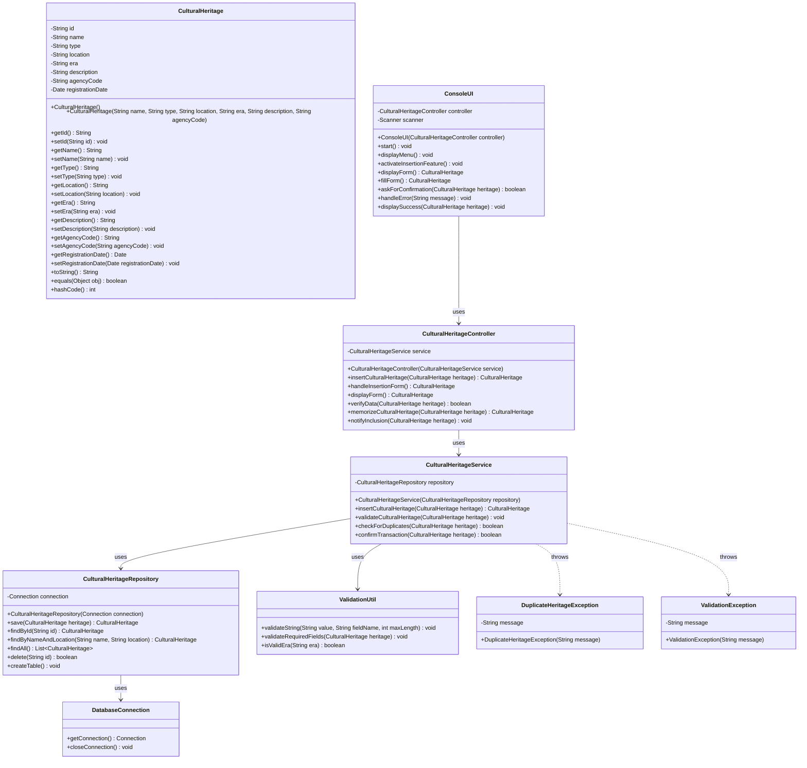
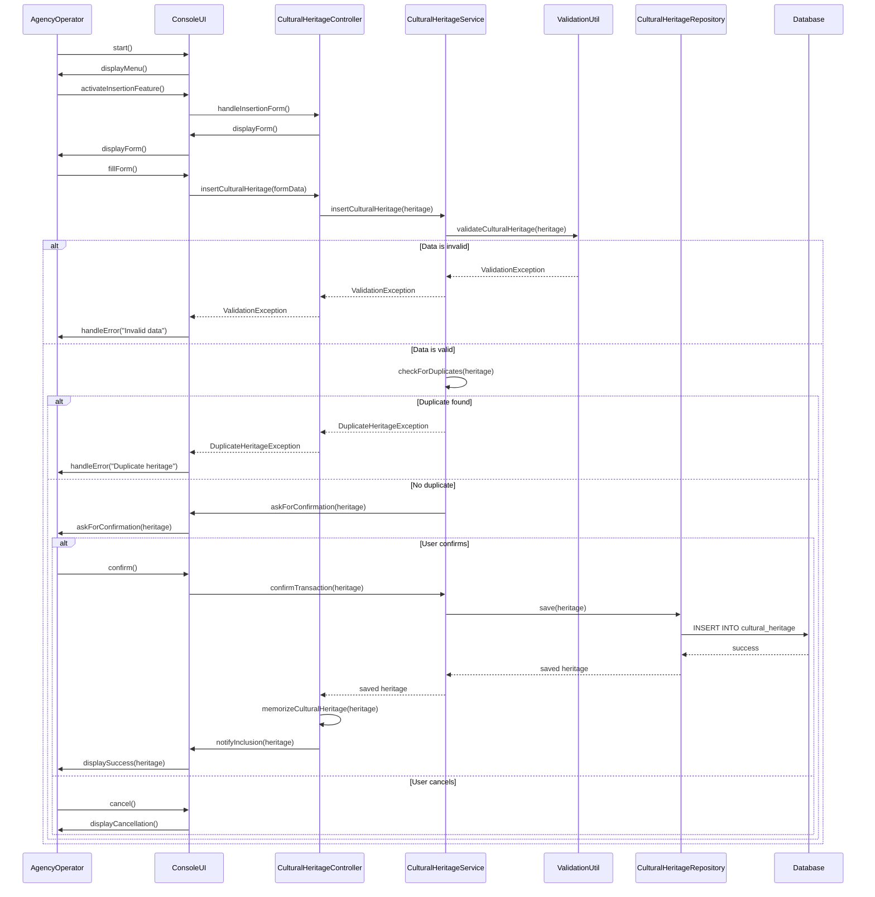

# System Design: Cultural Heritage Management System

## Implementation approach

We will implement a Java-based system for managing cultural heritage objects with the following approach:

1. **Framework Selection**: Use plain Java with JDBC for database persistence (could be extended with Spring Boot later). For simplicity in this design, we'll use an in-memory H2 database for demonstration.

2. **Architecture Pattern**: MVC (Model-View-Controller) pattern to separate concerns:
   - Model: CulturalHeritage entity class
   - Controller: CulturalHeritageController for business logic
   - Service: CulturalHeritageService for validation and duplicate checking
   - Repository: CulturalHeritageRepository for data persistence
   - View: Console-based UI for simplicity (could be replaced with GUI later)

3. **Key Components**:
   - Data validation using Java Bean Validation (JSR-380) annotations
   - Duplicate checking based on unique identifier or combination of attributes
   - Transaction confirmation mechanism
   - Error handling for invalid data and server interruptions

4. **Database**: Use H2 in-memory database for simplicity with JDBC. The system can be easily extended to use PostgreSQL, MySQL, etc.

5. **Build Tool**: Maven for dependency management and build automation.

## File list

- src/main/java/com/culturalheritage/Main.java
- src/main/java/com/culturalheritage/model/CulturalHeritage.java
- src/main/java/com/culturalheritage/controller/CulturalHeritageController.java
- src/main/java/com/culturalheritage/service/CulturalHeritageService.java
- src/main/java/com/culturalheritage/repository/CulturalHeritageRepository.java
- src/main/java/com/culturalheritage/exception/DuplicateHeritageException.java
- src/main/java/com/culturalheritage/exception/ValidationException.java
- src/main/java/com/culturalheritage/database/DatabaseConnection.java
- src/main/java/com/culturalheritage/util/ValidationUtil.java
- src/main/java/com/culturalheritage/view/ConsoleUI.java
- src/test/java/com/culturalheritage/service/CulturalHeritageServiceTest.java
- src/test/java/com/culturalheritage/repository/CulturalHeritageRepositoryTest.java
- pom.xml
- README.md
- docs/system_design.md
- docs/system_design-sequence-diagram.mermaid
- docs/system_design-class-diagram.mermaid

## Data structures and interfaces

## Program call flow

## Anything UNCLEAR

1. **Server ETOUR Connection**: The requirement mentions "Interruption of the connection to the server ETOUR" but doesn't specify what ETOUR is. I assume it's an external server or database. The design includes basic connection handling but would need more details about ETOUR protocol.

2. **Agency Login**: The entry condition states "The agency has logged" but doesn't specify authentication mechanism. The design assumes the agency is already authenticated.

3. **Duplicate Criteria**: The quality requirement states "not accept duplicates cultural heritage" but doesn't define what constitutes a duplicate. I've assumed duplicates are based on name and location combination, but this might need refinement.

4. **Errored Use Case**: The flow mentions activating "use case Errored" but doesn't provide details. I've implemented basic error handling with exceptions.

5. **Persistence Details**: The requirement doesn't specify database technology. I've used H2 for simplicity but the design can be extended to other databases.

6. **Form Fields**: The exact fields for cultural heritage aren't specified. I've included common attributes like name, type, location, era, description, and agency code.

7. **Transaction Confirmation**: The flow asks for confirmation but doesn't specify UI mechanism. I've implemented a simple console confirmation prompt.