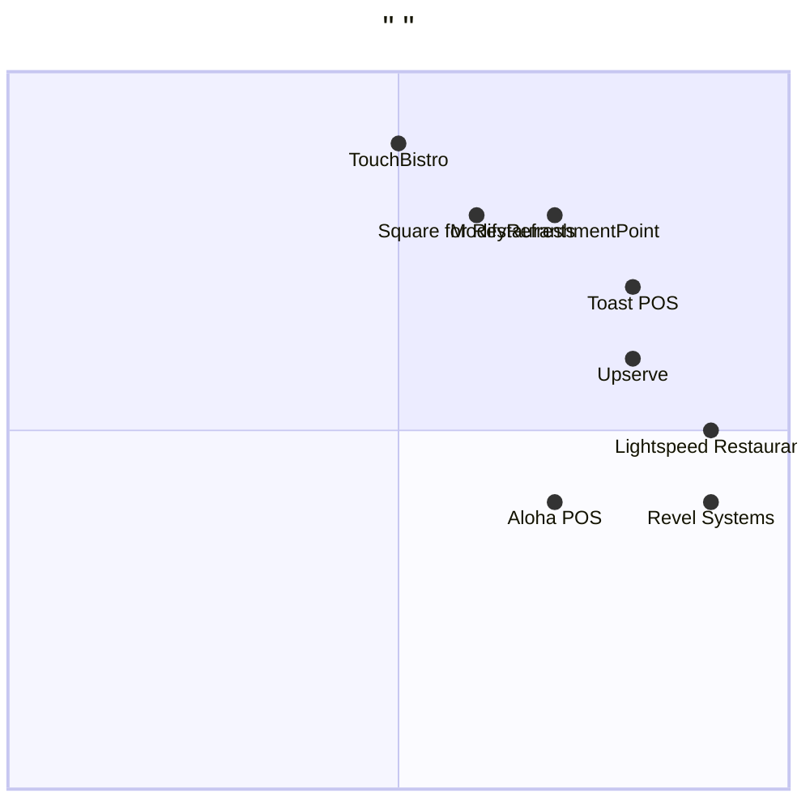

# ModifyRefreshmentPoint        (PRD)

##     
- **    **: 1.0
- **    **: 2025-12-27
- **    **: Alice
- **    **:   （  ）
- **    **: Java
- **    **: modify_refreshment_point_system

## 1.       

### 1.1     
- **    **: ModifyRefreshmentPoint
- **  **:             
- **   **:        (   )

### 1.2     
-                  

### 1.3     
1.             
2.               
3.            
4.               （          ，     Errored  ）
5.     
6.            

### 1.4     
-              
-           
-  ETOUR        

### 1.5     
1.   Java
2.         
3.            
4.       ，     

## 2.     

### 2.1     
1. **     **:                ，        1%  
2. **    **:         ，        5     2    
3. **     **:            ，  99.9%      

### 2.2     
1. **        ，              **，          
2. **        ，                  **，         
3. **        ，           **，           
4. **       ，               **，        
5. **      ，              **，          

### 2.3     


###     

1. **Toast POS**
   - **  **:          ，    ，       
   - **  **:     ，       
   - **  **:         

2. **Square for Restaurants**
   - **  **:            ，        
   - **  **:           ，          
   - **  **:          

3. **Lightspeed Restaurant**
   - **  **:          ，           
   - **  **:       ，      
   - **  **:          

4. **Aloha POS**
   - **  **:            ，         
   - **  **:     ，        
   - **  **:         

5. **Upserve**
   - **  **:         ，       
   - **  **:            
   - **  **:          

6. **TouchBistro**
   - **  **: iPad     ，         
   - **  **:           
   - **  **:            

7. **Revel Systems**
   - **  **:        ，       
   - **  **:     ，    
   - **  **:         

###      



###      
1. **       **:                 ，                 
2. **      **:    4     ，       5-7       
3. **      **:   ETOUR           ，        
4. **    **:                   

## 3.     

### 3.1     

####     
1. **       **
   -           
   -          
   -     

2. **       **
   -        
   -       
   -       

3. **       **
   -       
   -        
   -         

4. **      **
   -        
   -       
   -       

5. **     **
   -      
   -       
   -       

####      
1. **    **
   -        < 2 
   -          < 3 
   -           ≥ 50

2. **     **
   -       ≥ 99.5%
   -        
   -      

3. **     **
   -       
   - SQL    
   -         

4. **     **
   -        < 30  
   -         ≥ 4.5/5
   -     ≤ 1%

### 3.2    

#### P0:     
1.             
2.             
3.         
4.          
5.          
6.       

#### P1:     
1.         
2.        
3.         
4.         
5.         
6.       

#### P2:     
1.         
2.     /    
3.        
4.       
5.      
6.         

### 3.3 UI    

####      
```
┌──────────────────────────────────────────────────────────┐
│           - ModifyRefreshmentPoint             │
├──────────────────────────────────────────────────────────┤
│ [  ID]: ________ [  ]      [  :    A] [  ]   │
├──────────────────────────────────────────────────────────┤
│                                                          │
│   1:                                              │
│ [    ]                                              │
│                                                          │
│   2:     （  ）                                 │
│      : [____________________________]               │
│    : [_________________________________]               │
│      : [________] - [________]                      │
│     : [____________________________]                 │
│    : [____________________________]                   │
│    : [○    ○    ○   ]                         │
│                                                          │
│   3:                                              │
│ [    ]                                              │
│      : ___________                                  │
│                                                          │
│   4:                                             │
│ [    ] [  ]                                       │
│                                                          │
│    :    |                                        │
└──────────────────────────────────────────────────────────┘
```

####     
1. **    **:        ID     ，      
2. **    **:         ，         
3. **    **:              
4. **    **:               

### 3.4      

1. **      **: 
   -            ？
   -             ？
   -         ？      ？

2. **    **: 
   - ETOUR             ？
   -             ？

3. **    **: 
   -        Errored  ？
   -               ？

4. **    **: 
   - Java       ？
   -            ？
   -             ？
## 4.     

### 4.1     

#### RestaurantPoint (   )
```java
/**
 *        -             
 */
public class RestaurantPoint {
    private String pointId;          //    ID
    private String restaurantName;   //     
    private String address;          //   
    private String businessHours;    //     
    private String contactPerson;    //    
    private String phoneNumber;      //     
    private Status status;           //   (  /  /  )
    private Date lastUpdated;        //       
    private String updatedBy;        //    
    
    //     
    public enum Status {
        ACTIVE,   //   
        MAINTENANCE,  //   
        CLOSED    //   
    }
}
```

#### RefreshmentData (     )
```java
/**
 *          -            
 */
public class RefreshmentData {
    private String refreshmentId;    //    ID
    private String pointId;          //       ID
    private String dataType;         //     
    private Object dataValue;        //    
    private Date timestamp;          //    
    private boolean validated;       //      
}
```

### 4.2      

#### 4.2.1    

**restaurant_points  **
```sql
CREATE TABLE restaurant_points (
    point_id VARCHAR(50) PRIMARY KEY,
    restaurant_name VARCHAR(100) NOT NULL,
    address VARCHAR(255) NOT NULL,
    business_hours VARCHAR(50),
    contact_person VARCHAR(50),
    phone_number VARCHAR(20),
    status VARCHAR(20) DEFAULT 'ACTIVE',
    last_updated TIMESTAMP DEFAULT CURRENT_TIMESTAMP,
    updated_by VARCHAR(50)
);
```

**refreshment_data  **
```sql
CREATE TABLE refreshment_data (
    refreshment_id VARCHAR(50) PRIMARY KEY,
    point_id VARCHAR(50) REFERENCES restaurant_points(point_id),
    data_type VARCHAR(50) NOT NULL,
    data_value TEXT,
    timestamp TIMESTAMP DEFAULT CURRENT_TIMESTAMP,
    validated BOOLEAN DEFAULT FALSE,
    INDEX idx_point_id (point_id)
);
```

**operation_logs  **
```sql
CREATE TABLE operation_logs (
    log_id INT AUTO_INCREMENT PRIMARY KEY,
    operation_type VARCHAR(50) NOT NULL,
    point_id VARCHAR(50) REFERENCES restaurant_points(point_id),
    operator_id VARCHAR(50) NOT NULL,
    operation_time TIMESTAMP DEFAULT CURRENT_TIMESTAMP,
    old_data JSON,
    new_data JSON,
    status VARCHAR(20) DEFAULT 'SUCCESS',
    error_message TEXT
);
```

### 4.3       

#### 4.3.1       
1. **    **:     ，  1-100  
2. **  **:     ，  1-255  
3. **    **:      "HH:MM-HH:MM"
4. **    **:       /        
5. **  **:          

#### 4.3.2       
1.             
2.         24     
3.                "  "
4.                 

## 5.     

### 5.1     

```
┌─────────────────────────────────────────────────────────────┐
│                          (UI Layer)                      │
│  -                                                   │
│  -                                                   │
│  -                                                   │
│  -                                                   │
└──────────────────────┬──────────────────────────────────────┘
                       │
┌──────────────────────▼──────────────────────────────────────┐
│                      (Service Layer)                    │
│  -                 -                            │
│  -                 -                          │
│  -                 -                            │
└──────────────────────┬──────────────────────────────────────┘
                       │
┌──────────────────────▼──────────────────────────────────────┐
│                      (Data Access Layer)                │
│  - RestaurantPointDAO       - RefreshmentDataDAO            │
│  - OperationLogDAO          -                         │
└──────────────────────┬──────────────────────────────────────┘
                       │
┌──────────────────────▼──────────────────────────────────────┐
│                   (Persistence Layer)                   │
│  -        (MySQL/PostgreSQL)                          │
│  -      (Redis)                                         │
│  -                                                   │
└─────────────────────────────────────────────────────────────┘
```

### 5.2     

####      
- **    **: Java 17+
- **Web  **: Spring Boot 3.x
- **    **: Spring Security
- **    **: Spring Data JPA/Hibernate
- **    **: Hibernate Validator
- **API  **: RESTful API
- **    **: Maven   Gradle

####       (  ，   )
- **  **: React   Vue.js
- **UI **: Ant Design   Material-UI
- **    **: Redux   Vuex
- **    **: Webpack/Vite

####    
- **    **: PostgreSQL 14+   MySQL 8+
- **  **: Redis 7+
- **    **:           

### 5.3     

```
┌─────────────────────────────────────────────────────────────┐
│                         (Nginx)                        │
│  -                      - SSL/TLS                     │
│  -                   -                           │
└──────────────────────┬──────────────────────────────────────┘
                       │
┌──────────────────────▼──────────────────────────────────────┐
│                         (Spring Boot)                  │
│  -                    -                            │
│  -                    -                            │
└──────────────────────┬──────────────────────────────────────┘
                       │
             ┌─────────┴─────────┐
             │                   │
    ┌────────▼──────┐   ┌────────▼──────┐
    │           │   │           │
    │(PostgreSQL/   │   │(Redis)        │
    │ MySQL)        │   │               │
    └───────────────┘   └───────────────┘
```

## 6.     

### 6.1      

#### 6.1.1      (Controller)
```java
@RestController
@RequestMapping("/api/restaurant-points")
public class RestaurantPointController {
    
    @Autowired
    private RestaurantPointService pointService;
    
    /**
     *        
     */
    @GetMapping("/{pointId}")
    public ResponseEntity<RestaurantPoint> getRestaurantPoint(
            @PathVariable String pointId) {
        RestaurantPoint point = pointService.getPointById(pointId);
        return ResponseEntity.ok(point);
    }
    
    /**
     *        
     */
    @PostMapping
    public ResponseEntity<RestaurantPoint> createRestaurantPoint(
            @Valid @RequestBody RestaurantPoint point,
            Principal principal) {
        point.setCreatedBy(principal.getName());
        RestaurantPoint created = pointService.createPoint(point);
        return ResponseEntity.status(HttpStatus.CREATED).body(created);
    }
    
    /**
     *        
     */
    @PutMapping("/{pointId}")
    public ResponseEntity<RestaurantPoint> updateRestaurantPoint(
            @PathVariable String pointId,
            @Valid @RequestBody RestaurantPoint point,
            Principal principal) {
        point.setUpdatedBy(principal.getName());
        RestaurantPoint updated = pointService.updatePoint(pointId, point);
        return ResponseEntity.ok(updated);
    }
}
```

#### 6.1.2     (Service)
```java
@Service
transactional
public class RestaurantPointService {
    
    @Autowired
    private RestaurantPointRepository pointRepository;
    
    @Autowired
    private DataValidator dataValidator;
    
    @Autowired
    private OperationLogService logService;
    
    /**
     *         -             
     */
    public RestaurantPoint updatePoint(String pointId, RestaurantPoint newData) {
        // 1.       
        ValidationResult validation = dataValidator.validate(newData);
        if (!validation.isValid()) {
            throw new ValidationException("      ", validation.getErrors());
        }
        
        // 2.      
        RestaurantPoint existingPoint = pointRepository.findById(pointId)
            .orElseThrow(() -> new NotFoundException("      "));
        
        // 3.       
        logService.logUpdateOperation(existingPoint, newData);
        
        // 4.     
        existingPoint.setRestaurantName(newData.getRestaurantName());
        existingPoint.setAddress(newData.getAddress());
        existingPoint.setBusinessHours(newData.getBusinessHours());
        existingPoint.setContactPerson(newData.getContactPerson());
        existingPoint.setPhoneNumber(newData.getPhoneNumber());
        existingPoint.setStatus(newData.getStatus());
        existingPoint.setUpdatedBy(newData.getUpdatedBy());
        existingPoint.setLastUpdated(new Date());
        
        // 5.     
        return pointRepository.save(existingPoint);
    }
}
```

### 6.2     

#### 6.2.1       
```java
/**
 *       -         
 */
@Component
public class DataValidator {
    
    private static final Pattern PHONE_PATTERN = 
        Pattern.compile("^[+]?[0-9]{10,15}$");
    private static final Pattern BUSINESS_HOURS_PATTERN = 
        Pattern.compile("^([0-1][0-9]|2[0-3]):[0-5][0-9]-([0-1][0-9]|2[0-3]):[0-5][0-9]$");
    
    /**
     *            
     */
    public ValidationResult validate(RestaurantPoint point) {
        ValidationResult result = new ValidationResult();
        
        //       
        validateRequiredField(point.getRestaurantName(), "    ", result);
        validateRequiredField(point.getAddress(), "  ", result);
        
        //         
        if (point.getPhoneNumber() != null && !point.getPhoneNumber().isEmpty()) {
            validatePhoneNumber(point.getPhoneNumber(), result);
        }
        
        //         
        if (point.getBusinessHours() != null && !point.getBusinessHours().isEmpty()) {
            validateBusinessHours(point.getBusinessHours(), result);
        }
        
        //       
        validateBusinessRules(point, result);
        
        return result;
    }
    
    private void validatePhoneNumber(String phone, ValidationResult result) {
        if (!PHONE_PATTERN.matcher(phone).matches()) {
            result.addError("phoneNumber", "         ");
        }
    }
}
```

## 7.     

### 7.1     

#### 7.1.1     
-         
-       
-        

#### 7.1.2     
- API    
-        
-       

#### 7.1.3      
-         
-       
-     

### 7.2      

#### 7.2.1     
-         
-      
-         

#### 7.2.2     
-        
-      
-      

## 8.     

### 8.1     
- Java JDK 17+
- IDE (IntelliJ IDEA   Eclipse)
- Git     
-       (  Docker)

### 8.2     
- Linux     (Ubuntu 20.04+   CentOS 7+)
- Java     17+
- PostgreSQL/MySQL    
- Redis   
- Nginx    
- SSL  

### 8.3     /    (CI/CD)
-     : GitHub/GitLab
-     : Jenkins   GitHub Actions
-    : Docker
-     : Kubernetes (  )

## 9.          

### 9.1     
1. **       **
   -   :                    
   -   :          、    、    

2. **       **
   -   :  ETOUR             
   -   :       、    、    

3. **       **
   -   :                     
   -   :      、    、    

### 9.2     
1. **       **
   -   :                
   -   :       、    、    

2. **      **
   -   :                
   -   :       、       、    

## 10.   

### 10.1    
- **   (RestaurantPoint)**:                 
- **     (RefreshmentData)**:            
- **   (Operator)**:               
- **ETOUR   **:     ，           

### 10.2     
- Java    
- Spring Boot    
- RESTful API    
-          

---

**    **

*      : 2025-12-27*   
*    : Alice*   
*    :    *
