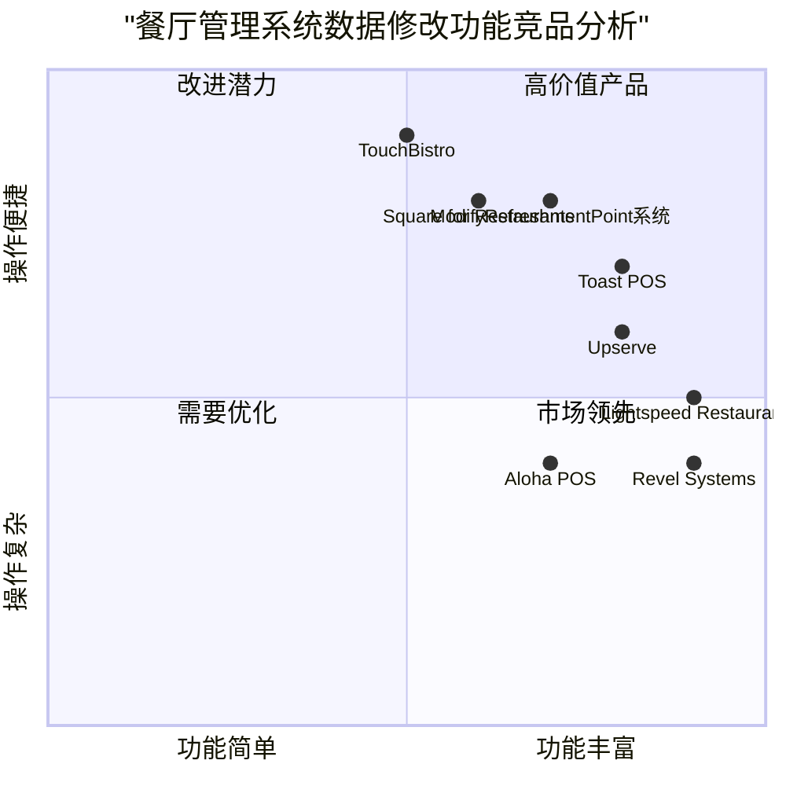

# ModifyRefreshmentPoint 产品需求文档 (PRD)

## 文档信息
- **文档版本**: 1.0
- **创建日期**: 2025-12-27
- **产品经理**: Alice
- **目标语言**: 中文（简体）
- **编程语言**: Java
- **项目名称**: modify_refreshment_point_system

## 1. 原始需求重述

### 1.1 用例概述
- **用例名称**: ModifyRefreshmentPoint
- **描述**: 更改与刷新点关联的数据点
- **参与者**: 餐厅点操作员 (初始化)

### 1.2 进入条件
- 餐厅点操作员已成功通过系统身份验证

### 1.3 事件流程
1. 启用餐厅点所需的信息功能
2. 上传刷新点数据并在表单中显示
3. 更改表单中的数据并提交
4. 验证输入的数据并请求更改确认（如果数据无效或不充分，系统将激活Errored用例）
5. 确认操作
6. 存储修改后的餐厅点数据

### 1.4 退出条件
- 系统已更改所选餐厅点的数据
- 餐厅点操作员取消操作
- 与ETOUR服务器的连接中断

### 1.5 技术要求
1. 使用Java
2. 代码应完全可运行
3. 包含解释关键逻辑的注释
4. 不要运行代码，只需保存它

## 2. 产品定义

### 2.1 产品目标
1. **数据准确性**: 确保餐厅点数据的准确修改和验证，减少数据错误率至1%以下
2. **操作效率**: 简化数据修改流程，将平均操作时间从5分钟缩短至2分钟以内
3. **系统可靠性**: 建立稳定的数据同步机制，确保99.9%的操作成功率

### 2.2 用户故事
1. **作为餐厅点操作员，我希望能够快速加载餐厅点数据**，以便立即开始修改工作
2. **作为餐厅点操作员，我希望系统能自动验证输入数据的有效性**，以避免提交错误信息
3. **作为餐厅点操作员，我希望有明确的确认步骤**，以防止意外修改重要数据
4. **作为系统管理员，我希望所有数据修改都有日志记录**，以便追溯操作历史
5. **作为餐厅经理，我希望能实时查看数据修改状态**，以便监控数据更新进度

### 2.3 竞品分析


### 竞品列表

1. **Toast POS**
   - **优点**: 强大的数据管理功能，实时同步，直观的用户界面
   - **缺点**: 价格较高，定制化选项有限
   - **定位**: 高端餐厅管理系统

2. **Square for Restaurants**
   - **优点**: 易于使用的数据编辑功能，强大的移动端支持
   - **缺点**: 高级数据验证功能有限，依赖于稳定的网络连接
   - **定位**: 中小型餐厅解决方案

3. **Lightspeed Restaurant**
   - **优点**: 高效的库存管理集成，详细的数据修改历史记录
   - **缺点**: 界面相对复杂，学习曲线较陡
   - **定位**: 多地点连锁餐厅管理

4. **Aloha POS**
   - **优点**: 行业标准的数据处理能力，健壮的错误处理机制
   - **缺点**: 更新较慢，用户界面较为传统
   - **定位**: 传统餐厅运营管理

5. **Upserve**
   - **优点**: 基于云的数据管理，强大的分析功能
   - **缺点**: 定制化数据验证规则有限
   - **定位**: 数据驱动型餐厅运营

6. **TouchBistro**
   - **优点**: iPad友好的界面，直观的数据编辑体验
   - **缺点**: 高级数据管理功能有限
   - **定位**: 移动优先的餐厅解决方案

7. **Revel Systems**
   - **优点**: 企业级数据安全，详细的权限管理
   - **缺点**: 设置复杂，成本较高
   - **定位**: 大型连锁餐厅企业

### 竞争象限图



### 差异化优势
1. **专注于数据验证**: 本系统在数据验证方面具有显著优势，特别是针对餐厅点数据的特定验证规则
2. **操作流程优化**: 精简的4步操作流程，相比竞品通常的5-7步流程更加高效
3. **离线处理能力**: 集成ETOUR服务器连接中断处理机制，支持部分离线操作
4. **成本效益**: 目标提供企业级功能的中等价格解决方案

## 3. 技术规格

### 3.1 需求分析

#### 功能需求
1. **用户认证与授权**
   - 餐厅点操作员身份验证
   - 基于角色的访问控制
   - 会话管理

2. **数据加载与显示**
   - 餐厅点数据读取
   - 数据表单渲染
   - 实时数据显示

3. **数据编辑与管理**
   - 表单数据编辑
   - 客户端数据验证
   - 服务器端数据验证

4. **操作流程控制**
   - 多步骤操作流程
   - 操作确认机制
   - 取消操作处理

5. **数据持久化**
   - 数据库更新
   - 数据修改日志
   - 数据同步机制

#### 非功能需求
1. **性能需求**
   - 数据加载时间 < 2秒
   - 数据提交响应时间 < 3秒
   - 支持并发操作用户数 ≥ 50

2. **可靠性需求**
   - 系统可用性 ≥ 99.5%
   - 数据一致性保证
   - 事务完整性

3. **安全性需求**
   - 数据传输加密
   - SQL注入防护
   - 跨站脚本攻击防护

4. **可用性需求**
   - 操作学习时间 < 30分钟
   - 用户满意度评分 ≥ 4.5/5
   - 错误率 ≤ 1%

### 3.2 需求池

#### P0: 必须实现
1. 餐厅点操作员身份验证机制
2. 餐厅点数据读取与显示功能
3. 基本数据编辑表单
4. 表单提交与数据验证
5. 数据存储与更新功能
6. 操作取消机制

#### P1: 应该实现
1. 高级数据验证规则
2. 操作确认对话框
3. 数据修改历史记录
4. 实时数据状态显示
5. 网络连接异常处理
6. 用户操作日志

#### P2: 可以添加
1. 批量数据修改功能
2. 数据导入/导出功能
3. 操作快捷键支持
4. 主题定制选项
5. 多语言支持
6. 数据统计分析报告

### 3.3 UI设计草案

#### 主界面布局
```
┌──────────────────────────────────────────────────────────┐
│ 餐厅点数据管理系统 - ModifyRefreshmentPoint             │
├──────────────────────────────────────────────────────────┤
│ [餐厅ID]: ________ [搜索]      [用户: 操作员A] [退出]   │
├──────────────────────────────────────────────────────────┤
│                                                          │
│ 步骤1: 数据加载                                         │
│ [加载数据]                                              │
│                                                          │
│ 步骤2: 数据编辑（表单）                                 │
│  餐厅名称: [____________________________]               │
│  地址: [_________________________________]               │
│  营业时间: [________] - [________]                      │
│  联系人: [____________________________]                 │
│  电话: [____________________________]                   │
│  状态: [○ 正常 ○ 维护 ○ 关闭]                         │
│                                                          │
│ 步骤3: 数据验证                                         │
│ [开始验证]                                              │
│  验证结果: ___________                                  │
│                                                          │
│ 步骤4: 确认与提交                                       │
│ [确认修改] [取消]                                       │
│                                                          │
│ 状态栏: 就绪 | 连接正常                                   │
└──────────────────────────────────────────────────────────┘
```

#### 操作流程
1. **加载数据**: 操作员输入餐厅ID或搜索餐厅，点击加载数据
2. **数据编辑**: 系统显示当前数据，操作员在表单中修改
3. **数据验证**: 系统验证修改后的数据完整性
4. **确认提交**: 确认无误后提交修改或取消操作

### 3.4 待澄清问题

1. **数据模型细节**: 
   - 餐厅点具体包含哪些字段？
   - 数据验证的具体规则是什么？
   - 哪些字段是必填的？哪些是可选的？

2. **系统集成**: 
   - ETOUR服务器具体的接口规范是什么？
   - 数据同步频率和机制是什么？

3. **业务规则**: 
   - 什么情况下激活Errored用例？
   - 操作取消后的数据状态如何处理？

4. **技术限制**: 
   - Java版本要求是什么？
   - 数据库类型和版本是什么？
   - 前端技术栈是否有特殊要求？
## 4. 数据模型

### 4.1 核心实体

#### RestaurantPoint (餐厅点)
```java
/**
 * 餐厅点实体类 - 表示一个餐厅点的完整信息
 */
public class RestaurantPoint {
    private String pointId;          // 餐厅点ID
    private String restaurantName;   // 餐厅名称
    private String address;          // 地址
    private String businessHours;    // 营业时间
    private String contactPerson;    // 联系人
    private String phoneNumber;      // 电话号码
    private Status status;           // 状态(正常/维护/关闭)
    private Date lastUpdated;        // 最后更新时间
    private String updatedBy;        // 更新者
    
    // 枚举类型
    public enum Status {
        ACTIVE,   // 正常
        MAINTENANCE,  // 维护
        CLOSED    // 关闭
    }
}
```

#### RefreshmentData (刷新点数据)
```java
/**
 * 刷新点数据实体类 - 与餐厅点关联的刷新数据
 */
public class RefreshmentData {
    private String refreshmentId;    // 刷新点ID
    private String pointId;          // 关联的餐厅点ID
    private String dataType;         // 数据类型
    private Object dataValue;        // 数据值
    private Date timestamp;          // 时间戳
    private boolean validated;       // 是否已验证
}
```

### 4.2 数据库设计

#### 4.2.1 表结构

**restaurant_points 表**
```sql
CREATE TABLE restaurant_points (
    point_id VARCHAR(50) PRIMARY KEY,
    restaurant_name VARCHAR(100) NOT NULL,
    address VARCHAR(255) NOT NULL,
    business_hours VARCHAR(50),
    contact_person VARCHAR(50),
    phone_number VARCHAR(20),
    status VARCHAR(20) DEFAULT 'ACTIVE',
    last_updated TIMESTAMP DEFAULT CURRENT_TIMESTAMP,
    updated_by VARCHAR(50)
);
```

**refreshment_data 表**
```sql
CREATE TABLE refreshment_data (
    refreshment_id VARCHAR(50) PRIMARY KEY,
    point_id VARCHAR(50) REFERENCES restaurant_points(point_id),
    data_type VARCHAR(50) NOT NULL,
    data_value TEXT,
    timestamp TIMESTAMP DEFAULT CURRENT_TIMESTAMP,
    validated BOOLEAN DEFAULT FALSE,
    INDEX idx_point_id (point_id)
);
```

**operation_logs 表**
```sql
CREATE TABLE operation_logs (
    log_id INT AUTO_INCREMENT PRIMARY KEY,
    operation_type VARCHAR(50) NOT NULL,
    point_id VARCHAR(50) REFERENCES restaurant_points(point_id),
    operator_id VARCHAR(50) NOT NULL,
    operation_time TIMESTAMP DEFAULT CURRENT_TIMESTAMP,
    old_data JSON,
    new_data JSON,
    status VARCHAR(20) DEFAULT 'SUCCESS',
    error_message TEXT
);
```

### 4.3 数据验证规则

#### 4.3.1 必填字段验证
1. **餐厅名称**: 不能为空，长度1-100字符
2. **地址**: 不能为空，长度1-255字符
3. **营业时间**: 格式必须为"HH:MM-HH:MM"
4. **电话号码**: 必须符合国际/本地电话号码格式
5. **状态**: 必须是预定义值之一

#### 4.3.2 业务规则验证
1. 同一地址不能有重复餐厅点
2. 营业时间不能违反24小时制规则
3. 联系电话不能为空值时状态不能为"正常"
4. 修改操作必须由已认证的操作员执行

## 5. 系统架构

### 5.1 架构概述

```
┌─────────────────────────────────────────────────────────────┐
│                     前端界面 (UI Layer)                      │
│  - 数据加载组件                                            │
│  - 数据编辑表单                                            │
│  - 验证结果展示                                            │
│  - 操作确认界面                                            │
└──────────────────────┬──────────────────────────────────────┘
                       │
┌──────────────────────▼──────────────────────────────────────┐
│                业务逻辑层 (Service Layer)                    │
│  - 用户认证服务          - 数据验证服务                     │
│  - 数据管理服务          - 操作流程控制服务                 │
│  - 日志记录服务          - 异常处理服务                     │
└──────────────────────┬──────────────────────────────────────┘
                       │
┌──────────────────────▼──────────────────────────────────────┐
│                数据访问层 (Data Access Layer)                │
│  - RestaurantPointDAO       - RefreshmentDataDAO            │
│  - OperationLogDAO          - 数据缓存管理                  │
└──────────────────────┬──────────────────────────────────────┘
                       │
┌──────────────────────▼──────────────────────────────────────┐
│             数据存储层 (Persistence Layer)                   │
│  - 关系型数据库 (MySQL/PostgreSQL)                          │
│  - 缓存系统 (Redis)                                         │
│  - 文件存储系统                                            │
└─────────────────────────────────────────────────────────────┘
```

### 5.2 技术选型

#### 后端技术栈
- **编程语言**: Java 17+
- **Web框架**: Spring Boot 3.x
- **安全框架**: Spring Security
- **数据访问**: Spring Data JPA/Hibernate
- **验证框架**: Hibernate Validator
- **API设计**: RESTful API
- **构建工具**: Maven 或 Gradle

#### 前端技术栈 (可选，如需要)
- **框架**: React 或 Vue.js
- **UI库**: Ant Design 或 Material-UI
- **状态管理**: Redux 或 Vuex
- **构建工具**: Webpack/Vite

#### 数据库
- **主数据库**: PostgreSQL 14+ 或 MySQL 8+
- **缓存**: Redis 7+
- **文件存储**: 本地文件系统或云存储

### 5.3 部署架构

```
┌─────────────────────────────────────────────────────────────┐
│                 反向代理服务器 (Nginx)                        │
│  - 负载均衡                 - SSL/TLS终止                   │
│  - 静态资源服务            - 请求路由                      │
└──────────────────────┬──────────────────────────────────────┘
                       │
┌──────────────────────▼──────────────────────────────────────┐
│                 应用程序服务器 (Spring Boot)                  │
│  - 多实例部署              - 健康检查                       │
│  - 自动重启               - 性能监控                       │
└──────────────────────┬──────────────────────────────────────┘
                       │
             ┌─────────┴─────────┐
             │                   │
    ┌────────▼──────┐   ┌────────▼──────┐
    │数据库服务器     │   │缓存服务器      │
    │(PostgreSQL/   │   │(Redis)        │
    │ MySQL)        │   │               │
    └───────────────┘   └───────────────┘
```

## 6. 实现建议

### 6.1 核心类设计

#### 6.1.1 控制器层 (Controller)
```java
@RestController
@RequestMapping("/api/restaurant-points")
public class RestaurantPointController {
    
    @Autowired
    private RestaurantPointService pointService;
    
    /**
     * 加载餐厅点数据
     */
    @GetMapping("/{pointId}")
    public ResponseEntity<RestaurantPoint> getRestaurantPoint(
            @PathVariable String pointId) {
        RestaurantPoint point = pointService.getPointById(pointId);
        return ResponseEntity.ok(point);
    }
    
    /**
     * 创建新的餐厅点
     */
    @PostMapping
    public ResponseEntity<RestaurantPoint> createRestaurantPoint(
            @Valid @RequestBody RestaurantPoint point,
            Principal principal) {
        point.setCreatedBy(principal.getName());
        RestaurantPoint created = pointService.createPoint(point);
        return ResponseEntity.status(HttpStatus.CREATED).body(created);
    }
    
    /**
     * 更新餐厅点数据
     */
    @PutMapping("/{pointId}")
    public ResponseEntity<RestaurantPoint> updateRestaurantPoint(
            @PathVariable String pointId,
            @Valid @RequestBody RestaurantPoint point,
            Principal principal) {
        point.setUpdatedBy(principal.getName());
        RestaurantPoint updated = pointService.updatePoint(pointId, point);
        return ResponseEntity.ok(updated);
    }
}
```

#### 6.1.2 服务层 (Service)
```java
@Service
transactional
public class RestaurantPointService {
    
    @Autowired
    private RestaurantPointRepository pointRepository;
    
    @Autowired
    private DataValidator dataValidator;
    
    @Autowired
    private OperationLogService logService;
    
    /**
     * 更新餐厅点数据 - 包含完整的验证和日志记录
     */
    public RestaurantPoint updatePoint(String pointId, RestaurantPoint newData) {
        // 1. 验证输入数据
        ValidationResult validation = dataValidator.validate(newData);
        if (!validation.isValid()) {
            throw new ValidationException("数据验证失败", validation.getErrors());
        }
        
        // 2. 获取原数据
        RestaurantPoint existingPoint = pointRepository.findById(pointId)
            .orElseThrow(() -> new NotFoundException("餐厅点不存在"));
        
        // 3. 记录操作日志
        logService.logUpdateOperation(existingPoint, newData);
        
        // 4. 更新数据
        existingPoint.setRestaurantName(newData.getRestaurantName());
        existingPoint.setAddress(newData.getAddress());
        existingPoint.setBusinessHours(newData.getBusinessHours());
        existingPoint.setContactPerson(newData.getContactPerson());
        existingPoint.setPhoneNumber(newData.getPhoneNumber());
        existingPoint.setStatus(newData.getStatus());
        existingPoint.setUpdatedBy(newData.getUpdatedBy());
        existingPoint.setLastUpdated(new Date());
        
        // 5. 保存更新
        return pointRepository.save(existingPoint);
    }
}
```

### 6.2 关键算法

#### 6.2.1 数据验证算法
```java
/**
 * 数据验证器 - 实现核心验证逻辑
 */
@Component
public class DataValidator {
    
    private static final Pattern PHONE_PATTERN = 
        Pattern.compile("^[+]?[0-9]{10,15}$");
    private static final Pattern BUSINESS_HOURS_PATTERN = 
        Pattern.compile("^([0-1][0-9]|2[0-3]):[0-5][0-9]-([0-1][0-9]|2[0-3]):[0-5][0-9]$");
    
    /**
     * 验证餐厅点数据的完整性
     */
    public ValidationResult validate(RestaurantPoint point) {
        ValidationResult result = new ValidationResult();
        
        // 验证必填字段
        validateRequiredField(point.getRestaurantName(), "餐厅名称", result);
        validateRequiredField(point.getAddress(), "地址", result);
        
        // 验证电话号码格式
        if (point.getPhoneNumber() != null && !point.getPhoneNumber().isEmpty()) {
            validatePhoneNumber(point.getPhoneNumber(), result);
        }
        
        // 验证营业时间格式
        if (point.getBusinessHours() != null && !point.getBusinessHours().isEmpty()) {
            validateBusinessHours(point.getBusinessHours(), result);
        }
        
        // 验证业务规则
        validateBusinessRules(point, result);
        
        return result;
    }
    
    private void validatePhoneNumber(String phone, ValidationResult result) {
        if (!PHONE_PATTERN.matcher(phone).matches()) {
            result.addError("phoneNumber", "电话号码格式不正确");
        }
    }
}
```

## 7. 质量保证

### 7.1 测试策略

#### 7.1.1 单元测试
- 数据验证逻辑测试
- 业务规则测试
- 数据访问层测试

#### 7.1.2 集成测试
- API端点测试
- 数据库集成测试
- 身份验证测试

#### 7.1.3 端到端测试
- 完整操作流程测试
- 错误场景测试
- 性能测试

### 7.2 监控与日志

#### 7.2.1 应用监控
- 接口响应时间监控
- 错误率监控
- 用户操作频率监控

#### 7.2.2 业务监控
- 数据修改成功率
- 操作取消率
- 验证失败率

## 8. 部署要求

### 8.1 开发环境
- Java JDK 17+
- IDE (IntelliJ IDEA 或 Eclipse)
- Git 版本控制
- 本地数据库 (可选Docker)

### 8.2 生产环境
- Linux 服务器 (Ubuntu 20.04+ 或 CentOS 7+)
- Java运行环境 17+
- PostgreSQL/MySQL 数据库
- Redis 缓存
- Nginx反向代理
- SSL证书

### 8.3 持续集成/持续部署(CI/CD)
- 代码仓库: GitHub/GitLab
- 构建工具: Jenkins 或 GitHub Actions
- 容器化: Docker
- 容器编排: Kubernetes (可选)

## 9. 风险分析与缓解措施

### 9.1 技术风险
1. **数据库性能瓶颈**
   - 风险: 高并发下的数据修改操作可能导致性能问题
   - 缓解: 实施数据库索引优化、查询缓存、读写分离

2. **网络连接不稳定**
   - 风险: 与ETOUR服务器连接中断导致操作失败
   - 缓解: 实现重试机制、本地缓存、异步操作

3. **数据一致性风险**
   - 风险: 多用户同时修改同一数据可能导致数据不一致
   - 缓解: 实施乐观锁、事务管理、操作日志

### 9.2 业务风险
1. **数据准确性风险**
   - 风险: 操作员输入错误数据导致信息错误
   - 缓解: 强化数据验证、操作确认、数据审计

2. **用户体验风险**
   - 风险: 操作流程复杂导致用户满意度降低
   - 缓解: 优化操作流程、提供清晰的提示、简化界面

## 10. 附录

### 10.1 术语表
- **餐厅点(RestaurantPoint)**: 表示一个餐厅的地理位置和基本信息
- **刷新点数据(RefreshmentData)**: 与餐厅点关联的动态数据
- **操作员(Operator)**: 负责管理餐厅点数据的系统用户
- **ETOUR服务器**: 外部系统，提供部分数据或功能集成

### 10.2 参考资料
- Java语言规范
- Spring Boot官方文档
- RESTful API设计指南
- 数据库设计最佳实践

---

**文档结束**

*最后更新时间: 2025-12-27*   
*产品经理: Alice*   
*文档状态: 已完成*
