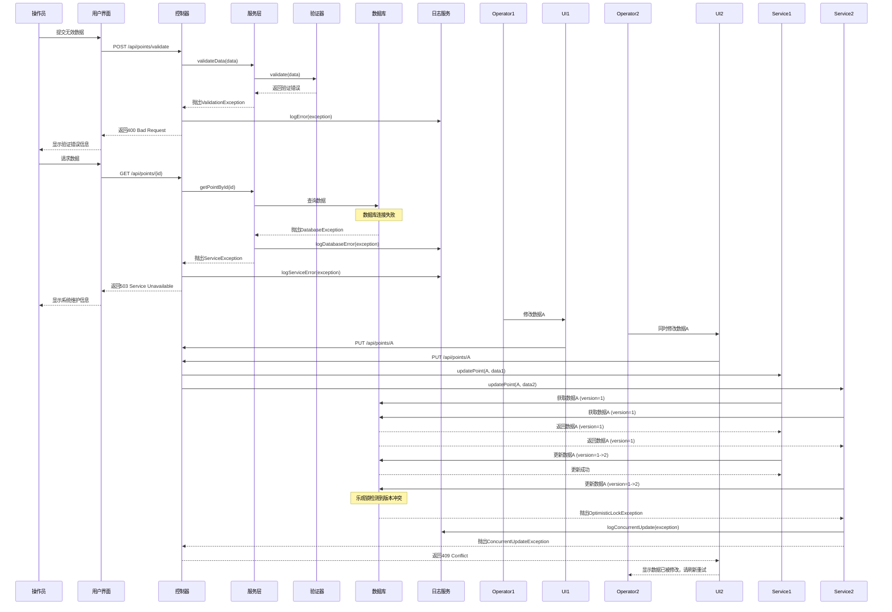

            PointService->>ETOURService: checkConnection()
            alt ETOUR连接正常
                ETOURService-->>PointService: 连接正常
                PointService->>PointRepository: save(updatedPoint)
                PointRepository->>DB: 更新数据
                DB-->>PointRepository: 更新成功
                PointRepository-->>PointService: 返回保存的对象
                PointService->>ETOURService: updatePointInETOUR(pointId, updateData)
                ETOURService-->>PointService: 同步成功
                PointService->>LogService: 记录操作成功
                PointService-->>PointController: 返回更新后的RestaurantPointDTO
            else ETOUR连接失败
                ETOURService-->>PointService: 连接失败
                PointService->>PointRepository: save(updatedPoint)
                PointRepository->>DB: 更新数据
                DB-->>PointRepository: 更新成功
                PointRepository-->>PointService: 返回保存的对象
                PointService->>LogService: 记录ETOUR连接失败警告
                PointService-->>PointController: 返回更新后的RestaurantPointDTO（带警告）
            end
        end
    end
    
    PointController-->>UI: 返回操作结果
    UI-->>Operator: 显示操作结果
    
    %% 5. 取消操作流程
    Operator->>UI: 点击取消
    UI->>PointController: POST /api/points/{pointId}/cancel
    PointController->>AuthService: 验证令牌
    AuthService-->>PointController: 验证通过
    PointController->>PointService: cancelOperation(pointId)
    PointService->>LogService: 记录操作取消
    PointService-->>PointController: 返回取消成功
    PointController-->>UI: 返回取消结果
    UI-->>Operator: 显示操作已取消
    
    %% 6. 错误处理流程
    Note over PointController,DB: 当发生异常时
    PointController->>PointController: 捕获异常
    PointController->>LogService: 记录异常
    PointController-->>UI: 返回错误响应
    UI-->>Operator: 显示错误信息
```

### 4.2 错误处理序列图



## 5. 数据库设计

### 5.1 物理数据模型

基于PRD中的数据库设计，扩展为完整的物理模型：

```sql
-- 用户表
CREATE TABLE users (
    user_id VARCHAR(50) PRIMARY KEY,
    username VARCHAR(50) UNIQUE NOT NULL,
    password_hash VARCHAR(255) NOT NULL,
    email VARCHAR(100)