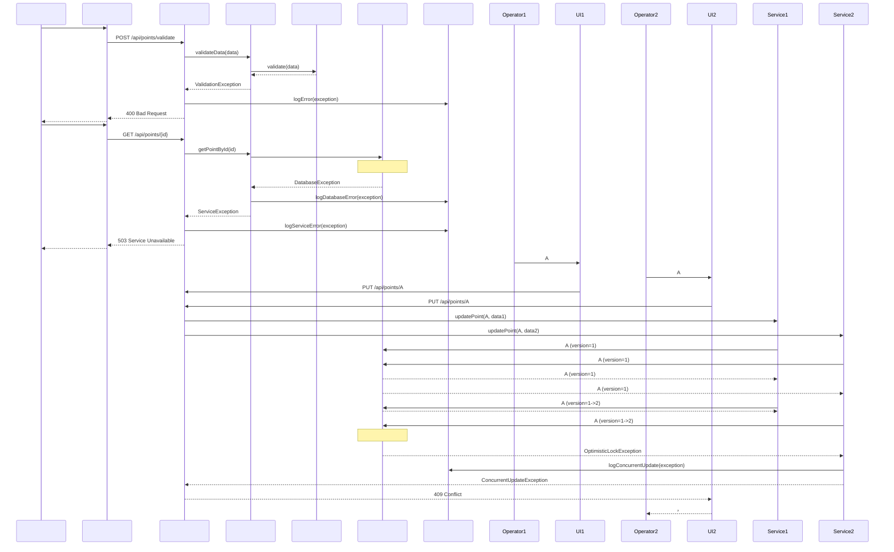

            PointService->>ETOURService: checkConnection()
            alt ETOUR    
                ETOURService-->>PointService:     
                PointService->>PointRepository: save(updatedPoint)
                PointRepository->>DB:     
                DB-->>PointRepository:     
                PointRepository-->>PointService:        
                PointService->>ETOURService: updatePointInETOUR(pointId, updateData)
                ETOURService-->>PointService:     
                PointService->>LogService:       
                PointService-->>PointController:       RestaurantPointDTO
            else ETOUR    
                ETOURService-->>PointService:     
                PointService->>PointRepository: save(updatedPoint)
                PointRepository->>DB:     
                DB-->>PointRepository:     
                PointRepository-->>PointService:        
                PointService->>LogService:   ETOUR      
                PointService-->>PointController:       RestaurantPointDTO（   ）
            end
        end
    end
    
    PointController-->>UI:       
    UI-->>Operator:       
    
    %% 5.       
    Operator->>UI:     
    UI->>PointController: POST /api/points/{pointId}/cancel
    PointController->>AuthService:     
    AuthService-->>PointController:     
    PointController->>PointService: cancelOperation(pointId)
    PointService->>LogService:       
    PointService-->>PointController:       
    PointController-->>UI:       
    UI-->>Operator:        
    
    %% 6.       
    Note over PointController,DB:       
    PointController->>PointController:     
    PointController->>LogService:     
    PointController-->>UI:       
    UI-->>Operator:       
```

### 4.2        



## 5.      

### 5.1       

  PRD       ，          ：

```sql
--    
CREATE TABLE users (
    user_id VARCHAR(50) PRIMARY KEY,
    username VARCHAR(50) UNIQUE NOT NULL,
    password_hash VARCHAR(255) NOT NULL,
    email VARCHAR(100)