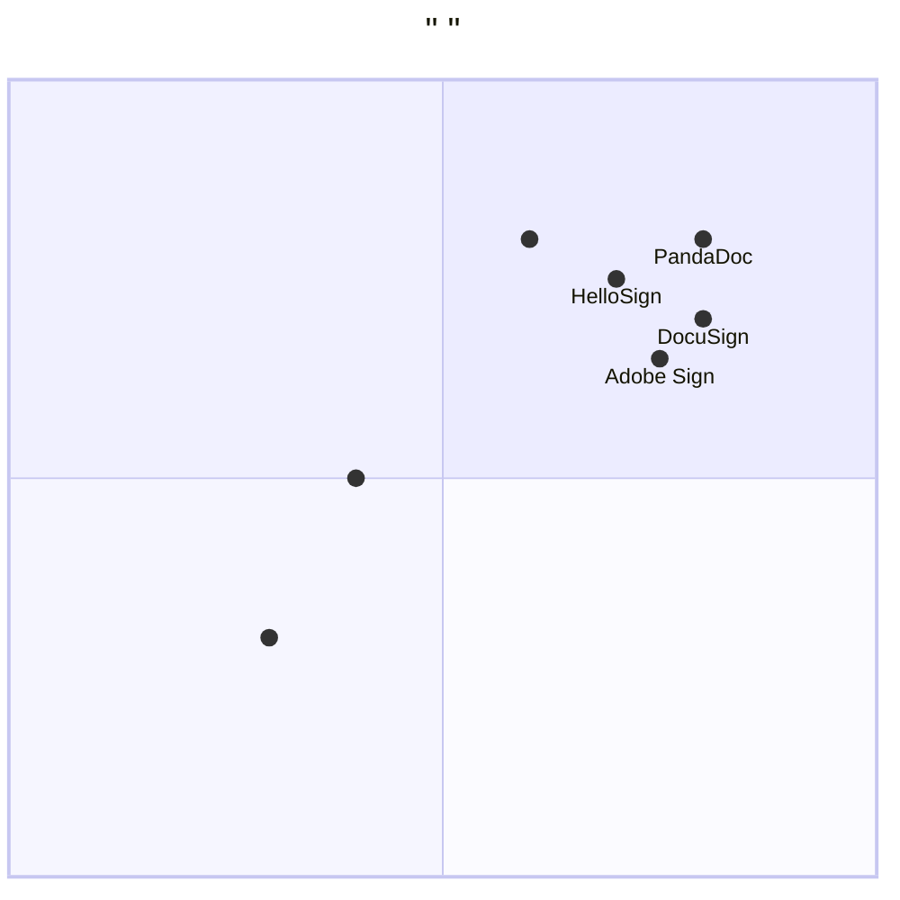

#               （PRD）

##     

###     
                             ，                       。           、                 ，                。

###       
1. **    **：               ，        
2. **    **：          ，       50%  
3. **    **：              70%
4. **    **：                   

###     
- **    **：     ，             
- **    **：     ，         
- **     **：         

###     
- **       **：>90%
- **       **：>99.5%
- **      **：<3  /  
- **       **：>95%

###      
- **   **：16 
- **    **：8 
- **    **：4 
- **    **：4 

###     
- **    **：         30  
- **    **：            
- **    **：         ，      
## 1.        

### 1.1   
-     ：  （         ）
-     ：Java（      ）

### 1.2     
-     ：convention_request_management_system
-    ：
  -   ：Java Spring Boot
  -   ：React（  ，    Web  ）
  -    ：PostgreSQL/MySQL
  -   ：Spring Security
  - API：RESTful API

### 1.3       

**    ：** ConventionRequest
**  ：**       （  ）           
**   ：**       （   ）
**    ：**               
**    ：**
1.             
2.              
3.              
4.               。          ，      Errored
5.     
6.         
**    ：**
-          
-           
-  ETOUR        

**    ：**
1.   Java
2.         
3.            
4.       ，     

## 2.     

### 2.1     

**  1：        **
            、     ，                ，           。

**  2：           **
                    、  ，                   。

**  3：           **
                ，                             。

### 2.2     

**  1：      **
       ，                ，                。

**  2：       **
       ，                      ，            。

**  3：      **
       ，                                ，        。

**  4：      **
       ，                      ，        。

**  5：      **
       ，                 ，          。

### 2.3     

#### 2.3.1         

**1. DocuSign（      ）**
**  ：**
-      ，      
-               
-    API    
-         
**  ：**
-     ，        
-       ，      
-               

**2. Adobe Sign（Adobe    ）**
**  ：**
-  Adobe      
-          
-           
-        
**  ：**
-       
-         
-          

**3. HelloSign（Dropbox  ）**
**  ：**
-        
-  Dropbox    
-       
-         
**  ：**
-       
-          
-          

**4. PandaDoc（       ）**
**  ：**
-           
-           
-          
-        
**  ：**
-         
-           
-       

**5.       **
**  ：**
-       
-       
-       
**  ：**
-     ，     
-        
-        
-        

**6.         **
**  ：**
-     
-     
-      
**  ：**
-         
-      
-       
-       

#### 2.3.2       

**     ：**
1. **       **：           ，             
2. **      **：          ，        
3. **      **：        ，               
4. **       **：                

**        ：**
1. **    **：         ，        
2. **    **：      ，      
3. **    **：           
4. **     **：            

### 2.4      

**      ：**
- **    （    ）**：           ，      
- **    （    ）**：           ，        
- **    （    ）**：        ，     
- **    （    ）**：          ，      

## 3.     

### 3.1     

**    ：**
1.          
2.         
3.       
4.        
5.       
6.         

**     ：**
1.     ：    <2 ，  <3 
2.    ：99.5%      
3.    ：        
4.     ：  1000+    

### 3.2    

**P0（    ）：**
1.          
2.       UI
3.       
4.        
5.       

**P1（    ）：**
1.       
2.         
3.      
4.      

**P2（    ）：**
1.       
2.       
3. API    
4.        

### 3.3 UI    

**     ：**
1.      ：    、    
2.     ：   、    、  
3.     ：      

**        ：**
1.       
2.       
3.       
4.      
5.     
6.     

### 3.4     

1.     ETOUR          
2.               
3.               
4.            
5.          

## 4.     

### 4.1     ：    
-       
-       
-       
-     

### 4.2     ：    
-       
-       
-     

### 4.3     ：    
-     
-     
-     

## 5.     

### 5.1     
-       > 80%
-        < 2 
-       > 99.5%

### 5.2     
-       > 90%
-            50%
-         70%

## 6.       

### 6.1     
**      ：**
1. **   ：** React    
2. **     ：** Spring Boot   
3. **     ：** JPA/Hibernate
4. **     ：** PostgreSQL   
5. **     ：** ETOUR     

### 6.2     
1. **      ：**   Spring Security          
2. **      ：**            
3. **      ：**            
4. **      ：**             
5. **      ：**            

### 6.3     
**    ：**
1. **User（  ）：**        
2. **ConventionRequest（    ）：**       
3. **ConventionForm（    ）：**          
4. **ValidationResult（    ）：**       
5. **RequestHistory（    ）：**          

## 7.     

### 7.1     
1. **ETOUR     ：**            
2. **       ：**            
3. **      ：**           

### 7.2     
1. **       ：**            
2. **     ：**           
3. **    ：**           

### 7.3     
1. **     ：**      ，    
2. **      ：**            
3. **      ：**         

## 8.     

### 8.1     
1. **    ：**         
2. **    ：**        
3. **     ：**         
4. **    ：**        
5. **    ：**        

### 8.2     
1. **    ：** 100%      
2. **      ：**         
3. **      ：**         

## 9.      

### 9.1     （8 ）
-  1-2 ：       
-  3-5 ：      
-  6-7 ：     
-  8 ：    

### 9.2     （4 ）
-  1 ：      
-  2-3 ：         
-  4 ：       

### 9.3     （4 ）
-  1-2 ：    
-  3-4 ：         

## 10.   

### 10.1    
- **ETOUR：**         
- **    ：**            
- **    ：**               
- **    ：**             

### 10.2     
1. Java Spring Boot    
2. React    
3. PostgreSQL     
4. ETOUR      

### 10.3     
1. ISO/IEC 25010      
2. GDPR      
3. WCAG 2.1      

---

*      ：2025-12-27*
*  ：1.0*
*    ：2025-12-27*

**    ：** _________
**  ：** ________________

---

###       
|    |    |      |     |
|------|------|----------|--------|
| 1.0 | 2025-12-27 |        | Alice |
| | | | |
