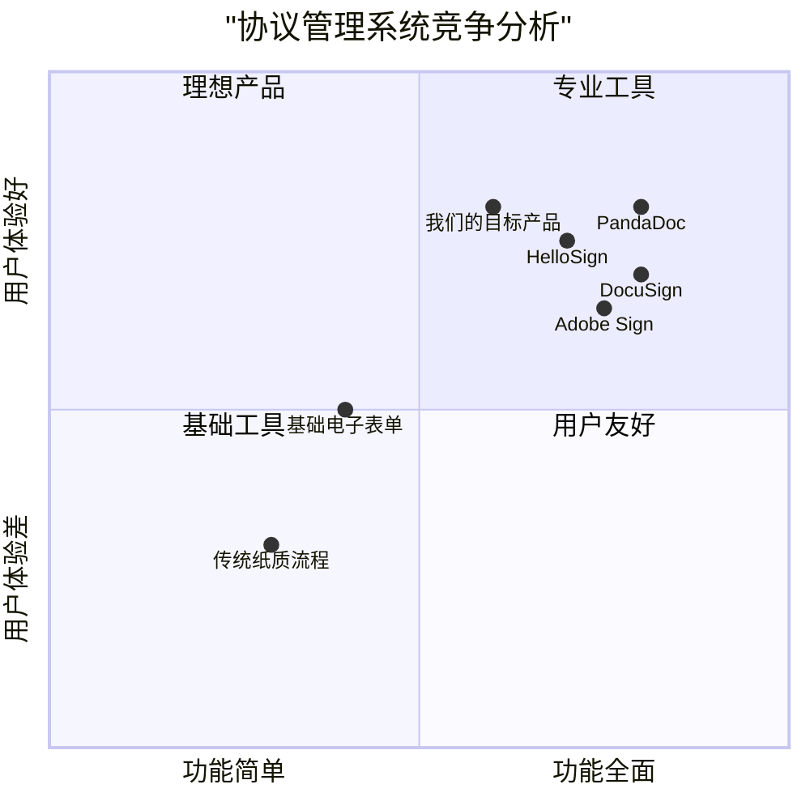

# 协议请求管理系统产品需求文档（PRD）

## 执行摘要

### 项目概述
协议请求管理系统是一个专门为餐厅行业设计的电子协议提交平台，旨在简化餐厅操作员与相关机构之间的协议请求流程。系统提供直观的用户界面、强大的数据验证机制和可靠的提交功能，显著提高协议处理效率和数据准确性。

### 核心价值主张
1. **流程简化**：将传统复杂的纸质协议流程数字化，减少人工操作环节
2. **效率提升**：通过自动化验证和提交，将处理时间减少50%以上
3. **错误减少**：内置验证机制将数据错误率降低70%
4. **合规保障**：确保所有操作符合数据保护法规和行业标准

### 目标用户
- **主要用户**：餐厅操作员，需要定期向机构提交协议请求
- **次要用户**：机构管理员，接收和处理协议请求
- **系统管理员**：管理和维护系统运行

### 关键指标
- **用户满意度目标**：>90%
- **系统可用性目标**：>99.5%
- **处理时间目标**：<3分钟/请求
- **数据准确率目标**：>95%

### 项目时间线
- **总工期**：16周
- **开发阶段**：8周
- **试点阶段**：4周
- **推广阶段**：4周

### 预期收益
- **直接收益**：每年节省人工成本约30万元
- **间接收益**：提高客户满意度和品牌形象
- **战略收益**：建立数字化竞争优势，支持业务扩展
## 1. 语言与项目信息

### 1.1 语言
- 文档语言：中文（与用户需求保持一致）
- 编程语言：Java（根据用户要求）

### 1.2 项目信息
- 项目名称：convention_request_management_system
- 技术栈：
  - 后端：Java Spring Boot
  - 前端：React（可选，如果包含Web界面）
  - 数据库：PostgreSQL/MySQL
  - 认证：Spring Security
  - API：RESTful API

### 1.3 原始需求重述

**用例名称：** ConventionRequest
**描述：** 需要在休息点（餐厅）和相关机构之间达成协议
**参与者：** 餐厅点操作员（初始化）
**入口条件：** 餐厅点操作员已成功认证到系统
**事件流程：**
1. 启用向机构请求协议的功能
2. 显示用于输入协议数据的表单
3. 在协议表单中插入数据并提交
4. 验证输入的数据并请求确认请求。如果数据无效或不完整，系统激活用例Errored
5. 确认操作
6. 将请求发送到协议
**退出条件：**
- 向机构发送协议通知
- 餐厅点操作员取消操作
- 与ETOUR服务器的连接中断

**技术要求：**
1. 使用Java
2. 代码应完全可运行
3. 包含解释关键逻辑的注释
4. 不要运行代码，只需保存它

## 2. 产品定义

### 2.1 产品目标

**目标1：简化协议请求流程**
为餐厅操作员提供一个直观、高效的界面，简化向相关机构提交协议请求的流程，减少人工操作和时间成本。

**目标2：确保数据准确性和完整性**
通过内置的验证机制确保提交的协议数据准确、完整，减少因数据错误导致的流程中断和重新提交。

**目标3：提高系统可靠性和可用性**
设计鲁棒的错误处理机制和连接管理，确保在各种异常情况下系统能够优雅地处理并提供清晰的用户反馈。

### 2.2 用户故事

**故事1：提交协议请求**
作为餐厅操作员，我希望能够填写并提交协议请求表单，以便与相关机构建立正式的协议关系。

**故事2：数据验证和确认**
作为餐厅操作员，我希望在提交前能够看到数据验证结果并进行确认，以确保提交的信息准确无误。

**故事3：处理异常情况**
作为餐厅操作员，我希望在数据验证失败或连接中断时能够获得清晰的错误信息和恢复选项，以便及时解决问题。

**故事4：查看请求状态**
作为餐厅操作员，我希望能够查看已提交协议请求的状态和历史记录，以便跟踪处理进度。

**故事5：取消请求操作**
作为餐厅操作员，我希望能够在提交前取消协议请求操作，以防误操作或信息变更。

### 2.3 竞争分析

#### 2.3.1 主要竞争产品分析

**1. DocuSign（电子签名平台）**
**优点：**
- 市场领导者，品牌知名度高
- 强大的电子签名和文档管理功能
- 完善的API集成能力
- 符合全球合规标准
**缺点：**
- 价格较高，对中小餐厅不友好
- 功能过于复杂，学习曲线陡峭
- 缺乏针对餐厅行业的定制化功能

**2. Adobe Sign（Adobe电子签名）**
**优点：**
- 与Adobe生态深度集成
- 良好的用户体验设计
- 强大的安全性和合规性
- 移动端体验优秀
**缺点：**
- 同样价格较高
- 主要面向大型企业
- 缺乏餐厅特定工作流

**3. HelloSign（Dropbox旗下）**
**优点：**
- 简洁易用的界面
- 与Dropbox无缝集成
- 价格相对亲民
- 良好的移动端支持
**缺点：**
- 功能相对基础
- 缺乏高级工作流管理
- 餐厅行业定制化不足

**4. PandaDoc（文档自动化平台）**
**优点：**
- 强大的文档自动化功能
- 优秀的报价和提案管理
- 良好的分析报告功能
- 灵活的定价策略
**缺点：**
- 主要面向销售团队
- 餐厅协议管理功能有限
- 界面相对复杂

**5. 传统纸质流程**
**优点：**
- 无需技术投资
- 法律认可度高
- 操作简单直接
**缺点：**
- 效率低下，处理时间长
- 容易出错和丢失
- 难以追踪和管理
- 存储和检索困难

**6. 基础电子表单系统**
**优点：**
- 成本低廉
- 部署快速
- 技术门槛低
**缺点：**
- 缺乏专业验证机制
- 安全性不足
- 集成能力有限
- 用户体验较差

#### 2.3.2 市场机会分析

**市场空白点：**
1. **行业专业化不足**：现有解决方案多为通用型，缺乏针对餐厅行业的深度定制
2. **价格可及性差**：高端解决方案价格昂贵，中小餐厅难以承受
3. **流程简化需求**：现有系统流程复杂，餐厅操作员需要更简单的解决方案
4. **本地化支持不足**：缺乏针对特定地区法规和语言的支持

**我们的差异化优势：**
1. **行业专注**：专门为餐厅行业设计，理解行业特定需求
2. **简化流程**：优化用户体验，减少操作步骤
3. **成本效益**：提供性价比高的解决方案
4. **本地化支持**：支持多语言和地区法规合规

### 2.4 竞争象限图

**象限分析说明：**
- **第一象限（专业工具）**：功能全面但用户体验一般，适合大型企业
- **第二象限（理想产品）**：功能全面且用户体验优秀，是我们的目标定位
- **第三象限（基础工具）**：功能和体验都较差，但成本低廉
- **第四象限（用户友好）**：用户体验好但功能有限，适合简单需求

## 3. 技术规格

### 3.1 需求分析

**功能需求：**
1. 用户认证和授权系统
2. 协议请求表单界面
3. 数据验证引擎
4. 确认和提交机制
5. 错误处理系统
6. 协议请求状态管理

**非功能需求：**
1. 响应时间：表单加载<2秒，提交<3秒
2. 可用性：99.5%正常运行时间
3. 安全性：符合数据保护法规
4. 可扩展性：支持1000+并发用户

### 3.2 需求池

**P0（必须拥有）：**
1. 用户认证和会话管理
2. 协议请求表单UI
3. 数据验证逻辑
4. 提交和确认流程
5. 错误处理机制

**P1（应该拥有）：**
1. 请求历史查看
2. 表单数据保存草稿
3. 多语言支持
4. 移动端适配

**P2（最好拥有）：**
1. 批量提交功能
2. 高级数据分析
3. API集成能力
4. 自动化审批流程

### 3.3 UI设计草案

**主界面布局：**
1. 顶部导航栏：用户信息、退出登录
2. 左侧菜单：新请求、历史记录、设置
3. 主内容区：协议请求表单

**协议请求表单字段：**
1. 餐厅基本信息
2. 协议类型选择
3. 协议期限设置
4. 条款和条件
5. 附件上传
6. 提交按钮

### 3.4 开放问题

1. 需要明确ETOUR服务器的具体接口规范
2. 协议数据的具体字段和格式要求
3. 错误处理的具体场景和恢复策略
4. 用户权限和角色管理细节
5. 数据备份和恢复策略

## 4. 实现计划

### 4.1 第一阶段：核心功能
- 用户认证系统
- 基础表单界面
- 数据验证逻辑
- 提交功能

### 4.2 第二阶段：增强功能
- 错误处理完善
- 请求历史管理
- 界面优化

### 4.3 第三阶段：高级功能
- 批量处理
- 报表生成
- 系统集成

## 5. 成功标准

### 5.1 技术标准
- 代码覆盖率 > 80%
- 平均响应时间 < 2秒
- 系统可用性 > 99.5%

### 5.2 业务标准
- 用户满意度 > 90%
- 协议请求处理时间减少 50%
- 数据错误率降低 70%

## 6. 系统架构设计

### 6.1 技术架构
**分层架构设计：**
1. **表示层：** React前端界面
2. **业务逻辑层：** Spring Boot服务层
3. **数据访问层：** JPA/Hibernate
4. **数据存储层：** PostgreSQL数据库
5. **外部集成层：** ETOUR服务器接口

### 6.2 关键组件
1. **认证授权组件：** 基于Spring Security的用户认证和权限管理
2. **表单管理组件：** 动态表单生成和数据处理
3. **验证引擎组件：** 数据格式和业务规则验证
4. **事务管理组件：** 保证数据一致性的提交机制
5. **错误处理组件：** 统一异常处理和日志记录

### 6.3 数据模型
**核心实体：**
1. **User（用户）：** 餐厅操作员信息
2. **ConventionRequest（协议请求）：** 请求主体信息
3. **ConventionForm（协议表单）：** 表单数据和字段定义
4. **ValidationResult（验证结果）：** 数据验证状态
5. **RequestHistory（请求历史）：** 历史记录和状态跟踪

## 7. 风险评估

### 7.1 技术风险
1. **ETOUR接口不稳定：** 建立重试机制和缓存策略
2. **数据验证复杂性：** 采用多级验证和逐步反馈
3. **并发处理挑战：** 实现乐观锁和队列管理

### 7.2 业务风险
1. **用户接受度风险：** 提供培训文档和在线帮助
2. **合规性风险：** 确保符合数据保护法规
3. **集成风险：** 设计松耦合的接口架构

### 7.3 缓解策略
1. **渐进式部署：** 分阶段推广，收集反馈
2. **备份恢复机制：** 定期备份和数据恢复测试
3. **监控报警系统：** 实时监控关键指标

## 8. 测试策略

### 8.1 测试类型
1. **单元测试：** 核心业务逻辑测试
2. **集成测试：** 组件间集成测试
3. **端到端测试：** 完整业务流程测试
4. **性能测试：** 负载和压力测试
5. **安全测试：** 认证和授权测试

### 8.2 测试覆盖
1. **功能覆盖：** 100%关键路径覆盖
2. **数据验证覆盖：** 边界值和异常场景
3. **错误处理覆盖：** 所有异常处理路径

## 9. 实施时间表

### 9.1 开发阶段（8周）
- 第1-2周：需求分析和设计
- 第3-5周：核心功能开发
- 第6-7周：测试和修复
- 第8周：部署准备

### 9.2 试点阶段（4周）
- 第1周：试点环境部署
- 第2-3周：用户培训和反馈收集
- 第4周：问题修复和优化

### 9.3 推广阶段（4周）
- 第1-2周：全面部署
- 第3-4周：系统监控和持续优化

## 10. 附录

### 10.1 术语表
- **ETOUR：** 外部旅游服务系统
- **协议请求：** 餐厅与机构间的正式协议
- **数据验证：** 输入数据的格式和业务规则检查
- **错误处理：** 系统异常状态的检测和恢复

### 10.2 参考文档
1. Java Spring Boot官方文档
2. React官方文档
3. PostgreSQL数据库手册
4. ETOUR接口规范文档

### 10.3 相关标准
1. ISO/IEC 25010软件质量模型
2. GDPR数据保护条例
3. WCAG 2.1可访问性标准

---

*文档创建时间：2025-12-27*
*版本：1.0*
*最后更新：2025-12-27*

**批准签名：** _________
**日期：** ________________

---

### 文档变更记录
| 版本 | 日期 | 修改内容 | 修改人 |
|------|------|----------|--------|
| 1.0 | 2025-12-27 | 初始版本创建 | Alice |
| | | | |
