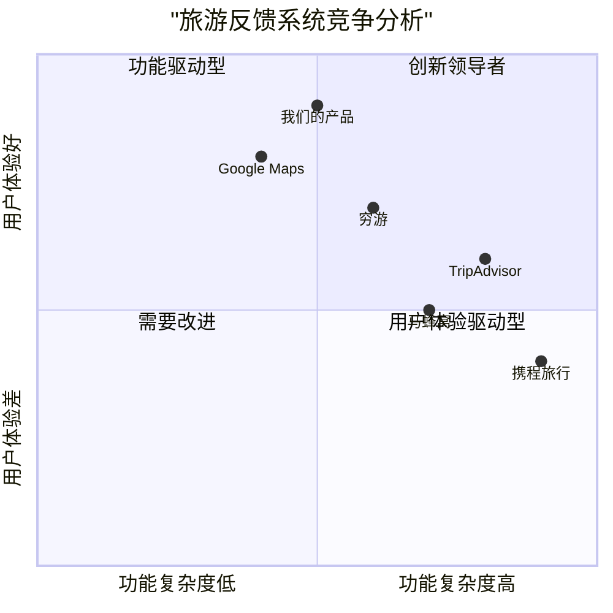

# ViewVisitedSites 产品需求文档 (PRD)

## 1. 语言与项目信息

### 1.1 语言
- **文档语言**: 中文（匹配用户需求）
- **编程语言**: Java（根据用户要求）
- **前端技术**: 如果涉及前端，建议使用Vite + React + MUI + Tailwind CSS

### 1.2 项目信息
- **项目名称**: tourist_feedback_system
- **模块名称**: view_visited_sites
- **版本**: 1.0.0
- **创建日期**: 2025-12-27

### 1.3 原始需求复述
**用例名称**: ViewVisitedSites
**描述**: 查看游客已发布反馈的站点列表
**参与者**: 已成功认证的游客
**入口条件**: 游客已成功认证到系统
**事件流程**:
1. 选择显示个人访问站点列表的功能
2. 上传游客已发布反馈的站点列表
**出口条件**: 系统显示访问过的站点列表
**中断条件**: 到ETOUR服务器的连接中断
**技术要求**: 使用Java，代码需可运行，包含注释，不实际运行只保存

## 2. 产品定义

### 2.1 产品目标

#### 目标1：提升用户体验
**描述**: 为用户提供清晰、直观的访问历史查看功能，帮助游客回顾和管理自己的旅行反馈记录。
**衡量指标**: 
- 用户满意度评分 ≥ 4.5/5
- 页面加载时间 ≤ 3秒
- 功能使用率 ≥ 70%

#### 目标2：增强数据价值
**描述**: 通过整理和展示用户的反馈历史，挖掘用户行为数据，为旅游推荐系统提供数据支持。
**衡量指标**:
- 数据完整度 ≥ 95%
- 数据准确率 ≥ 98%
- 数据可追溯性 = 100%

#### 目标3：优化系统性能
**描述**: 确保功能在高并发场景下的稳定性和响应速度，提供可靠的服务体验。
**衡量指标**:
- 系统可用性 ≥ 99.9%
- 平均响应时间 ≤ 2秒
- 错误率 ≤ 0.1%

### 2.2 用户故事

#### 用户故事1：快速查看历史记录
**作为** 一个经常旅行的游客，
**我想要** 快速查看我之前访问过并留下反馈的景点列表，
**以便于** 我可以回忆起这些地方的体验，并为未来的旅行计划做参考。

**验收标准**:
- 用户登录后能立即看到访问记录入口
- 列表加载时间不超过3秒
- 每条记录包含景点名称、访问时间、评分和评论
- 支持按时间排序

#### 用户故事2：分享旅行经历
**作为** 一个喜欢分享的旅行者，
**我想要** 查看我的历史反馈记录，
**以便于** 我可以选择有趣的经历分享到社交媒体，或者推荐给朋友。

**验收标准**:
- 支持一键分享功能
- 提供美观的分享卡片模板
- 包含景点图片和用户评论
  - 支持主流社交媒体平台

#### 用户故事3：管理个人足迹
**作为** 一个注重个人数据的用户，
**我想要** 查看和管理我的旅行足迹记录，
**以便于** 我可以了解自己的旅行偏好，发现潜在的兴趣点。

**验收标准**:
- 提供数据统计视图（如访问次数最多的景点）
- 支持导出个人数据
- 提供隐私设置选项
- 支持数据纠正和更新

#### 用户故事4：规划未来旅行
**作为** 一个正在规划下一次旅行的游客，
**我想要** 回顾我之前去过的地方和我的评价，
**以便于** 我可以决定是否要再次访问，或者寻找类似的目的地。

**验收标准**:
- 提供搜索和筛选功能
- 支持地图视图展示
- 提供相似景点推荐
- 支持创建旅行清单

### 2.3 竞品分析

#### 竞品1：TripAdvisor（猫途鹰）
**优势**:
- 全球最大的旅游社区平台
- 海量的用户评价和照片
- 完善的景点分类和搜索系统
- 移动端体验优秀

**劣势**:
- 界面信息过载，不够简洁
- 个性化推荐不够精准
- 社交功能相对薄弱
- 数据隐私关注度不够

#### 竞品2：Google Maps 地点评价
**优势**:
- 与地图深度集成
- 用户基数巨大
- 数据准确性高
- 多语言支持完善

**劣势**:
- 旅游专业功能较少
- 社区互动性不足
 - 个性化功能有限
- 旅游规划工具不完善

#### 竞品3：马蜂窝
**优势**:
- 专注于中国出境游市场
- 内容质量较高
- 社区氛围良好
- 旅游攻略详细

**劣势**:
- 国际化程度有限
- 技术体验有待提升
- 数据可视化不足
- 移动端性能优化不够

#### 竞品4：携程旅行
**优势**:
- 一站式旅游服务平台
- 强大的预订功能
- 用户评价系统完善
- 数据覆盖全面

**劣势**:
- 功能过于复杂
- 用户体验不够简洁
- 社交属性较弱
- 个性化推荐精度一般

#### 竞品5：穷游
**优势**:
- 专注于自由行用户
2. 社区内容质量高
- 工具属性强
- 用户忠诚度高

**劣势**:
- 用户规模相对较小
- 商业化程度不足
- 技术更新较慢
- 国际化程度有限

### 2.4 竞争象限图



**象限分析**:
1. **创新领导者（第一象限）**: 功能丰富且用户体验优秀
2. **功能驱动型（第二象限）**: 功能丰富但用户体验有待提升
3. **需要改进（第三象限）**: 功能和体验都需要提升
4. **用户体验驱动型（第四象限）**: 用户体验优秀但功能相对简洁

## 3. 技术规格

### 3.1 需求分析

#### 3.1.1 功能需求
**必须实现的功能**:
1. 用户认证验证系统
2. 用户反馈数据查询接口
3. 站点信息关联查询
4. 数据列表展示功能
5. 错误处理和异常管理

**应该实现的功能**:
1. 数据分页功能
2. 搜索和筛选功能
3. 排序功能（按时间、评分等）
4. 数据导出功能
5. 缓存机制优化

**可以实现的增强功能**:
1. 数据可视化展示
2. 社交分享功能
3. 个性化推荐
4. 移动端优化
5. 离线访问支持

#### 3.1.2 非功能需求
**性能需求**:
- 页面加载时间 ≤ 3秒
- 并发用户支持 ≥ 1000
- 数据库查询响应 ≤ 1秒
- API响应时间 ≤ 500ms

**安全需求**:
- 用户认证必须使用JWT
- 数据传输必须加密
- 防止SQL注入攻击
- 访问权限控制

**可用性需求**:
- 界面符合WCAG 2.1标准
- 支持主流浏览器
- 移动端适配
- 多语言支持

### 3.2 需求池

#### P0（必须实现）
1. **P0-001**: 用户认证验证机制
   - 描述：验证用户是否已成功登录
   - 优先级：必须
   - 验收标准：未登录用户无法访问功能

2. **P0-002**: 反馈数据查询功能
   - 描述：查询指定用户的所有反馈记录
   - 优先级：必须
   - 验收标准：返回正确的反馈数据

3. **P0-003**: 站点信息关联查询
   - 描述：根据反馈记录关联查询站点信息
   - 优先级：必须
   - 验收标准：返回完整的站点信息

4. **P0-004**: 数据列表展示
   - 描述：以列表形式展示访问过的站点
   - 优先级：必须
   - 验收标准：界面清晰，数据完整

5. **P0-005**: 错误处理机制
   - 描述：处理各种异常情况
   - 优先级：必须
   - 验收标准：系统不会崩溃，提供友好的错误提示

#### P1（应该实现）
1. **P1-001**: 数据分页功能
   - 描述：支持大量数据的分页显示
   - 优先级：重要
   - 验收标准：每页显示合理数量的数据

2. **P1-002**: 搜索和筛选功能
   - 描述：支持按站点名称、时间等条件筛选
   - 优先级：重要
   - 验收标准：搜索结果准确

3. **P1-003**: 排序功能
   - 描述：支持按时间、评分等排序
   - 优先级：重要
   - 验收标准：排序结果正确

4. **P1-004**: 数据导出功能
   - 描述：支持导出为CSV或PDF格式
   - 优先级：重要
   - 验收标准：导出数据完整准确

#### P2（可以实现）
1. **P2-001**: 数据可视化
   - 描述：提供图表展示统计数据
   - 优先级：可选
   - 验收标准：图表清晰美观

2. **P2-002**: 社交分享功能
   - 描述：支持分享到社交媒体
   - 优先级：可选
   - 验收标准：分享功能正常

3. **P2-003**: 个性化推荐
   - 描述：基于历史记录推荐相似景点
   - 优先级：可选
   - 验收标准：推荐准确度≥70%

### 3.3 UI设计草案

#### 3.3.1 页面布局
```
┌─────────────────────────────────────────────────────┐
│ 头部导航栏                                          │
│  Logo | 首页 | 我的足迹 | 设置 | 用户名 ▼          │
├─────────────────────────────────────────────────────┤
│                                                     │
│  【页面标题】我的访问记录                           │
│                                                     │
│  ┌─────────────────────────────────────────────┐   │
│  │ 搜索框 [搜索...]     排序: ▼ 时间  ▼ 评分    │   │
│  └─────────────────────────────────────────────┘   │
│                                                     │
│  ┌─────────────────────────────────────────────┐   │
│  │  ○ 埃菲尔铁塔                               │   │
│  │     访问时间: 2024-01-15                    │   │
│  │     评分: ★★★★★ (5.0)                       │   │
│  │     评论: 非常棒的体验！                     │   │
│  │     [查看详情] [分享]                        │   │
│  │                                              │   │
│  │  ○ 卢浮宫                                    │   │
│  │     访问时间: 2024-01-16                    │   │
│  │     评分: ★★★★☆ (4.0)                       │   │
│  │     评论: 艺术品很丰富                       │   │
│  │     [查看详情] [分享]                        │   │
│  │                                              │   │
│  │  ○ 凯旋门                                    │   │
│  │     访问时间: 2024-01-17                    │   │
│  │     评分: ★★★★☆ (4.5)                       │   │
│  │     评论: 历史感很强                         │   │
│  │     [查看详情] [分享]                        │   │
│  └─────────────────────────────────────────────┘   │
│                                                     │
│  【分页控件】 上一页 1 2 3 ... 10 下一页           │
│                                                     │
│  【操作按钮】 [导出CSV] [导出PDF] [刷新]          │
│                                                     │
└─────────────────────────────────────────────────────┘
```

#### 3.3.2 设计规范
1. **色彩方案**:
   - 主色调: #1890FF（蓝色系）
   - 辅助色: #52C41A（绿色系）
   - 背景色: #FFFFFF（白色）
   - 文字色: #000000（黑色）/#595959（深灰）

2. **字体规范**:
   - 标题: 16px, 600 weight
   - 正文: 14px, 400 weight
   - 辅助文字: 12px, 400 weight

3. **间距规范**:
   - 大间距: 24px
   - 中间距: 16px
   - 小间距: 8px
   - 微小间距: 4px

### 3.4 开放问题

#### 问题1：数据同步机制
**问题描述**: 当ETOUR服务器连接中断时，如何处理数据同步？
**影响范围**: 数据一致性和用户体验
**建议方案**:
1. 实现本地缓存机制
2. 提供离线访问模式
3. 设计数据同步冲突解决策略

#### 问题2：隐私保护级别
**问题描述**: 用户访问记录包含哪些敏感信息？如何保护用户隐私？
**影响范围**: 用户信任和法律合规
**建议方案**:
1. 明确隐私政策
2. 提供隐私设置选项
3. 实施数据加密存储
4. 定期安全审计

#### 问题3：国际化支持
**问题描述**: 是否支持多语言和多地区？
**影响范围**: 用户覆盖范围
**建议方案**:
1. 支持中英文界面
2. 考虑时区处理
3. 本地化内容适配

#### 问题4：性能优化策略
**问题描述**: 如何应对大量用户同时访问？
**影响范围**: 系统稳定性和用户体验
**建议方案**:
1. 数据库读写分离
2. 引入缓存层
3. 实施负载均衡
4. 定期性能测试

## 4. 实施建议

### 4.1 开发阶段划分
**第一阶段（MVP）**: 实现P0需求
- 预计时间: 2-3周
- 交付物: 基础功能版本
- 重点: 功能完整性和稳定性

**第二阶段（增强功能）**: 实现P1需求
- 预计时间: 3-4周
- 交付物: 功能增强版本
- 重点: 用户体验优化

**第三阶段（扩展功能）**: 实现P2需求
- 预计时间: 4-6周
- 交付物: 完整产品版本
- 重点: 创新功能和差异化竞争

### 4.2 技术选型建议
1. **后端框架**: Spring Boot 3.1+
2. **数据库**: PostgreSQL 15+
3. **缓存**: Redis 7.0+
4. **API文档**: OpenAPI 3.0
5. **测试框架**: JUnit 5, Mockito
6. **构建工具**: Maven 3.9+

### 4.3 质量保证措施
1. **代码质量**: SonarQube静态分析
2. **自动化测试**: CI/CD流水线
3. **性能监控**: Prometheus + Grafana
4. **日志管理**: ELK Stack
5. **安全扫描**: OWASP依赖检查

## 5. 成功指标

### 5.1 业务指标
1. **用户采用率**: 目标 ≥ 60%
2. **功能使用频率**: 目标 ≥ 每周1次/用户
3. **用户满意度**: 目标 ≥ 4.5/5
4. **用户留存率**: 目标 ≥ 80%（30天）

### 5.2 技术指标
1. **系统可用性**: 目标 ≥ 99.9%
2. **平均响应时间**: 目标 ≤ 2秒
3. **错误率**: 目标 ≤ 0.1%
