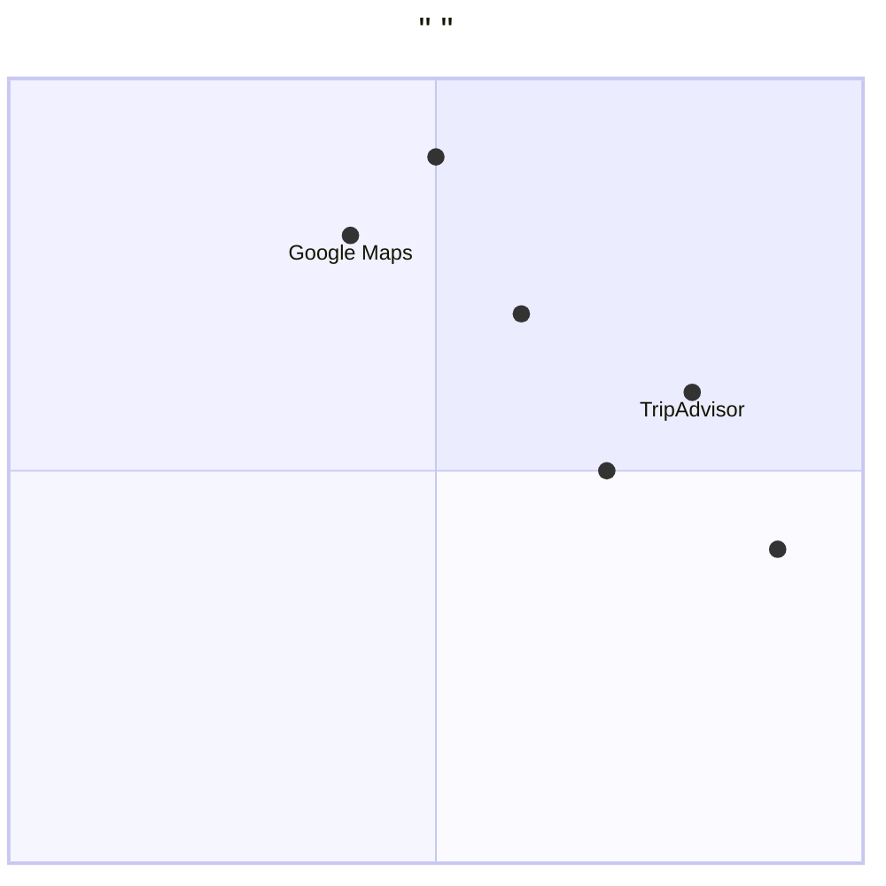

# ViewVisitedSites        (PRD)

## 1.        

### 1.1   
- **    **:   （      ）
- **    **: Java（      ）
- **    **:       ，    Vite + React + MUI + Tailwind CSS

### 1.2     
- **    **: tourist_feedback_system
- **    **: view_visited_sites
- **  **: 1.0.0
- **    **: 2025-12-27

### 1.3       
**    **: ViewVisitedSites
**  **:               
**   **:         
**    **:           
**    **:
1.                
2.               
**    **:             
**    **:  ETOUR        
**    **:   Java，      ，    ，        

## 2.     

### 2.1     

####   1：      
**  **:        、           ，                  。
**    **: 
-         ≥ 4.5/5
-        ≤ 3 
-       ≥ 70%

####   2：      
**  **:               ，        ，             。
**    **:
-       ≥ 95%
-       ≥ 98%
-        = 100%

####   3：      
**  **:                     ，         。
**    **:
-       ≥ 99.9%
-        ≤ 2 
-     ≤ 0.1%

### 2.2     

####     1：        
**  **          ，
**   **                     ，
**   **              ，            。

**    **:
-                 
-          3 
-           、    、     
-        

####     2：      
**  **           ，
**   **           ，
**   **                  ，       。

**    **:
-         
-            
-            
  -           

####     3：      
**  **            ，
**   **              ，
**   **             ，        。

**    **:
-         （          ）
-         
-         
-          

####     4：      
**  **               ，
**   **                ，
**   **             ，          。

**    **:
-          
-         
-         
-         

### 2.3     

####   1：TripAdvisor（   ）
**  **:
-            
-           
-             
-        

**  **:
-       ，    
-          
-         
-          

####   2：Google Maps     
**  **:
-        
-       
-       
-        

**  **:
-         
-        
 -        
-          

####   3：   
**  **:
-           
-       
-       
-       

**  **:
-        
-         
-        
-          

####   4：    
**  **:
-          
-        
-         
-       

**  **:
-       
-         
-       
-          

####   5：  
**  **:
-         
2.        
-      
-       

**  **:
-         
-        
-       
-        

### 2.4      



**    **:
1. **     （    ）**:            
2. **     （    ）**:              
3. **    （    ）**:           
4. **       （    ）**:              

## 3.     

### 3.1     

#### 3.1.1     
**       **:
1.         
2.           
3.         
4.         
5.          

**       **:
1.       
2.        
3.     （   、   ）
4.       
5.       

**         **:
1.        
2.       
3.      
4.      
5.       

#### 3.1.2      
**    **:
-        ≤ 3 
-        ≥ 1000
-         ≤ 1 
- API     ≤ 500ms

**    **:
-         JWT
-         
-   SQL    
-       

**     **:
-     WCAG 2.1  
-        
-      
-      

### 3.2    

#### P0（    ）
1. **P0-001**:         
   -   ：           
   -    ：  
   -     ：           

2. **P0-002**:         
   -   ：             
   -    ：  
   -     ：         

3. **P0-003**:         
   -   ：              
   -    ：  
   -     ：         

4. **P0-004**:       
   -   ：             
   -    ：  
   -     ：    ，    

5. **P0-005**:       
   -   ：        
   -    ：  
   -     ：      ，         

#### P1（    ）
1. **P1-001**:       
   -   ：           
   -    ：  
   -     ：           

2. **P1-002**:        
   -   ：       、       
   -    ：  
   -     ：      

3. **P1-003**:     
   -   ：     、     
   -    ：  
   -     ：      

4. **P1-004**:       
   -   ：     CSV PDF  
   -    ：  
   -     ：        

#### P2（    ）
1. **P2-001**:      
   -   ：          
   -    ：  
   -     ：      

2. **P2-002**:       
   -   ：         
   -    ：  
   -     ：      

3. **P2-003**:      
   -   ：            
   -    ：  
   -     ：     ≥70%

### 3.3 UI    

#### 3.3.1     
```
┌─────────────────────────────────────────────────────┐
│                                                │
│  Logo |    |      |    |     ▼          │
├─────────────────────────────────────────────────────┤
│                                                     │
│  【    】                                 │
│                                                     │
│  ┌─────────────────────────────────────────────┐   │
│  │     [  ...]       : ▼     ▼       │   │
│  └─────────────────────────────────────────────┘   │
│                                                     │
│  ┌─────────────────────────────────────────────┐   │
│  │  ○                                     │   │
│  │         : 2024-01-15                    │   │
│  │       : ★★★★★ (5.0)                       │   │
│  │       :       ！                     │   │
│  │     [    ] [  ]                        │   │
│  │                                              │   │
│  │  ○                                        │   │
│  │         : 2024-01-16                    │   │
│  │       : ★★★★☆ (4.0)                       │   │
│  │       :                              │   │
│  │     [    ] [  ]                        │   │
│  │                                              │   │
│  │  ○                                        │   │
│  │         : 2024-01-17                    │   │
│  │       : ★★★★☆ (4.5)                       │   │
│  │       :                               │   │
│  │     [    ] [  ]                        │   │
│  └─────────────────────────────────────────────┘   │
│                                                     │
│  【    】     1 2 3 ... 10               │
│                                                     │
│  【    】 [  CSV] [  PDF] [  ]          │
│                                                     │
└─────────────────────────────────────────────────────┘
```

#### 3.3.2     
1. **    **:
   -    : #1890FF（   ）
   -    : #52C41A（   ）
   -    : #FFFFFF（  ）
   -    : #000000（  ）/#595959（  ）

2. **    **:
   -   : 16px, 600 weight
   -   : 14px, 400 weight
   -     : 12px, 400 weight

3. **    **:
   -    : 24px
   -    : 16px
   -    : 8px
   -     : 4px

### 3.4     

####   1：      
**    **:  ETOUR        ，        ？
**    **:           
**    **:
1.         
2.         
3.             

####   2：      
**    **:               ？        ？
**    **:          
**    **:
1.       
2.         
3.         
4.       

####   3：     
**    **:            ？
**    **:       
**    **:
1.        
2.       
3.        

####   4：      
**    **:             ？
**    **:           
**    **:
1.        
2.      
3.       
4.       

## 4.     

### 4.1       
**    （MVP）**:   P0  
-     : 2-3 
-    :       
-   :          

**    （    ）**:   P1  
-     : 3-4 
-    :       
-   :       

**    （    ）**:   P2  
-     : 4-6 
-    :       
-   :           

### 4.2       
1. **    **: Spring Boot 3.1+
2. **   **: PostgreSQL 15+
3. **  **: Redis 7.0+
4. **API  **: OpenAPI 3.0
5. **    **: JUnit 5, Mockito
6. **    **: Maven 3.9+

### 4.3       
1. **    **: SonarQube    
2. **     **: CI/CD   
3. **    **: Prometheus + Grafana
4. **    **: ELK Stack
5. **    **: OWASP    

## 5.     

### 5.1     
1. **     **:    ≥ 60%
2. **      **:    ≥   1 /  
3. **     **:    ≥ 4.5/5
4. **     **:    ≥ 80%（30 ）

### 5.2     
1. **     **:    ≥ 99.9%
2. **      **:    ≤ 2 
3. **   **:    ≤ 0.1%
