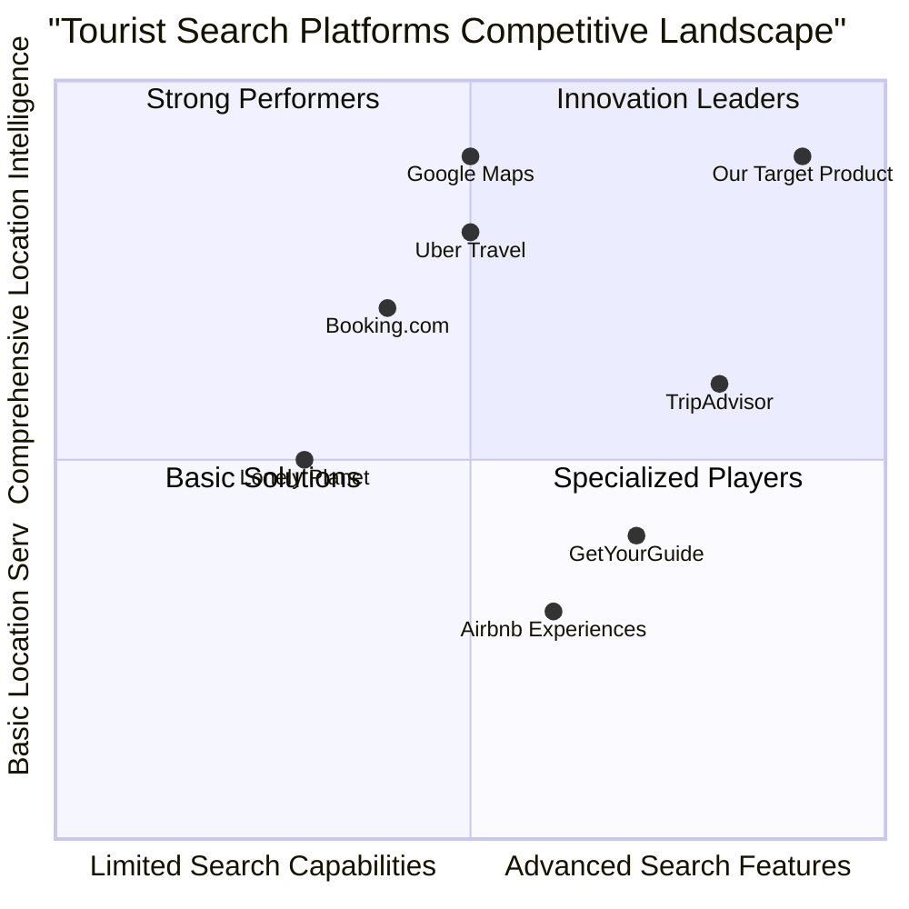

# Product Requirement Document: Advanced Tourist Search System

## 1. Language & Project Info

**Language**: English (matching user requirements)
**Programming Language**: Java (as specified in requirements)
**Project Name**: advanced_tourist_search_system
**Repository Structure**: 
- `/src/main/java/com/tourist/search/` - Main application code
- `/src/test/java/com/tourist/search/` - Test cases
- `/docs/` - Documentation
- `/config/` - Configuration files

### Original Requirements Restatement
Based on the provided use case, we need to develop an Advanced Search system for tourists that allows authenticated users to:
1. Access advanced search functionality from their personal area
2. View and fill an advanced search form
3. Submit search criteria including location-based parameters
4. Receive search results within 15 seconds
5. Handle server connection interruptions gracefully

## 2. Product Definition

### 2.1 Product Goals
1. **Enhanced Discovery Experience**: Enable tourists to find relevant sites and attractions through powerful, multi-criteria search capabilities
2. **Location-Aware Intelligence**: Leverage tourist location data to provide contextually relevant and personalized search results
3. **Performance Optimization**: Ensure all search operations complete within 15 seconds, even with complex queries and large datasets

### 2.2 Target Users
- **Tourists**: Both domestic and international travelers seeking attractions, accommodations, restaurants, and activities
- **Authenticated Users**: Users who have successfully logged into the ETourism system
- **Mobile & Desktop Users**: Accessible across different dev

## 3. User Stories

1. **As an** international tourist visiting a new city, **I want to** filter attractions by category (museums, parks, historical sites), distance from my current location, and opening hours **so that** I can efficiently plan my day and visit relevant sites.
2. **As a** budget-conscious traveler, **I want to** search for attractions with specific price ranges, user ratings above 4 stars, and free entry options **so that** I can maximize my experience while staying within budget.
3. **As a** family tourist with children, **I want to** filter activities by age-appropriateness, accessibility features (wheelchair access), and family-friendly amenities **so that** I can find suitable attractions for all family members.
4. **As a** solo traveler interested in photography, **I want to** search for scenic locations, viewpoints, and photo spots with good lighting conditions and crowd density information **so that** I can capture memorable photographs.
5. **As a** tourist with mobility challenges, **I want to** filter attractions by accessibility features, parking availability, and distance from transportation hubs **so that** I can enjoy the destination comfortably.

(To be continued with competitive analysis, technical specifications, and requirements pool...)

## 4. Competitive Analysis

### 4.1 Key Competitors

1. **TripAdvisor**
   - **Pros**: Massive user base, extensive reviews, comprehensive filtering options, global coverage
   - **Cons**: Complex interface, ad-heavy, limited real-time data, performance can be slow

2. **Google Maps Tourism Features**
   - **Pros**: Excellent location accuracy, real-time data, integration with Google ecosystem
   - **Cons**: Limited advanced filtering, basic search capabilities, less focus on tourism-specific needs

3. **GetYourGuide**
   - **Pros**: Strong focus on tours and activities, booking integration, user-friendly interface
   - **Cons**: Limited to bookable experiences, fewer independent attractions, regional coverage gaps

4. **Lonely Planet Travel Guides**
   - **Pros**: Expert-curated content, detailed destination guides, offline functionality
   - **Cons**: Static content, limited real-time updates, minimal user-generated content

5. **Booking.com Experiences**
   - **Pros**: Strong booking capabilities, integrated with accommodations, user reviews
   - **Cons**: Primarily hotel-focused, limited search customization, commission-based model

6. **Airbnb Experiences**
   - **Pros**: Unique local experiences, strong community aspect, personal hosting
   - **Cons**: Limited traditional attractions, quality consistency issues, availability varies

7. **Uber Travel**
   - **Pros**: Real-time transportation integration, predictive routing, seamless booking
   - **Cons**: Limited attraction database, primarily transportation focused, regional availability

### 4.2 Competitive Quadrant Chart



### 4.3 Market Gaps Identified
- **Performance Optimization**: Most platforms struggle with response times for complex queries
- **Personalization**: Limited ability to combine multiple user preferences into intelligent recommendations
- **Accessibility Focus**: Few platforms offer comprehensive accessibility filtering
- **Real-time Data Integration**: Limited integration of live conditions (crowds, weather, events)
- **Multi-modal Integration**: Minimal connection between search, booking, and transportation

## 5. Technical Specifications

### 5.1 Requirements Analysis

The system requires a comprehensive solution that includes:
1. **Authentication Integration**: Must connect with existing ETourism authentication system
2. **Location Serv**: GPS integration for real-time location awareness
3. **Advanced Search Engine**: Multi-criteria filtering with complex boolean logic
4. **Performance Database**: Optimized for sub-15-second response times
5. **Caching Layer**: Intelligent caching to reduce database load
6. **Error Handling**: Graceful degradation during server interruptions
7. **Mobile Responsiveness**: Support for various device screen sizes

### 5.2 Architecture Overview
- **Frontend**: Responsive web application (React.js with Material-UI)
- **Backend**: Java Spring Boot microserv
- **Database**: PostgreSQL with PostGIS for spatial queries
- **Cache**: Redis for query results and session storage
- **Search Engine**: Elasticsearch for full-text and faceted search
- **APIs**: RESTful design with OpenAPI documentation

### 5.3 UI Design Draft
```
┌─────────────────────────────────────────────────────┐
│               ADVANCED SEARCH PANEL                  │
├─────────────────────────────────────────────────────┤
│                                                      │
│  Location: [▢ Use my current location]              │
│          [_______________ City/Region ___________]  │
│                                                      │
│  Categories:                                        │
│  ▢ Museums    ▢ Parks      ▢ Historical Sites       │
│  ▢ Restaurants ▢ Shopping  ▢ Entertainment          │
│  ▢ Accommodation ▢ Tours   ▢ Natural Attractions    │
│                                                      │
│  Filters:                                           │
│  • Distance:    [0-5km ▾]                           │
│  • Price Range: [$___ to $___]                      │
│  • Rating:      [★★★★☆+]                            │
│  • Open Now:    [▢]                                 │
│  • Accessibility: [▢ Wheelchair ▢ Family ▢ Parking] │
│                                                      │
│  Sort By: [Relevance ▾]                             │
│                                                      │
│  ┌─────────────┐  ┌─────────────┐                  │
│  │   RESET     │  │   SEARCH    │                  │
│  └─────────────┘  └─────────────┘                  │
│                                                      │
├─────────────────────────────────────────────────────┤
│                 SEARCH RESULTS                       │
├─────────────────────────────────────────────────────┤
│  Showing 1-10 of 247 results (0.8 seconds)          │
│                                                      │
│  ── National Museum (4.8★)                          │
│     Distance: 2.3km | Open: 9AM-5PM | $15           │
│     Wheelchair accessible | Family friendly          │
│                                                      │
│  ── Central Park (4.6★)                             │
│     Distance: 1.7km | Open: 24/7 | Free             │
│     Picnic areas | Walking trails                    │
│                                                      │
│  ── Historic Old Town (4.7★)                        │
│     Distance: 3.1km | Guided tours available        │
│     Photo spots | Cultural heritage                  │
│                                                      │
└─────────────────────────────────────────────────────┘
```

### 5.4 Requirements Pool

**P0 - Must-Have (Core Requirements)**
1. User authentication and session management
2. Multi-criteria search form with validation
3. Location-based search (GPS and manual input)
4. Search response time ≤ 15 seconds
5. Server connection error handling
6. Basic filtering (category, distance, price)
7. Results display with pagination

**P1 - Should-Have (Enhanced Features)**
1. Advanced filters (accessibility, ratings, opening hours)
2. Real-time location updates
3. Search history and saved searches
4. Export/search results functionality
5. Multi-language support
6. Responsive mobile design
7. Performance monitoring dashboard

**P2 - Nice-to-Have (Future Enhancements)**
1. AI-powered recommendations
2. Offline search capabilities
3. Integration with booking systems
4. Social sharing features
5. Augmented reality previews
6. Voice search interface
7. Itinerary planning integration

### 5.5 Performance Requirements
- **Search Response Time**: ≤15 seconds for 95th percentile queries
- **System Availability**: 99.5% uptime during peak tourist seasons
- **Concurrent Users**: Support 10,000+ simultaneous authenticated users
- **Data Freshness**: Attraction data updated within 24 hours
- **API Response Time**: ≤2 seconds for all individual API calls
- **Cache Hit Ratio**: ≥80% for common search patterns

## 6. Open Questions

1. **Data Sources**: Should we integrate with third-party APIs (Google Places, TripAdvisor) or maintain our own database?
2. **Location Accuracy**: What level of GPS accuracy is required (city-level vs. street-level)?
3. **Authentication Depth**: Should we implement multi-factor authentication for enhanced security?
4. **Offline Functionality**: Is offline search capability required for areas with poor connectivity?
5. **Real-time Updates**: How frequently should we update attraction data (hourly/daily/weekly)?
6. **Scalability Strategy**: Vertical scaling vs. horizontal scaling for peak tourist seasons?
7. **Legal Compliance**: GDPR and data protection requirements for location data storage?
8. **Pricing Model**: Free service or premium features for enhanced search capabilities?
9. **Third-party Integrations**: Should we integrate with transportation and booking platforms?
10. **Accessibility Standards**: WCAG compliance level (AA vs. AAA) for the search interface?

## 7. Success Metrics

### 7.1 Key Performance Indicators
1. **Search Completion Rate**: Percentage of searches that return results within 15 seconds
2. **User Satisfaction Score**: Post-search satisfaction rating (target: ≥4.5/5)
3. **Feature Adoption Rate**: Percentage of authenticated users using advanced search
4. **Error Rate**: System errors per 1,000 search requests (target: <0.1%)
5. **Conversion Rate**: Percentage of searches leading to attraction visits or bookings

### 7.2 Business Impact Metrics
1. **User Retention**: Increased return visits due to improved search experience
2. **Engagement Time**: Average time spent using advanced search features
3. **Revenue Impact**: Direct and indirect revenue from search-driven bookings
4. **Market Penetration**: Increased user base due to superior search capabilities
5. **Competitive Advantage**: Feature parity/superiority compared to key competitors

## 8. Implementation Roadmap

### Phase 1 (Months 1-3): Core Foundation
- Backend Java Spring Boot application
- Basic search form and results display
- Authentication integration
- Performance benchmarking

### Phase 2 (Months 4-6): Enhanced Features
- Advanced filtering capabilities
- Location-based optimizations
- Mobile responsive design
- Performance optimizations

### Phase 3 (Months 7-9): Advanced Capabilities
- AI recommendations engine
- Offline functionality
- Third-party integrations
- Extensive testing and optimization

### Phase 4 (Months 10-12): Scaling and Expansion
- Multi-language support
- Enhanced accessibility features
- Global scaling infrastructure
- Advanced analytics dashboard

---
*PRD Version: 1.0 | Created: 2025-03-15 | Last Updated: 2025-03-15*
*Product Manager: Alice | Technical Lead: Engineering Team*
