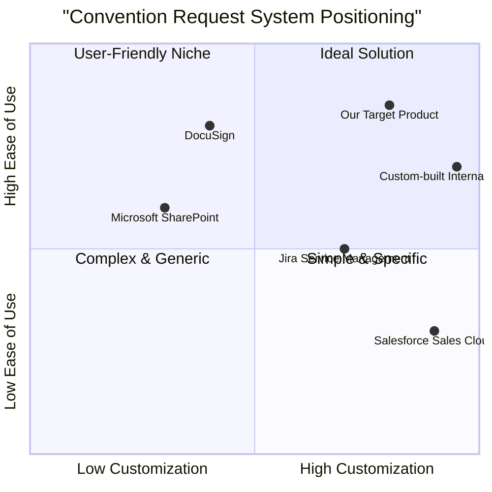

# Product Requirement Document: ConventionRequest

## 1. Language & Project Info

*   **Language**: English
*   **Programming Language**: Java
*   **Project Name**: convention_request
*   **Original Requirements**: Based on the provided use case, create a system to manage convention requests between points of rest and agencies. The system should allow a Point Of Restaurant Operator to initiate, fill out, confirm, and send a convention request to an agency, handling data validation and potential cancellations or connection interruptions.

## 2. Product Definition

### 2.1 Product Goals

1.  **Streamline Convention Request Process**: Enable Point Of Restaurant Operators to efficiently initiate and submit convention requests to agencies, reducing manual effort and potential errors.
2.  **Ensure Data Integrity and Validation**: Implement robust data validation to ensure that all convention request data is accurate and complete before submission, minimizing rejections due to insufficient information.
3.  **Provide Clear Communication and Status Updates**: Offer clear notifications regarding the status of convention requests, including successful submissions, cancellations, and system interruptions, to keep operators informed.

### 2.2 User Stories

*   **As a Point Of Restaurant Operator**, I want to enable the functionality to request a Convention to the Agency, so that I can initiate the process of forming an agreement.
*   **As a Point Of Restaurant Operator**, I want to see a form for entering Convention data, so that I can easily input all necessary information for the agreement.
*   **As a Point Of Restaurant Operator**, I want the system to verify my entered data and ask for confirmation, so that I can ensure accuracy before sending the request.
*   **As a Point Of Restaurant Operator**, I want to receive a notification about the call for the Convention to the Agency upon successful submission, so that I know my request has been sent.
*   **As a Point Of Restaurant Operator**, I want to be able to cancel the operation at any point before confirmation, so that I have control over the request process.

### 2.3 Competitive Analysis

While there isn't a direct "Convention Request" software market, we can analyze similar systems that manage agreements, bookings, or formal requests between entities. These often include CRM systems with contract management, booking platforms, or internal workflow management tools.

1.  **Salesforce Sales Cloud (CRM with Contract Management)**
    *   **Pros**: Comprehensive CRM features, robust contract management, highly customizable, extensive integration capabilities.
    *   **Cons**: High cost, complex setup, steep learning curve, potentially overkill for simple convention requests.
2.  **DocuSign (E-signature and Agreement Cloud)**
    *   **Pros**: Excellent for secure e-signatures, workflow automation for agreements, legally binding, user-friendly interface.
    *   **Cons**: Primarily focused on signing, less on initial request generation and data validation, may require integration with other systems for full functionality.
3.  **Jira Service Management (ITSM/Workflow Management)**
    *   **Pros**: Highly configurable workflows, good for tracking requests and approvals, integrates with other Atlassian products, strong reporting.
    *   **Cons**: Can be complex to set up for non-IT processes, may require significant customization for specific convention request forms, not designed for external agency interaction out-of-the-box.
4.  **Microsoft SharePoint (Document Management & Collaboration)**
    *   **Pros**: Good for document storage and sharing, basic workflow capabilities, integrates with Microsoft Office suite, familiar to many users.
    *   **Cons**: Workflows can be clunky, less intuitive for structured data entry and validation, not a dedicated request management system.
5.  **Custom-built Internal Systems (Hypothetical)**
    *   **Pros**: Perfectly tailored to specific business needs, full control over features and integrations.
    *   **Cons**: High development and maintenance costs, long development cycles, potential for bugs and security vulnerabilities if not professionally built.

### 2.4 Competitive Quadrant Chart

## 3. Technical Specifications

### 3.1 Requirements Analysis

The system needs to provide a user-friendly interface for the Point Of Restaurant Operator to initiate and manage convention requests. Key technical considerations include:

*   **User Interface (UI)**: A web-based or desktop application (given Java context) with clear navigation and form elements.
*   **Data Input and Validation**: Robust client-side and server-side validation for all form fields to ensure data quality. This includes checking for completeness, correct data types, and business rule adherence.
*   **Backend Logic**: A Java-based backend to handle request processing, data storage, communication with the agency system, and error handling.
*   **Database**: A relational database to store convention request details, operator information, and agency data.
*   **Integration**: Potential integration with an external agency system (ETOUR) for sending the final convention request. This implies API communication (e.g., RESTful serv).
*   **Error Handling**: Mechanisms to gracefully handle invalid/insufficient data (activating 'Errored' use case), connection interruptions (e.g., to ETOUR server), and other system failures.
*   **Security**: Authentication for operators (entry condition) and secure data transmission.
*   **Notifications**: System-generated notifications to inform operators about the status of their requests.

### 3.2 Requirements Pool

*   **P0 (Must-have)**:
    *   The system MUST allow authenticated Point Of Restaurant Operators to initiate a new convention request.
    *   The system MUST display a form for entering convention data.
    *   The system MUST perform data validation on all entered convention data (e.g., required fields, data types).
    *   The system MUST prompt the operator for confirmation before sending the request.
    *   The system MUST send the confirmed convention request to the Agency.
    *   The system MUST notify the operator upon successful submission of the convention request.
    *   The system MUST activate the 'Errored' use case if data is invalid or insufficient.
    *   The system MUST allow the operator to cancel the operation at any point before confirmation.
*   **P1 (Should-have)**:
    *   The system SHOULD provide clear error messages for invalid or insufficient data.
    *   The system SHOULD save draft convention requests if the operator cancels or exits before submission.
    *   The system SHOULD provide a mechanism to retry sending a request if there's an interruption to the ETOUR server connection.
    *   The system SHOULD log all convention request activities for auditing purposes.
*   **P2 (Nice-to-have)**:
    *   The system MAY allow operators to view the status of previously submitted convention requests.
    *   The system MAY provide pre-filled data options for common fields to speed up form completion.
    *   The system MAY offer a printable summary of the convention request before submission.

### 3.3 UI Design Draft

**Screen 1: Convention Request Initiation**

*   **Header**: "Convention Request"
*   **Main Content**: A button labeled "Request New Convention" or similar. Possibly a list of past requests if P2 is implemented.
*   **Action**: Click "Request New Convention" to proceed.

**Screen 2: Convention Data Entry Form**

*   **Header**: "New Convention Request Form"
*   **Form Fields**: (Examples - actual fields depend on convention details)
    *   Agency Name (Dropdown/Text Input)
    *   Convention Type (Dropdown)
    *   Start Date (Date Picker)
    *   End Date (Date Picker)
    *   Description (Text Area)
    *   Contact Person (Text Input)
    *   Contact Email (Text Input)
    *   Required Documents (Upload Field - if applicable)
*   **Buttons**: "Submit", "Cancel"
*   **Validation**: Real-time feedback on invalid fields.

**Screen 3: Confirmation Screen**

*   **Header**: "Confirm Convention Request"
*   **Content**: A summary of all entered data for review.
*   **Buttons**: "Confirm and Send", "Edit", "Cancel"

**Screen 4: Submission Status / Notification**

*   **Header**: "Request Status"
*   **Content**: "Your Convention Request has been successfully sent to the Agency." or "Convention Request Failed: [Error Message]. Please try again."
*   **Action**: "Return to Dashboard" or "View Request Details"

**Screen 5: Errored Use Case (Example)**

*   **Header**: "Error: Invalid Data"
*   **Content**: "Some fields contain invalid or insufficient data. Please review the highlighted fields and correct them." (List of specific errors).
*   **Action**: "Go Back to Form"

### 3.4 Open Questions

1.  What specific data fields are required for a "Convention" request? (e.g., duration, terms, participants, financial details).
2.  What is the exact nature of the "Agency involved" and the "ETOUR server"? Is ETOUR a specific external API or a general term for the agency's system?
3.  What are the detailed business rules for data validation (e.g., date ranges, minimum/maximum values, specific formats)?
4.  What is the expected response time from the Agency system (ETOUR) after a request is sent? Is it synchronous or asynchronous?
5.  What are the security requirements for data transmission to the Agency system?
6.  Are there any specific reporting or auditing requirements for convention requests?
7.  What is the desired user experience for handling connection interruptions to the ETOUR server (e.g., automatic retry, manual retry, notification)?
