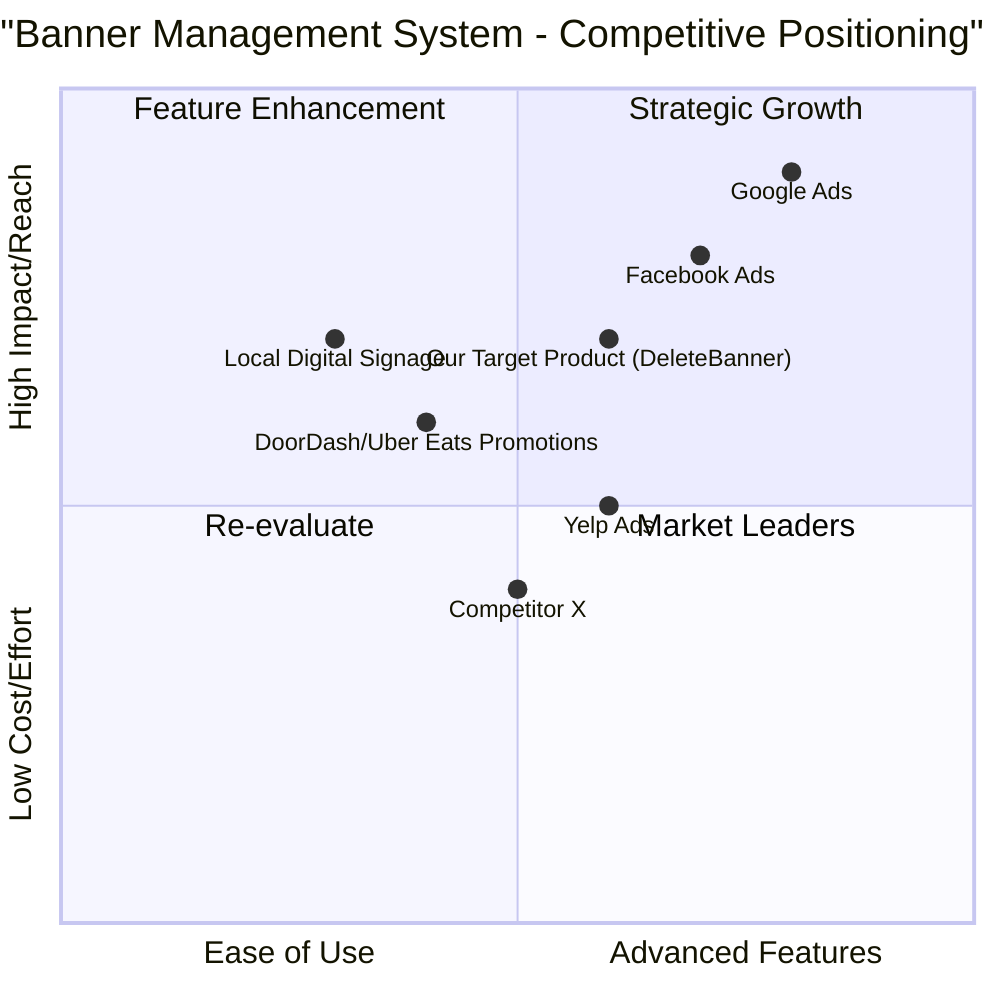

# Product Requirement Document: DeleteBanner Feature

## 1. Language & Project Info

*   **Language:** English
*   **Programming Language:** Java (as per original request, though not directly applicable to PRD content)
*   **Project Name:** banner_management_system

### Original Requirements:
Based on the following use case, create a Product Requirement Document (PRD). Make sure to include all necessary functions, classes, and imports. Ensure the code is correct, efficient, and handles edge cases.

**Use Case: DeleteBanner**
*   **Description:** Delete a banner ad associated with the point of rest.
*   **Participating Actor:** Initialization Operator Point Of Restaurants
*   **Entry conditions:** The Point Of Restaurant Operator has successfully authenticated to the system.
*   **Flow of events User System:**
    1.  Select the feature for removal of the banner.
    2.  View the list of banner associated with the point of rest.
    3.  Select a banner from the list and enter the function of elimination.
    4.  Displays a message confirming the deletion.
    5.  Confirm the operation.
    6.  Removes the banner.
*   **Exit conditions:**
    *   The system shall notify the successful elimination of the selected banner.
    *   The Point Of Operator Restaurant cancels the operation.
    *   Interruption of the connection to the server ETOUR.
*   **Quality requirements:** (Not specified in the original use case, will be inferred or left as TBD)

## 2. Product Definition

### Product Goals:
1.  **Streamline Banner Management:** To provide Point Of Restaurant Operators with an efficient and intuitive way to remove outdated or irrelevant banner ads.
2.  **Ensure Data Integrity:** To guarantee that banner deletions are accurately processed and reflected across the system, preventing orphaned data or display errors.
3.  **Enhance User Control:** To empower operators with clear control over their restaurant's advertising content, improving their overall experience and operational autonomy.

### User Stories:
*   **As a** Point Of Restaurant Operator,
    **I want** to easily find and select a banner for deletion,
    **so that** I can remove outdated promotions quickly.
*   **As a** Point Of Restaurant Operator,
    **I want** to see a confirmation message before a banner is permanently deleted,
    **so that** I can prevent accidental deletions.
*   **As a** Point Of Restaurant Operator,
    **I want** the system to clearly notify me of the success or failure of a banner deletion,
    **so that** I am always aware of the status of my banner management actions.

### Competitive Analysis:

| Product/Platform | Pros | Cons |
| :----------------- | :--- | :--- |
| **Google Ads** | Extensive reach, detailed targeting, robust analytics. | Complex interface, can be expensive, steep learning curve. |
| **Facebook Ads** | Large user base, strong demographic targeting, good for local businesses. | Privacy concerns, ad fatigue, can be less effective for niche markets. |
| **Yelp Ads** | Targets users actively looking for local businesses, good for restaurants. | Limited reach compared to Google/Facebook, higher cost per click. |
| **DoorDash/Uber Eats (Promotions)** | Integrated with food delivery, direct access to customers, easy setup. | Limited customization, dependent on platform's user base, commission fees. |
| **Local Digital Signage Solutions** | High visibility in physical locations, dynamic content. | High initial cost, limited analytics, requires physical installation. |
| **Our Current System (Before DeleteBanner)** | Integrated with existing restaurant operations, tailored for internal use. | Lack of efficient banner removal, potential for clutter and outdated ads. |
| **Competitor X (Hypothetical)** | Simple UI for ad management, quick deletion process. | Limited reporting, basic features. |

### Competitive Quadrant Chart:

## 3. Technical Specifications

### Requirements Analysis:
The `DeleteBanner` feature requires a user interface for selecting banners, a backend service to handle the deletion logic, and a database to store banner information. Authentication of the operator is a prerequisite. The system must handle successful deletions, user cancellations, and server connection interruptions gracefully.

### Requirements Pool:
*   **P0 (Must-have):**
    *   The system MUST allow authenticated Point Of Restaurant Operators to select a banner for deletion.
    *   The system MUST display a list of banners associated with the operator's point of rest.
    *   The system MUST prompt for confirmation before permanently deleting a banner.
    *   The system MUST remove the selected banner from the database and associated display mechanisms upon confirmation.
    *   The system MUST notify the operator of the successful deletion.
    *   The system MUST handle cases where the operator cancels the deletion operation.
*   **P1 (Should-have):**
    *   The system SHOULD provide clear error messages if the deletion fails due to server connection issues (e.g., ETOUR server interruption).
    *   The system SHOULD log all banner deletion activities for auditing purposes.
    *   The system SHOULD refresh the banner list automatically after a successful deletion.
*   **P2 (Nice-to-have):**
    *   The system MAY allow bulk deletion of multiple banners.
    *   The system MAY provide an "undo" option for a short period after deletion.

### UI Design Draft:

**Screen 1: Banner Management Dashboard**
*   **Header:** "Banner Management"
*   **Content:** A table or list displaying active banners. Each row/item includes:
    *   Banner Name/Title
    *   Start Date / End Date
    *   Status (Active/Inactive)
    *   An "Actions" column with buttons like "Edit", "Delete".
*   **Action:** Clicking "Delete" button next to a banner.

**Screen 2: Delete Confirmation Dialog**
*   **Title:** "Confirm Banner Deletion"
*   **Message:** "Are you sure you want to delete the banner '[Banner Name]'? This action cannot be undone."
*   **Buttons:** "Confirm Delete", "Cancel"

**Screen 3: Notification (after action)**
*   **Success:** A toast message or alert: "Banner '[Banner Name]' successfully deleted."
*   **Cancellation:** No specific message, returns to Screen 1.
*   **Error (e.g., ETOUR):** A toast message or alert: "Error: Could not delete banner. Please check your connection and try again." or "Server connection interrupted. Please try again later."

### Open Questions:
*   What specific data points are associated with a banner that need to be deleted (e.g., images, associated campaigns, analytics data)?
*   What are the exact error codes or messages expected from the ETOUR server in case of connection interruption?
*   Is there a requirement for soft deletion (marking as deleted but retaining data) versus hard deletion (permanent removal)?
*   What are the performance requirements for displaying the list of banners (e.g., maximum number of banners, loading time)?
*   Are there any specific security considerations beyond operator authentication for banner deletion?