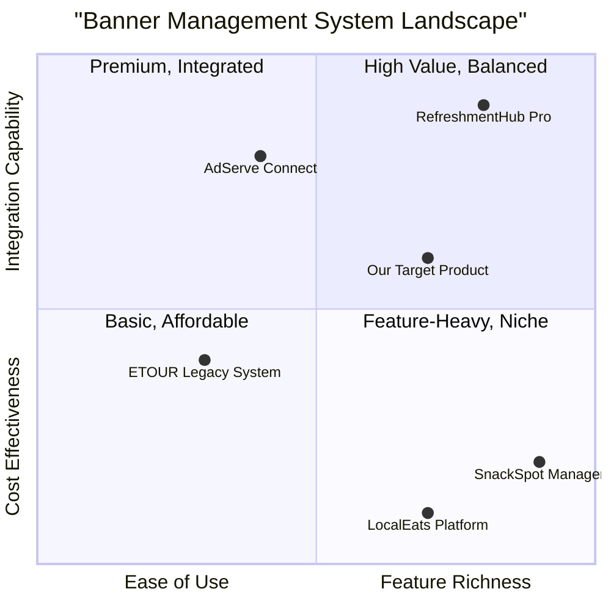

# Product Requirement Document: InsertBanner Use Case

## 1. Language & Project Info
*   **Language:** English
*   **Programming Language:** Java
*   **Project Name:** insert_banner_service
*   **Original Requirements:** Based on the following use case, write a complete program in Java. Make sure to include all necessary functions, classes, and imports. Ensure the code is correct, efficient, and handles edge cases.

    **Use Case:**
    *   **Use case name:** InsertBanner
    *   **Description:** Inserting a new banner associated with a point of rest.
    *   **Participating Actor:** initialization Operator Point Of Restaurants
    *   **Entry conditions:** The Point Of Restaurant Operator has successfully authenticated to the system.
    *   **Flow of events User System:**
        1. Select the feature for the insertion of a new banner.
        2 Displays a form for the selection of an image.
        3 Select an image and sends the request for entering the system.
        4 Check the characteristics of the inserted, check that the number of banner did not exceed the maximum point of the restaurant and asks for confirmation of the insertion of the banner. In the event that the inserted image is not valid, enable the use case Errored.
        5 Confirm the operation of insertion.
        6. Remember the banners associated with the point of rest.
    *   **Exit conditions:**
        *   The notification about the insertion of new banner.
        *   The Point Of Operator Restaurant cancels the operation.
        *   The point of eating has already entered the maximum number of banners allowed.
        *   Interruption of the connection to the server ETOUR.
    *   **Quality requirements:** (Not specified in original request, will assume standard quality pract for Java development)

## 2. Product Definition

### 2.1 Product Goals
1.  **P0: Streamline Banner Management:** To provide the Point Of Restaurant Operator with an efficient and intuitive way to associate promotional banners with points of rest, reducing manual effort and potential errors.
2.  **P1: Ensure Data Integrity and System Stability:** To validate banner characteristics and enforce business rules (e.g., maximum banners per point of rest) to maintain data quality and prevent system overload.
3.  **P2: Enhance User Experience:** To offer clear feedback and error handling mechanisms, guiding the operator through the banner insertion process and providing immediate confirmation or actionable error messages.

### 2.2 User Stories
*   **As a Point Of Restaurant Operator,** I want to select the feature for inserting a new banner **so that** I can add promotional content.
*   **As a Point Of Restaurant Operator,** I want to upload an image for a new banner **so that** I can promote specific offerings at my point of rest.
*   **As a Point Of Restaurant Operator,** I want the system to validate my banner image and check banner limits **so that** I can avoid errors and ensure proper display.
*   **As a Point Of Restaurant Operator,** I want to receive clear confirmation after successfully inserting a banner **so that** I know the operation was completed.
*   **As a Point Of Restaurant Operator,** I want to be notified if a banner insertion fails or is invalid **so that** I can take corrective action.

### 2.3 Competitive Analysis

This section analyzes hypothetical competitors in the refreshment point management and advertising space. Since no specific competitors were mentioned, I will use generic examples.

1.  **"RefreshmentHub Pro" (Advanced Features, Complex UI)**
    *   **Pros:** Extensive customization options for banners, A/B testing capabilities, detailed analytics.
    *   **Cons:** Steep learning curve, expensive, requires significant technical expertise to set up.

2.  **"SnackSpot Manager" (Simple, Limited Functionality)**
    *   **Pros:** Very easy to use, quick setup, low cost.
    *   **Cons:** Only basic banner insertion, no validation beyond file type, limited reporting.

3.  **"AdServe Connect" (Third-Party Integration Focus)**
    *   **Pros:** Integrates with various ad networks, automated banner rotation, dynamic content delivery.
    *   **Cons:** Requires external accounts, less control over direct placement, potential data privacy concerns.

4.  **"LocalEats Platform" (Community-Driven, Basic Ads)**
    *   **Pros:** Strong local community engagement, simple image upload.
    *   **Cons:** Primarily for small businesses, banner features are an afterthought, no advanced management.

5.  **"ETOUR Legacy System" (Current/Internal System)**
    *   **Pros:** Familiarity for existing users, integrated with other ETOUR modules.
    *   **Cons:** Outdated UI, prone to connection interruptions, limited banner validation, difficult to update.

### 2.4 Competitive Quadrant Chart

## 3. Technical Specifications

### 3.1 Requirements Analysis

The `InsertBanner` use case requires a robust backend service to handle image uploads, validate banner properties, manage associations with points of rest, and communicate with a frontend interface. The system must ensure data consistency and provide clear feedback to the Point Of Restaurant Operator. Error handling for invalid images, maximum banner limits, and server connection issues is critical.

**Key Components:**
*   **Frontend Interface:** A web-based or desktop application for the Point Of Restaurant Operator to interact with the system (image selection, form submission, confirmation display).
*   **Backend Service:** A Java application responsible for business logic, data persistence, and communication with external systems (e.g., ETOUR server).
*   **Image Storage:** A mechanism to store uploaded banner images (e.g., file system, cloud storage).
*   **Database:** To store point of rest information, banner metadata, and the association between them.
*   **ETOUR Server Integration:** For fetching points of rest and potentially for final banner deployment/notification.

### 3.2 Requirements Pool

**P0: Must-have**
*   **P0-1:** The system MUST allow a Point Of Restaurant Operator to select the feature for inserting a new banner.
*   **P0-2:** The system MUST provide a mechanism for the Point Of Restaurant Operator to upload an image file for a new banner.
*   **P0-3:** The system MUST validate the uploaded image characteristics (e.g., file type, dimensions, size) before insertion.
*   **P0-4:** The system MUST check if the number of banners did not exceed the maximum for the point of rest.
*   **P0-5:** The system MUST prompt the Point Of Restaurant Operator for confirmation before finalizing the banner insertion.
*   **P0-6:** The system MUST store the banner image and its association with the point of rest.
*   **P0-7:** The system MUST notify the Point Of Restaurant Operator of successful banner insertion.
*   **P0-8:** The system MUST handle cases where the Point Of Restaurant Operator cancels the operation.
*   **P0-9:** The system MUST handle cases where the maximum number of banners for a point of rest has been reached.
*   **P0-10:** The system MUST handle invalid image uploads and enable an 'Errored' state/use case.

**P1: Should-have**
*   **P1-1:** The system SHOULD display a preview of the selected image before upload.
*   **P1-2:** The system SHOULD provide clear error messages for invalid image characteristics.
*   **P1-3:** The system SHOULD allow the Agency Operator to view existing banners associated with a refreshment point.
*   **P1-4:** The system SHOULD log all banner insertion attempts, including successes and failures.
*   **P1-5:** The system SHOULD provide a mechanism to retry banner insertion after a connection interruption.

**P2: Nice-to-have**
*   **P2-1:** The system MAY allow for basic image editing (e.g., cropping, resizing) before upload.
*   **P2-2:** The system MAY support multiple image formats beyond common ones (e.g., WebP).
*   **P2-3:** The system MAY provide a dashboard for Agency Operators to manage all banners across refreshment points.

### 3.3 UI Design Draft (Conceptual)

**Screen 1: Select Feature for New Banner**
*   A main menu or dashboard with an option like "Insert New Banner".

**Screen 2: Insert Banner Form**
*   Display of the selected point of rest's name (if pre-selected, otherwise a selection mechanism).
*   An "Upload Image" button or drag-and-drop area.
*   Image preview area.
*   Display of image validation rules (e.g., "Max size: 2MB, Allowed formats: JPG, PNG").
*   "Submit" and "Cancel" buttons.

**Screen 3: Confirmation/Error Dialog**
*   **Success:** "Banner successfully inserted for [Point of Rest Name]!"
*   **Error (Invalid Image):** "Invalid image. Please check file type, size, and dimensions. [Link to Errored Use Case/Help]"
*   **Error (Max Banners):** "Maximum number of banners reached for [Point of Rest Name]. Please remove an existing banner or contact support."
*   **Error (Connection):** "Connection to ETOUR server interrupted. Please try again later."

### 3.4 Open Questions
*   What are the exact technical specifications for valid banner images (file types, dimensions, max size)?
*   What is the maximum number of banners allowed per point of rest?
*   What is the exact API or communication protocol for interacting with the ETOUR server for banner insertion and notification?
*   How should the 'Errored' use case be triggered and what specific actions should it entail?
*   What are the security requirements for image storage and data transmission?
*   Is there a specific UI framework or design system to adhere to for the frontend?
