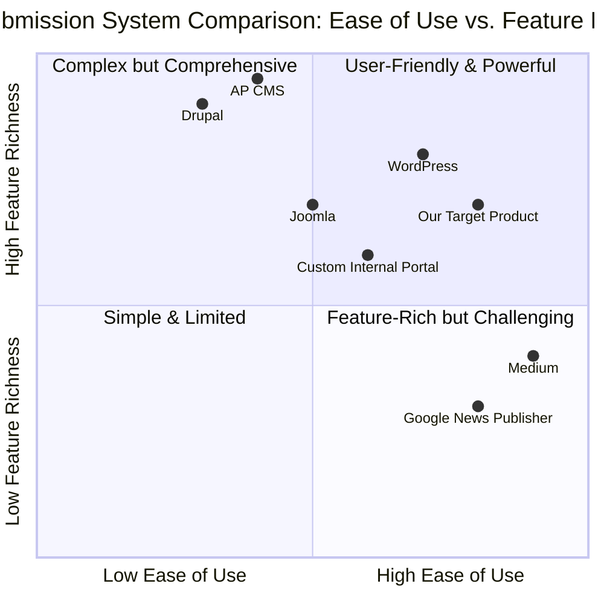

# Product Requirement Document: InsertNews Feature

## 1. Language & Project Info

*   **Language:** English
*   **Programming Language:** Java
*   **Project Name:** news_management_system

### Original Requirements:

Based on the following use case, write a complete program in Java. Make sure to include all necessary functions, classes, and imports. Ensure the code is correct, efficient, and handles edge cases.

**Use Case: InsertNews**
*   **Description:** Inserts a new news in the system.
*   **Participating Actor:** Agency Operator
*   **Entry Conditions:** The agency has logged in.
*   **Flow of Events (User System):**
    1.  Activate the feature to insert a news.
    2.  Displays the corresponding form.
    3.  Fill out the form and submit.
    4.  Verify the data entered and asks for confirmation of the transaction. Where the data is invalid or insufficient, the system activates the use case Errored.
    5.  Confirm the operation of insertion.
    6.  Stores the data of the new news.
*   **Exit Conditions:**
    *   The system shall notify the proper placement of the news.
    *   The Operator Agency cancels the operation.
    *   Interruption of the connection to the server ETOUR.
*   **Quality Requirements:** (Not explicitly defined in the original prompt, will assume standard software quality attributes like reliability, usability, performance, security).

## 2. Product Definition

### 2.1 Product Goals

1.  **Efficiency:** To enable Agency Operators to quickly and efficiently publish news articles with minimal steps and clear feedback.
2.  **Data Integrity:** To ensure that all news data entered into the system is valid, complete, and consistently stored, preventing erroneous or insufficient submissions.
3.  **User Experience:** To provide a clear, intuitive, and robust interface for news submission, including proper error handling and confirmation mechanisms.

### 2.2 User Stories

*   **As an Agency Operator,** I want to activate the news insertion feature **so that** I can begin the process of adding a new news article.
*   **As an Agency Operator,** I want to fill out a form with news details **so that** I can provide all necessary information for the news article.
*   **As an Agency Operator,** I want the system to validate my input **so that** I am informed of any errors or missing information before submission.
*   **As an Agency Operator,** I want to confirm the news insertion **so that** I have a final chance to review before the news is permanently stored.
*   **As an Agency Operator,** I want to receive a confirmation message upon successful news insertion **so that** I know the news has been published correctly.

### 2.3 Competitive Analysis

To understand the landscape of news submission systems, we can look at various content management systems (CMS) and news publishing platforms. While a direct competitor for an internal "InsertNews" feature might not exist, we can draw parallels from public-facing systems.

1.  **WordPress (CMS):**
    *   **Pros:** Highly customizable, extensive plugin ecosystem, widely adopted, user-friendly interface for content creation.
    *   **Cons:** Can be complex to set up and maintain for specific enterprise needs, potential security vulnerabilities if not managed well.
2.  **Joomla (CMS):**
    *   **Pros:** Powerful content management capabilities, good for structured content, strong access control features.
    *   **Cons:** Steeper learning curve than WordPress, less intuitive for basic users.
3.  **Drupal (CMS):**
    *   **Pros:** Enterprise-grade security and scalability, robust for complex data models and large sites.
    *   **Cons:** Requires significant technical expertise, higher development costs.
4.  **Medium (Publishing Platform):**
    *   **Pros:** Extremely simple and clean interface for writing and publishing, focus on content readability.
    *   **Cons:** Limited customization, not designed for internal agency operations or complex data structures.
5.  **Custom Internal News Portals:**
    *   **Pros:** Tailored exactly to agency needs, full control over features and security.
    *   **Cons:** High initial development cost, ongoing maintenance burden, can lack advanced features found in off-the-shelf solutions.
6.  **Google News Publisher Center:**
    *   **Pros:** Direct submission to Google News, broad reach, analytics.
    *   **Cons:** Strict content guidelines, not a full CMS, primarily for distribution rather than content creation.
7.  **Associated Press (AP) Content Management System:**
    *   **Pros:** Designed for professional news agencies, robust editorial workflows, high reliability.
    *   **Cons:** Proprietary, likely very expensive, not publicly available for detailed analysis.

### 2.4 Competitive Quadrant Chart



## 3. Technical Specifications

### 3.1 Requirements Analysis

The `InsertNews` feature requires a robust backend to handle data persistence, validation, and transaction management, coupled with a user-friendly frontend for data input. The system must ensure data integrity and provide clear feedback to the Agency Operator at each step of the news insertion process. Error handling for invalid or insufficient data is critical, leading to an `Errored` state, and the system must also gracefully handle cancellations and connection interruptions.

**Key Technical Considerations:**

*   **Frontend (UI):** A form-based interface for news input, including fields for title, content, author, publication date, categories, etc. Real-time validation feedback is desirable.
*   **Backend (API/Service):** An endpoint to receive news submissions, perform server-side validation, interact with the database, and manage transactions.
*   **Database:** A relational database (e.g., PostgreSQL, MySQL) to store news articles, ensuring atomicity, consistency, isolation, and durability (ACID properties).
*   **Error Handling:** A dedicated mechanism to capture, log, and respond to validation errors, database errors, and network issues.
*   **Security:** Authentication and authorization for Agency Operators, input sanitization to prevent injection attacks.
*   **Concurrency:** Handling multiple simultaneous news submissions without data corruption.

### 3.2 Requirements Pool

*   **P0 (Must-have):**
    *   The system MUST provide a form for news input.
    *   The system MUST validate all submitted news data (e.g., required fields, data types, length constraints).
    *   The system MUST prevent the insertion of invalid or insufficient data.
    *   The system MUST store valid news data persistently in a database.
    *   The system MUST notify the Agency Operator of successful news placement.
    *   The system MUST allow the Agency Operator to cancel the operation at any point before final confirmation.
    *   The system MUST handle connection interruptions gracefully, preventing data loss and informing the user.
    *   The system MUST ensure that only logged-in Agency Operators can access the news insertion feature.

*   **P1 (Should-have):**
    *   The system SHOULD provide real-time feedback on form validation errors.
    *   The system SHOULD offer a preview of the news article before final confirmation.
    *   The system SHOULD allow for categorization and tagging of news articles.
    *   The system SHOULD log all news insertion attempts, including successful ones, cancellations, and errors.
    *   The system SHOULD provide clear, user-friendly error messages.

*   **P2 (Nice-to-have):**
    *   The system MAY support rich text editing for news content.
    *   The system MAY allow for scheduling news publication.
    *   The system MAY integrate with external media libraries for image/video embedding.
    *   The system MAY provide version control for news articles.

### 3.3 UI Design Draft

**Page: Insert News Form**

**Layout:**

```
+-------------------------------------------------------------------+
| Header (Logo, User Info, Navigation)                              |
+-------------------------------------------------------------------+
| Breadcrumbs: Home > News Management > Insert News                 |
+-------------------------------------------------------------------+
|                                                                   |
|  ## Insert New News Article                                       |
|                                                                   |
|  [Text Input: News Title]                                         |
|  (Required, Max 255 chars)                                        |
|                                                                   |
|  [Text Area: News Content]                                        |
|  (Required, Rich Text Editor - P2)                                |
|                                                                   |
|  [Text Input: Author]                                             |
|  (Default to logged-in user, editable)                            |
|                                                                   |
|  [Date Picker: Publication Date]                                  |
|  (Default to current date/time, editable)                         |
|                                                                   |
|  [Dropdown/Multi-select: Categories]                              |
|  (P1: e.g., Sports, Politics, Technology)                         |
|                                                                   |
|  [Text Input: Tags]                                               |
|  (P1: Comma-separated, e.g., "economy, market, finance")          |
|                                                                   |
|  [Button: Preview (P1)]  [Button: Submit]  [Button: Cancel]       |
|                                                                   |
+-------------------------------------------------------------------+
| Footer (Copyright, Links)                                         |
+-------------------------------------------------------------------+
```

**Flow:**

1.  **Activate Feature:** User navigates to "News Management" and clicks "Insert News".
2.  **Display Form:** The above form is displayed.
3.  **Fill & Submit:** User fills out the form and clicks "Submit".
4.  **Verification & Confirmation:**
    *   If data is invalid/insufficient: Error messages appear next to respective fields. A general error notification (e.g., "Please correct the highlighted errors") is shown. The system activates the `Errored` use case (e.g., displays a detailed error page or modal).
    *   If data is valid: A confirmation modal appears:
        ```
        +---------------------------------------+
        |  Confirm News Insertion               |
        |---------------------------------------|
        |  Are you sure you want to publish     |
        |  this news article?                   |
        |                                       |
        |  [Button: Confirm] [Button: Go Back]  |
        +---------------------------------------+
        ```
5.  **Confirm Operation:** User clicks "Confirm" in the modal.
6.  **Store Data:** System processes the request, stores data.
7.  **Exit Conditions:**
    *   **Success:** "News successfully published!" notification displayed. User redirected to news list or dashboard.
    *   **Cancel:** User clicks "Cancel" on the form or "Go Back" in the confirmation modal. User redirected to previous page or news list.
    *   **Connection Interruption:** A system-level error message (e.g., "Connection lost. Please try again.") is displayed. The system should attempt to save draft if possible (P2) or guide the user to retry.

### 3.4 Open Questions

1.  What specific validation rules are required for each news field (e.g., minimum/maximum length for title, content)?
2.  Are there any specific categories or tags that should be pre-defined or managed by administrators?
3.  What is the desired behavior for the `Errored` use case? Is it a separate page, a modal, or just inline error messages?
4.  What are the exact security requirements for user authentication and authorization for Agency Operators?
5.  What is the expected volume of news insertions, and what are the performance requirements (e.g., response time for submission)?
6.  How should media (images, videos) be handled if rich text editing is implemented (P2)?
7.  Is there a requirement for versioning or auditing of news articles after they are published?