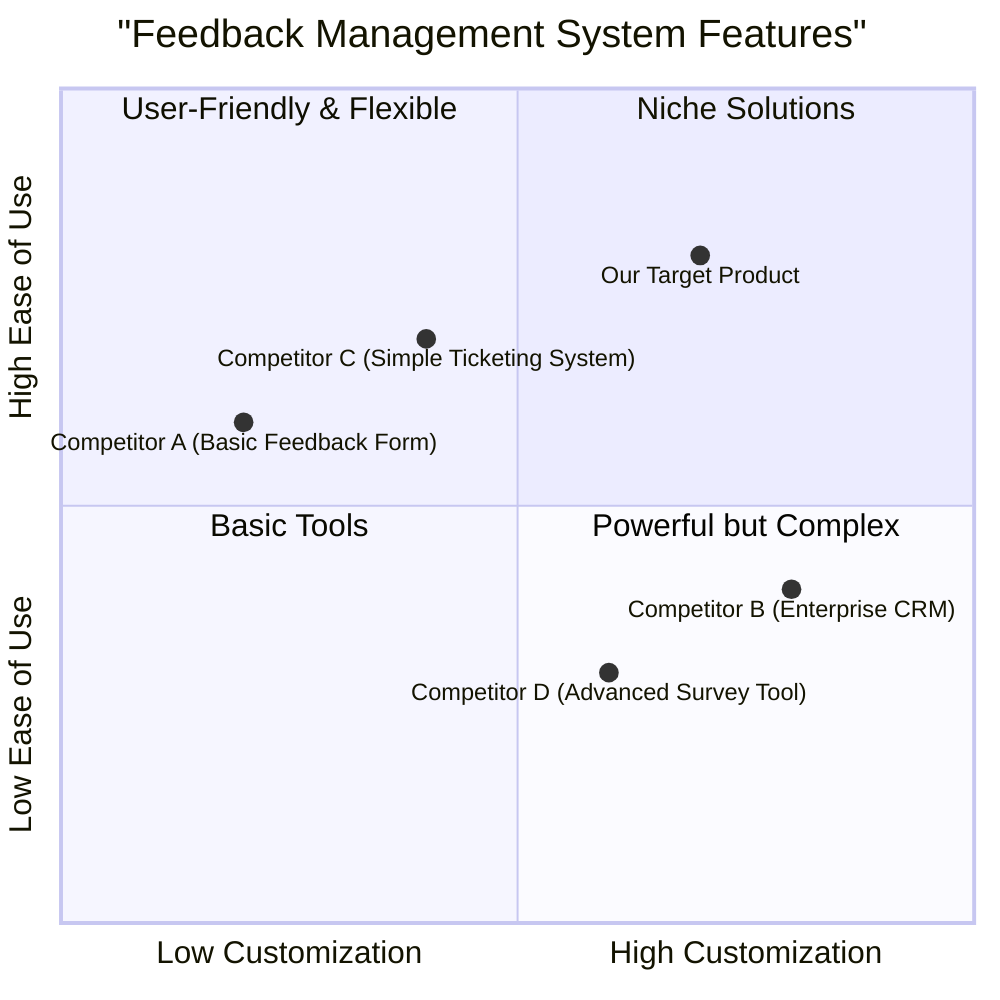

# Product Requirement Document: ModifyComment

## 1. Language & Project Info

*   **Language**: English
*   **Programming Language**: Java
*   **Project Name**: modify_comment
*   **Original Requirements**: Based on the following use case, write a complete program in Java. Make sure to include all necessary functions, classes, and imports. Ensure the code is correct, efficient, and handles edge cases.

    **Use Case: ModifyComment**
    *   **Description**: Editing a comment by a feedback selected.
    *   **Participating Actor**: Agency Operator
    *   **Entry Conditions**: The agency has logged in.
    *   **Flow of Events (User System)**:
        1.  View the list of sites as a result of the use case SearchSite, it selects and activates a function of change in the selected comment.
        2.  Upload feedback issued to that site and displays them in a form.
        3.  Select a feedback from the list and submit the form.
        4.  Displays a form for editing the comment of feedback selected.
        5.  Edit the comment and submit the form.
        6.  Verify the data entered and asks for confirmation of the change. Where the data is invalid or insufficient, the system activates the use case Errored.
        7.  Confirm the operation.
        8.  Remember the comment changed.
    *   **Exit Conditions**: The notification system has been modified for the comment feedback selected.
    *   **Operator Agency cancels the operation**: The operation is cancelled.
    *   **Interruption of the connection to the server**: The operation is interrupted.

## 2. Product Definition

### 2.1 Product Goals

1.  **Enable Efficient Comment Modification**: Allow Agency Operators to quickly and easily edit feedback comments, reducing manual effort and improving data accuracy.
2.  **Ensure Data Integrity and Validation**: Implement robust validation mechanisms to prevent invalid or insufficient data from being saved, maintaining the quality of feedback data.
3.  **Provide a Seamless User Experience**: Offer an intuitive and clear workflow for modifying comments, minimizing user errors and enhancing operator productivity.

### 2.2 User Stories

*   **As an Agency Operator**, I want to view a list of sites and their associated feedback, so that I can select a specific feedback to modify its comment.
*   **As an Agency Operator**, I want to edit the comment of a selected feedback in a dedicated form, so that I can update the feedback details accurately.
*   **As an Agency Operator**, I want the system to validate my edited comment and ask for confirmation, so that I can ensure the changes are correct before saving.
*   **As an Agency Operator**, I want to be notified if my edited comment is invalid or insufficient, so that I can correct it and proceed with the modification.

### 2.3 Competitive Analysis

(To be filled after research, if applicable. For this specific use case, direct competitive analysis might be less relevant as it's an internal system feature. However, we can consider general feedback management systems.)

### 2.4 Competitive Quadrant Chart

## 3. Technical Specifications

### 3.1 Requirements Analysis

The `ModifyComment` use case requires a robust backend service to handle comment retrieval, update, and validation, coupled with a user-friendly frontend interface. The system must integrate with existing `SearchSite` functionality to allow operators to select sites and their associated feedback. Data validation is critical to ensure the integrity of feedback comments. Error handling should gracefully manage invalid inputs and server connection interruptions.

### 3.2 Requirements Pool

*   **P0 (Must-have)**: The system MUST allow an Agency Operator to select a site and view its feedback.
*   **P0 (Must-have)**: The system MUST display a form for editing the comment of a selected feedback.
*   **P0 (Must-have)**: The system MUST validate the edited comment for invalid or insufficient data.
*   **P0 (Must-have)**: The system MUST prompt the Agency Operator for confirmation before saving the modified comment.
*   **P0 (Must-have)**: The system MUST save the modified comment upon confirmation.
*   **P1 (Should-have)**: The system SHOULD provide clear error messages when data validation fails.
*   **P1 (Should-have)**: The system SHOULD allow the Agency Operator to cancel the modification operation at any point before confirmation.
*   **P2 (Nice-to-have)**: The system MAY log all comment modification activities for auditing purposes.
*   **P2 (Nice-to-have)**: The system MAY provide an undo functionality for recently modified comments within a short timeframe.

### 3.3 UI Design Draft

**Screen 1: Site and Feedback Selection**

*   **Header**: "Feedback Management"
*   **Content**: A table or list displaying sites (from `SearchSite` use case).
    *   Each row: Site Name, Site ID, etc.
    *   Action button/link next to each site: "View Feedback"
*   **Interaction**: Clicking "View Feedback" for a site loads its feedback.

**Screen 2: Feedback List for a Site**

*   **Header**: "Feedback for [Selected Site Name]"
*   **Content**: A table or list displaying feedback entries for the selected site.
    *   Each row: Feedback ID, Original Comment, Date, etc.
    *   Action button/link next to each feedback: "Edit Comment"
*   **Interaction**: Clicking "Edit Comment" for a feedback loads the comment editing form.

**Screen 3: Edit Comment Form**

*   **Header**: "Edit Comment for Feedback [Feedback ID]"
*   **Content**:
    *   Read-only field: "Original Comment: [Original Comment Text]"
    *   Editable text area: "New Comment:" (pre-filled with original comment)
    *   Buttons: "Submit", "Cancel"
*   **Interaction**: 
    *   "Submit": Triggers validation and confirmation.
    *   "Cancel": Returns to the previous screen without saving.

**Screen 4: Confirmation Dialog**

*   **Header**: "Confirm Comment Change"
*   **Content**: "Are you sure you want to change the comment to: '[New Comment Text]'?"
*   **Buttons**: "Confirm", "Cancel"
*   **Interaction**: 
    *   "Confirm": Saves the change and displays success message.
    *   "Cancel": Returns to the edit form.

**Error Screen (if validation fails or server interruption)**

*   **Header**: "Error"
*   **Content**: "An error occurred: [Specific error message, e.g., 'Comment cannot be empty.']"
*   **Buttons**: "Back to Edit" (if validation error), "Try Again" (if server error), "Close"

### 3.4 Open Questions

*   What are the specific validation rules for a comment (e.g., minimum/maximum length, allowed characters, profanity filters)?
*   How should concurrent modifications to the same comment be handled?
*   What is the expected response time for comment modification operations?
*   Are there any specific logging requirements for comment changes beyond basic auditing?
*   What is the integration point with the `SearchSite` use case? Is it an API call or a direct UI navigation?
