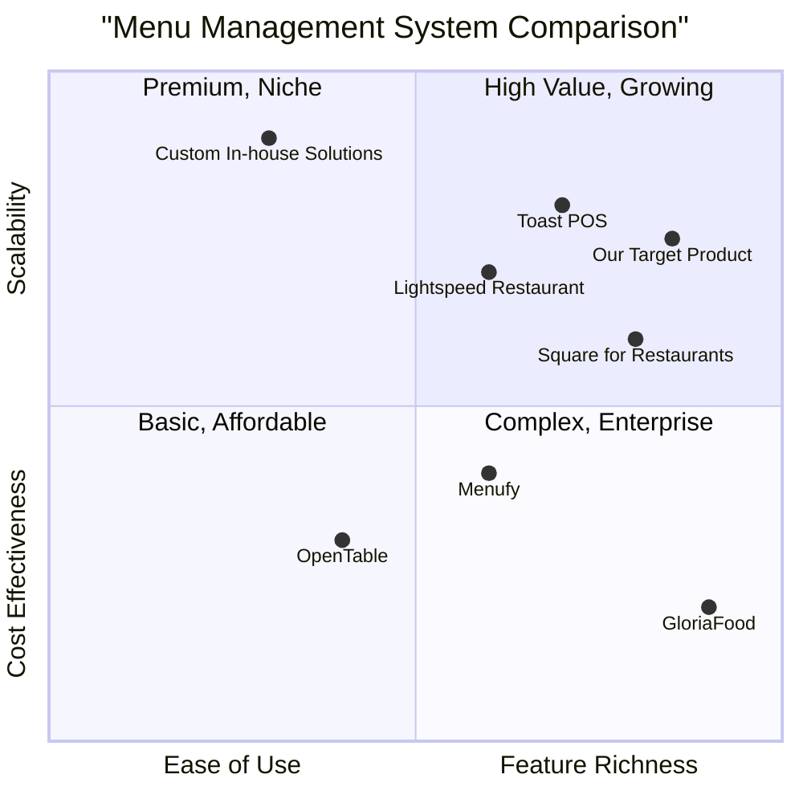

# Product Requirement Document: ModifyMenu

## 1. Language & Project Info

*   **Language**: English
*   **Programming Language**: Java
*   **Project Name**: restaurant_menu_management
*   **Original Requirements**: Based on the provided use case, create a complete program in Java to allow a restaurant operator to modify the daily menu. The program should include all necessary functions, classes, and imports, be correct, efficient, and handle edge cases. Comments explaining key logic are required, and the code should be fully runnable but not executed.

## 2. Product Definition

### 2.1 Product Goals

1.  **Goal 1**: Enable restaurant operators to efficiently update daily menus with minimal effort.
2.  **Goal 2**: Ensure data integrity and validity of menu information through robust validation mechanisms.
3.  **Goal 3**: Provide a user-friendly interface for seamless menu modification, reducing operational errors.

### 2.2 User Stories

*   **As a** Restaurant Operator, **I want to** activate the menu editing functionality **so that I can** begin modifying the daily menu.
*   **As a** Restaurant Operator, **I want to** select a specific day of the week from a displayed form **so that I can** view and edit the menu for that day.
*   **As a** Restaurant Operator, **I want to** upload and edit menu data for the selected day **so that I can** update the offerings for that specific day.
*   **As a** Restaurant Operator, **I want to** receive confirmation of my menu edits **so that I can** be assured the changes have been successfully saved.
*   **As a** Restaurant Operator, **I want to** be notified of invalid or insufficient data during menu editing **so that I can** correct errors before saving.

### 2.3 Competitive Analysis

To understand the landscape of menu management systems, we've analyzed several existing solutions. This analysis focuses on their strengths and weaknesses in the context of daily menu modification.

1.  **Toast POS**: 
    *   **Pros**: Comprehensive POS system, integrated menu management, widely adopted, good reporting. 
    *   **Cons**: Can be complex for simple menu changes, higher cost, steep learning curve for some features.
2.  **Square for Restaurants**: 
    *   **Pros**: User-friendly interface, affordable, good for small to medium-sized restaurants, easy menu updates. 
    *   **Cons**: Less robust features compared to enterprise solutions, limited customization for complex menus.
3.  **OpenTable (Menu Management)**: 
    *   **Pros**: Focus on online presence and reservations, basic menu display. 
    *   **Cons**: Not a primary menu editing tool, limited backend management features, primarily for customer-facing menus.
4.  **GloriaFood**: 
    *   **Pros**: Free online ordering system, includes menu builder, easy to set up. 
    *   **Cons**: Basic functionality, less suitable for in-house menu management, limited advanced features.
5.  **Custom In-house Solutions**: 
    *   **Pros**: Tailored to specific restaurant needs, full control over features. 
    *   **Cons**: High development and maintenance costs, requires technical expertise, potential for bugs and security issues if not professionally developed.
6.  **Menufy**: 
    *   **Pros**: Online ordering platform with menu management, good for delivery and pickup. 
    *   **Cons**: Primarily focused on online ordering, less emphasis on internal daily menu operations.
7.  **Lightspeed Restaurant**: 
    *   **Pros**: Advanced POS features, inventory management, detailed reporting, flexible menu options. 
    *   **Cons**: Can be expensive, complex setup, might be overkill for simpler restaurant operations.

### 2.4 Competitive Quadrant Chart



## 3. Technical Specifications

### 3.1 Requirements Analysis

The `ModifyMenu` functionality requires a robust backend to manage menu data and a user-friendly frontend for interaction. The system must handle authentication, data persistence, input validation, and error handling. Given the requirement for a Java program, a desktop application (e.g., Swing/JavaFX) or a web application (e.g., Spring Boot with a web UI) could be considered. For simplicity and direct interpretation of the use case flow, a desktop application approach is assumed for the core logic, with potential for web integration.

**Key Technical Considerations:**

*   **User Interface**: A form-based UI to display days of the week, menu items, and input fields for editing.
*   **Data Storage**: A mechanism to store and retrieve daily menu data (e.g., flat files, database like H2, SQLite, or a simple in-memory structure for demonstration).
*   **Data Validation**: Server-side (or application-side) validation to ensure menu items, pr, and other details are valid before saving.
*   **Error Handling**: Graceful handling of invalid input, connection interruptions, and other system errors.
*   **Authentication**: While the use case states "Operator has successfully authenticated," the PRD will focus on the menu modification logic, assuming authentication is handled externally.
*   **Concurrency**: If multiple operators could potentially edit menus simultaneously, concurrency control would be necessary. For a single operator scenario, this is less critical.

### 3.2 Requirements Pool

*   **P0 (Must-have)**:
    *   The system **must** display a form with seven days of the week.
    *   The system **must** allow the operator to select a day and load its existing menu data.
    *   The system **must** allow the operator to edit menu items (add, remove, modify) for the selected day.
    *   The system **must** validate entered menu data (e.g., item name not empty, price is a valid number).
    *   The system **must** ask for confirmation before saving changes.
    *   The system **must** save confirmed changes to the menu for the selected day.
    *   The system **must** notify the operator of successful menu modification.
    *   The system **must** handle cases where data is insufficient or invalid, preventing save and prompting for correction.
    *   The system **must** allow the operator to cancel the operation at any point before confirmation.

*   **P1 (Should-have)**:
    *   The system **should** provide clear visual feedback on the status of the operation (e.g., loading indicators, success/error messages).
    *   The system **should** persist menu data across application restarts (e.g., using a file or database).
    *   The system **should** provide a clear and intuitive user interface for menu editing.
    *   The system **should** allow for easy addition and removal of individual menu items.

*   **P2 (Nice-to-have)**:
    *   The system **may** include a feature to copy a menu from one day to another.
    *   The system **may** support different menu categories (e.g., appetizers, main courses, desserts).
    *   The system **may** provide an undo/redo functionality for recent edits.

### 3.3 UI Design Draft

**Main Menu Editing Screen:**

```
+---------------------------------------------------+
| Restaurant Menu Management                        |
+---------------------------------------------------+
| [Activate Menu Editing Button]                    |
|                                                   |
|   [Day Selector Dropdown: Mon, Tue, Wed, Thu, Fri, Sat, Sun] |
|   [Load Menu Button]                              |
|                                                   |
|   ---------------------------------------------   |
|   | Current Menu for [Selected Day]             |   |
|   |                                             |   |
|   | [Menu Item 1 Name] [Price] [Edit] [Delete]  |   |
|   | [Menu Item 2 Name] [Price] [Edit] [Delete]  |   |
|   | ...                                         |   |
|   | [Add New Item Button]                       |   |
|   ---------------------------------------------   |
|                                                   |
|   [Save Changes Button] [Cancel Button]           |
|                                                   |
|   [Status Message: e.g., "Menu loaded."]          |
+---------------------------------------------------+
```

**Edit/Add Menu Item Dialog:**

```
+---------------------------------------------------+
| Edit Menu Item                                    |
+---------------------------------------------------+
| Item Name: [____________________]                 |
| Description: [____________________]               |
| Price: [_______]                                  |
| Category: [Dropdown: Appetizer, Main, Dessert]    |
|                                                   |
| [Save Item Button] [Cancel Button]                |
+---------------------------------------------------+
```

### 3.4 Open Questions

1.  **Data Persistence Mechanism**: What is the preferred method for storing menu data? (e.g., simple file I/O, embedded database like H2/SQLite, or a more robust solution if this is part of a larger system)? For the initial Java program, a simple file-based persistence or in-memory storage will be assumed, but this needs clarification for a production system.
2.  **Error Handling for Server Connection**: The use case mentions "Interruption of the connection to the server ETOUR." How should the system behave in such a scenario? Should it attempt to reconnect, save locally, or simply notify the user and halt the operation?
3.  **User Interface Framework**: Is a specific Java UI framework preferred (e.g., Swing, JavaFX, or a web-based approach using Spring Boot/Vaadin)? The current draft assumes a generic desktop UI concept.
4.  **Authentication Details**: While authentication is an entry condition, are there any specific requirements for how the menu modification module interacts with the authentication system (e.g., API calls, shared session)?
5.  **Menu Item Structure**: What specific fields should each menu item have (e.g., name, description, price, category, availability)? The current draft assumes basic name and price.
