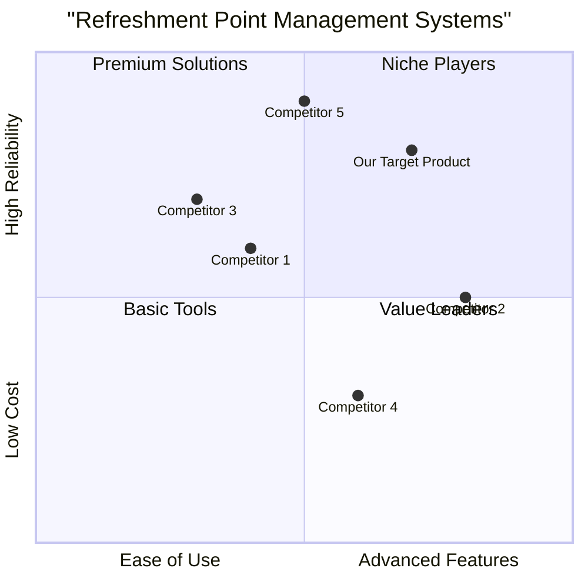

# Product Requirement Document: ModifyRefreshmentPoint

## 1. Language & Project Info
- **Language**: English
- **Programming Language**: Java
- **Project Name**: modify_refreshment_point
- **Original Requirements**: Change data point associated refreshment.

## 2. Product Definition

### 2.1 Product Goals
1. **Efficiency**: To enable Point Restaurant Operators to quickly and accurately update refreshment data points.
2. **Data Integrity**: To ensure that all modified refreshment data is validated and stored correctly, preventing errors and inconsistencies.
3. **User Experience**: To provide a clear and intuitive interface for operators to modify refreshment data with minimal effort.

### 2.2 User Stories
- As a **Point Restaurant Operator**, I want to **easily access and view existing refreshment data** so that I can identify which data point needs modification.
- As a **Point Restaurant Operator**, I want to **modify specific details of a refreshment data point** so that the system reflects the most current information.
- As a **Point Restaurant Operator**, I want to **receive immediate feedback on data validity** so that I can correct any errors before saving.
- As a **Point Restaurant Operator**, I want to **confirm changes before they are permanently saved** so that I can prevent accidental modifications.
- As a **Point Restaurant Operator**, I want the **system to store the updated refreshment data reliably** so that all subsequent operations use the correct information.

### 2.3 Competitive Analysis

#### 2.3.1 Competitor 1: Toast POS
- **Pros**: Comprehensive restaurant management, strong POS features, integrated payment processing.
- **Cons**: Can be expensive for smaller operations, steep learning curve, less focus on specific 'refreshment point' management.

#### 2.3.2 Competitor 2: Square for Restaurants
- **Pros**: User-friendly interface, affordable for small businesses, good for quick service and cafes, easy setup.
- **Cons**: Limited advanced features compared to enterprise solutions, less customizable for complex operations.

#### 2.3.3 Competitor 3: Lightspeed Restaurant
- **Pros**: Robust inventory management, multi-location support, strong reporting and analytics, good for fine dining.
- **Cons**: Higher cost, complex setup, may be overkill for simple refreshment points.

#### 2.3.4 Competitor 4: Revel Systems POS
- **Pros**: Highly customizable, strong offline mode, good for diverse restaurant types, extensive integrations.
- **Cons**: Can be pricey, implementation can be lengthy, requires specific hardware.

#### 2.3.5 Competitor 5: Clover POS
- **Pros**: Flexible hardware options, app marketplace for added functionality, good for various business sizes.
- **Cons**: Transaction fees can add up, customer support can be inconsistent, less specialized for restaurant operations.

#### 2.3.6 Competitive Quadrant Chart

## 3. Technical Specifications

### 3.1 Requirements Analysis
- The system must provide a secure authentication mechanism for Point Restaurant Operators (Entry Condition).
- The system must allow operators to select a specific refreshment point for modification (Flow of Events 1).
- The system must retrieve and display the current data associated with the selected refreshment point in an editable form (Flow of Events 2).
- The system must allow operators to modify the displayed data (Flow of Events 3).
- The system must validate the modified data upon submission (Flow of Events 4).
- The system must prompt for confirmation before saving changes (Flow of Events 4).
- The system must handle invalid or insufficient data by activating an 'Errored' use case (Flow of Events 4).
- The system must store the modified data persistently (Flow of Events 6).
- The system must provide a notification upon successful data change (Exit Condition).
- The system must allow operators to cancel the operation at any point (Exit Condition).
- The system must gracefully handle connection interruptions to the server (Exit Condition).

### 3.2 Requirements Pool
- **P0 (Must-have)**:
    - Secure operator authentication.
    - Ability to select a refreshment point.
    - Display existing refreshment data in an editable form.
    - Allow modification of refreshment data.
    - Data validation on submission.
    - Confirmation prompt before saving.
    - Persistent storage of modified data.
    - Notification of successful data change.
    - Error handling for invalid/insufficient data.
- **P1 (Should-have)**:
    - Clear and intuitive UI for data modification.
    - Real-time validation feedback.
    - Audit trail for data changes.
- **P2 (Nice-to-have)**:
    - Bulk editing capabilities.
    - Version history for refreshment data.

### 3.3 UI Design Draft
- A web-based form with fields corresponding to refreshment data points.
- Clear labels for each field.
- Input validation messages displayed next to invalid fields.
- 'Save' and 'Cancel' buttons.
- A confirmation dialog box before final save.
- A success/error message display area.

### 3.4 Open Questions
- What specific data fields constitute a 'refreshment data point'? (e.g., name, price, quantity, description, availability)
- What are the exact validation rules for each data field?
- How will the 'Errored' use case be implemented and what information will it convey to the operator?
- What are the performance requirements for data retrieval and saving?
- What are the security requirements beyond authentication (e.g., data encryption, authorization levels)?
- What is the expected volume of refreshment points and modification frequency?
