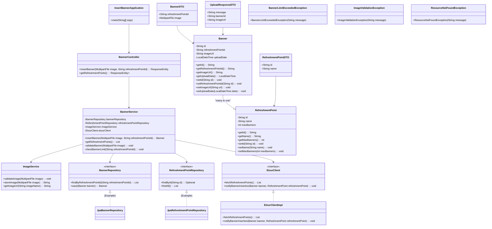

## Implementation approach

We will implement the `InsertBanner` functionality as a Java backend service, following a layered architecture (e.g., Controller, Service, Repository). This approach promotes separation of concerns, testability, and maintainability. We will use standard Java libraries and potentially Spring Boot for rapid development and dependency injection, given its widespread adoption and robust ecosystem for building RESTful serv.

**Key Design Principles:**
*   **Modularity:** Components will be designed to be loosely coupled and highly cohesive.
*   **Scalability:** The architecture will support future scaling by using stateless serv where possible.
*   **Robustness:** Comprehensive error handling, input validation, and graceful degradation will be implemented.
*   **Security:** Basic security considerations for image uploads and data access will be taken into account.
*   **Extensibility:** The design will allow for easy addition of new features or changes to existing ones.

**Difficult Points and Solutions:**
1.  **Image Handling and Validation:** This involves receiving image files, validating their format, size, and dimensions, and securely storing them. We will use a dedicated `ImageService` to encapsulate this logic. Validation will occur early in the process to prevent unnecessary resource consumption. For storage, we will consider local file system storage for simplicity, but the design will allow for easy integration with cloud storage (e.g., AWS S3) in the future.
2.  **ETOUR Server Integration:** The PRD mentions interaction with an "ETOUR server" for `SearchRefreshmentPoint` and final notification. Since the exact API is unclear, we will design an `EtourClient` interface with a mock implementation for initial development. This interface will define methods for fetching refreshment points and sending notifications, allowing for easy swapping with a real implementation once the ETOUR API details are known.
3.  **Concurrency and Transaction Management:** Ensuring data consistency when multiple operators might be inserting banners simultaneously, especially concerning the maximum banner limit. We will use appropriate synchronization mechanisms or database transaction management to handle this.
4.  **User Interface (Frontend):** While the core task is backend, the PRD describes UI interactions. We will assume a separate frontend application (e.g., built with React/Angular/Vue) will consume our backend API. Our API design will be RESTful to facilitate this.

## File list

```
insert_banner_service
├── pom.xml
├── src
│   ├── main
│   │   ├── java
│   │   │       └── com
│   │   │           └── etour
│   │   │               └── banner
│   │   │                   ├── config
│   │   │                   │   └── AppConfig.java
│   │   │                   ├── controller
│   │   │                   │   └── BannerController.java
│   │   │                   ├── dto
│   │   │                   │   ├── BannerDTO.java
│   │   │                   │   ├── RefreshmentPointDTO.java
│   │   │                   │   └── UploadResponseDTO.java
│   │   │                   ├── exception
│   │   │                   │   ├── BannerLimitExceededException.java
│   │   │                   │   ├── ImageValidationException.java
│   │   │                   │   └── ResourceNotFoundException.java
│   │   │                   ├── model
│   │   │                   │   ├── Banner.java
│   │   │                   │   └── RefreshmentPoint.java
│   │   │                   ├── repository
│   │   │                   │   ├── BannerRepository.java
│   │   │                   │   └── RefreshmentPointRepository.java
│   │   │                   ├── service
│   │   │                   │   ├── BannerService.java
│   │   │                   │   ├── ImageService.java
│   │   │                   │   └── EtourClient.java
│   │   │                   │   └── EtourClientImpl.java
│   │   │                   └── InsertBannerApplication.java
│   │   └── resources
│   │       ├── application.properties
│   │       └── static
│   │           └── images
│   └── test
│       └── java
│           └── com
│               └── etour
│                   └── banner
│                       └── service
│                           └── BannerServiceTest.java
└── docs
    └── system_design.md
    └── system_design-class-diagram.mermaid
    └── system_design-sequence-diagram.mermaid
```

## Data structures and interfaces:



## Program call flow:

```mermaid
sequenceDiagram
    participant FE as Frontend (Agency Operator)
    participant BC as BannerController
    participant BS as BannerService
    participant IS as ImageService
    participant RPRepo as RefreshmentPointRepository
    participant BRepo as BannerRepository
    participant EC as EtourClient
    participant DB as Database
    participant FS as File Storage
    participant ES as ETOUR Server

    FE->>BC: POST /api/banners (image, refreshmentPointId)
    activate BC

    BC->>BS: insertBanner(image, refreshmentPointId)
    activate BS

    BS->>RPRepo: findById(refreshmentPointId)
    activate RPRepo
    RPRepo-->>BS: RefreshmentPoint (or null)
    deactivate RPRepo

    alt RefreshmentPoint not found
        BS-->>BC: ResourceNotFoundException
        BC-->>FE: 404 Not Found
    else RefreshmentPoint found
        BS->>IS: validateImage(image)
        activate IS
        alt Image invalid
            IS-->>BS: ImageValidationException
            deactivate IS
            BS-->>BC: ImageValidationException
            BC-->>FE: 400 Bad Request (Invalid Image)
        else Image valid
            IS-->>BS: Image valid
            deactivate IS

            BS->>BRepo: findByRefreshmentPointId(refreshmentPointId)
            activate BRepo
            BRepo-->>BS: List<Banner>
            deactivate BRepo

            alt Banner limit exceeded
                BS-->>BC: BannerLimitExceededException
                BC-->>FE: 400 Bad Request (Banner Limit Exceeded)
            else Banner limit not exceeded
                FE->>FE: Operator confirms insertion

                BS->>IS: storeImage(image)
                activate IS
                IS->>FS: Save image file
                FS-->>IS: Image URL/Path
                IS-->>BS: imageUrl
                deactivate IS

                BS->>DB: Create new Banner object
                BS->>BRepo: save(banner)
                activate BRepo
                BRepo->>DB: Persist Banner
                DB-->>BRepo: Persisted Banner
                BRepo-->>BS: Saved Banner
                deactivate BRepo

                BS->>EC: notifyBannerInsertion(banner, refreshmentPoint)
                activate EC
                EC->>ES: Send notification
                ES-->>EC: Notification status
                EC-->>BS: Notification successful
                deactivate EC

                BS-->>BC: Saved Banner
                deactivate BS

                BC-->>FE: 201 Created (UploadResponseDTO)
                deactivate BC
            end
        end
    end
```

## Anything UNCLEAR

Clarification is needed on the following points from the PRD:

*   **Image Specifications:** What are the exact technical specifications for valid banner images (file types, dimensions, max size)? This is crucial for the `ImageService.validateImage` method.
*   **Maximum Banners:** What is the maximum number of banners allowed per refreshment point? This directly impacts the `BannerService.checkBannerLimit` method.
*   **ETOUR Server API:** What is the exact API or communication protocol for interacting with the ETOUR server (e.g., for `SearchRefreshmentPoint` and final notification)? This will determine the concrete implementation of `EtourClientImpl`.
*   **'Errored' Use Case Trigger and Actions:** How should the 'Errored' use case be triggered and what specific actions should it entail? This impacts error handling and potential logging/reporting mechanisms.
*   **Security Requirements:** What are the specific security requirements for image storage and data transmission (e.g., encryption, access control)?
*   **Frontend UI Framework:** Is there a specific UI framework or design system to adhere to for the frontend? While not directly impacting the backend, it helps in understanding the overall system context.
