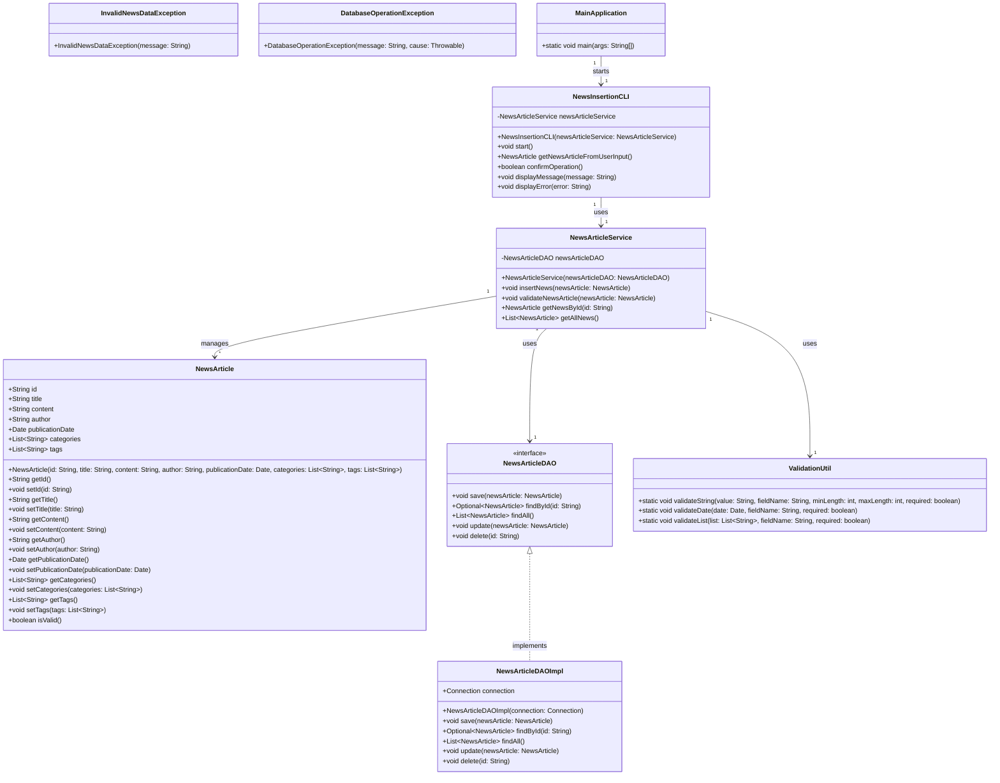
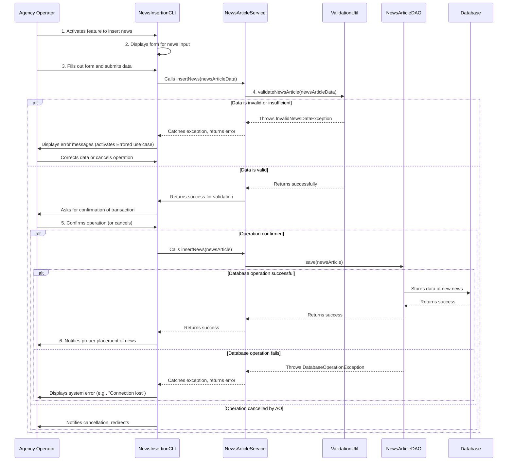

## Implementation approach

We will implement the `InsertNews` feature using a layered architecture, common in Java enterprise applications. This will involve a presentation layer (simulated by a command-line interface or a simple web-like interaction for this exercise, as a full UI framework is not specified), a service layer for business logic and validation, and a data access layer for interacting with a persistent storage (e.g., a relational database). We will use standard Java libraries and potentially a lightweight ORM (like Hibernate or Spring Data JPA if a full Spring ecosystem were in play, but for a standalone Java program, we'll keep it simpler with JDBC or a custom DAO). Error handling will be centralized, and data validation will occur at both the service and potentially the data access layers.

## File list

- `src/main/java/com/news/management/system/model/NewsArticle.java`
- `src/main/java/com/news/management/system/dao/NewsArticleDAO.java`
- `src/main/java/com/news/management/system/service/NewsArticleService.java`
- `src/main/java/com/news/management/system/util/ValidationUtil.java`
- `src/main/java/com/news/management/system/exception/InvalidNewsDataException.java`
- `src/main/java/com/news/management/system/exception/DatabaseOperationException.java`
- `src/main/java/com/news/management/system/MainApplication.java`
- `src/main/java/com/news/management/system/cli/NewsInsertionCLI.java`

## Data structures and interfaces:

## Program call flow:

## Anything UNCLEAR

1.  **Validation Rules:** The PRD mentions the need for specific validation rules (e.g., min/max length for title, content). These will need to be defined in detail. For the initial implementation, we will assume basic non-empty checks and reasonable length limits (e.g., title max 255 chars, content max 65535 chars).
2.  **Pre-defined Categories/Tags:** The PRD asks if categories/tags should be pre-defined. For this design, we assume categories and tags are free-form text input by the operator, stored as lists of strings. A future enhancement could involve a separate management system for these.
3.  **Errored Use Case Behavior:** The PRD asks for clarification on the `Errored` use case. In this design, `InvalidNewsDataException` will be caught by the CLI, and specific error messages will be displayed to the user, allowing them to correct the input. For database or connection errors, a generic error message will be shown.
4.  **Authentication and Authorization:** The PRD states that only logged-in Agency Operators can access the feature. This design assumes that the `NewsInsertionCLI` (or a higher-level application) handles user authentication and passes an authenticated context (e.g., the current user's ID for the 'author' field) to the `NewsArticleService`. The `NewsArticleService` itself does not directly handle authentication but relies on it being pre-verified.
5.  **Performance Requirements:** No specific performance requirements (e.g., TPS, response time) were provided. The current design focuses on correctness and modularity. Performance optimization would be a subsequent step if specific bottlenecks are identified under load.
6.  **Media Handling:** The P2 requirement for rich text editing and media handling is not included in this basic design. If implemented, it would require integration with a file storage service (e.g., AWS S3, local file system) and a mechanism to embed media URLs within the news content.
7.  **Versioning/Auditing:** The P2 requirement for versioning or auditing is not included in this basic design. This would typically involve additional database tables and logic to track changes to news articles over time.
