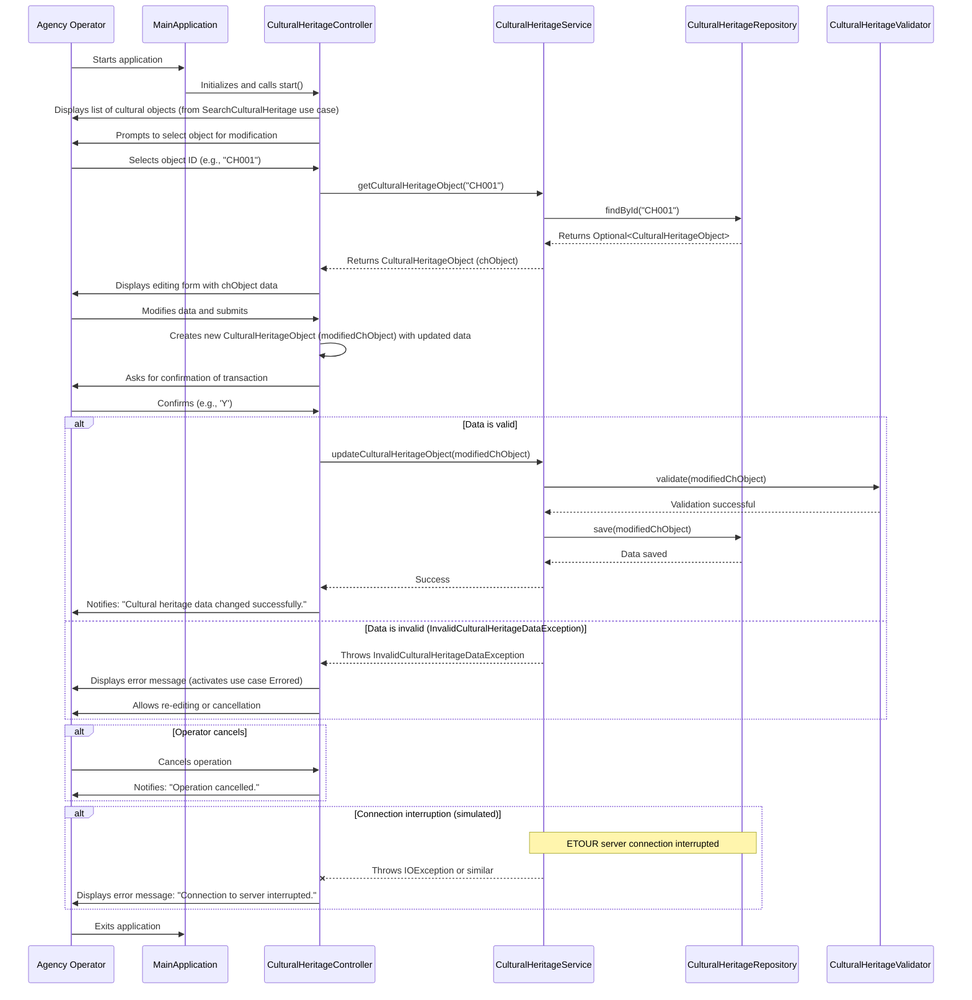

## Implementation approach

We will design a Java-based system for managing cultural heritage objects, focusing on the `ModifyCulturalHeritage` use case. The system will follow a layered architecture, separating concerns into presentation (simulated by console interaction for this design), service, and data access layers. We will use standard Java libraries and principles to ensure correctness, efficiency, and maintainability.

Key considerations:
*   **Data Model**: A `CulturalHeritageObject` class will represent the cultural object with its attributes.
*   **Data Access**: A `CulturalHeritageRepository` interface and its implementation will handle persistence (e.g., in-memory for simplicity, or a database in a real-world scenario).
*   **Service Layer**: A `CulturalHeritageService` will encapsulate business logic, including loading, validating, and saving cultural objects.
*   **Validation**: A `CulturalHeritageValidator` will ensure data integrity before saving.
*   **User Interaction**: A `CulturalHeritageController` (or a simple console application) will manage the flow of events, interacting with the user and the service layer.
*   **Error Handling**: Custom exceptions will be used to manage specific error conditions.
*   **Concurrency Control**: A mechanism to prevent multiple submissions will be implemented at the UI level (simulated by disabling input after submission).

## File list

- `cultural_heritage_management/src/main/java/com/culturalheritage/model/CulturalHeritageObject.java`
- `cultural_heritage_management/src/main/java/com/culturalheritage/repository/CulturalHeritageRepository.java`
- `cultural_heritage_management/src/main/java/com/culturalheritage/repository/InMemoryCulturalHeritageRepository.java`
- `cultural_heritage_management/src/main/java/com/culturalheritage/service/CulturalHeritageService.java`
- `cultural_heritage_management/src/main/java/com/culturalheritage/service/CulturalHeritageValidator.java`
- `cultural_heritage_management/src/main/java/com/culturalheritage/controller/CulturalHeritageController.java`
- `cultural_heritage_management/src/main/java/com/culturalheritage/exception/InvalidCulturalHeritageDataException.java`
- `cultural_heritage_management/src/main/java/com/culturalheritage/exception/CulturalHeritageNotFoundException.java`
- `cultural_heritage_management/src/main/java/com/culturalheritage/MainApplication.java`

## Data structures and interfaces:

```mermaid
classDiagram
    class CulturalHeritageObject {
        -String id
        -String name
        -String description
        -String origin
        -int year
        +CulturalHeritageObject(id: String, name: String, description: String, origin: String, year: int)
        +getId(): String
        +getName(): String
        +setName(name: String): void
        +getDescription(): String
        +setDescription(description: String): void
        +getOrigin(): String
        +setOrigin(origin: String): void
        +getYear(): int
        +setYear(year: int): void
        +toString(): String
    }

    interface CulturalHeritageRepository {
        +findById(id: String): Optional<CulturalHeritageObject>
        +save(object: CulturalHeritageObject): void
        +findAll(): List<CulturalHeritageObject>
    }

    class InMemoryCulturalHeritageRepository {
        -Map<String, CulturalHeritageObject> dataStore
        +InMemoryCulturalHeritageRepository()
        +findById(id: String): Optional<CulturalHeritageObject>
        +save(object: CulturalHeritageObject): void
        +findAll(): List<CulturalHeritageObject>
    }

    class CulturalHeritageValidator {
        +validate(object: CulturalHeritageObject): void
    }

    class CulturalHeritageService {
        -CulturalHeritageRepository repository
        -CulturalHeritageValidator validator
        +CulturalHeritageService(repository: CulturalHeritageRepository, validator: CulturalHeritageValidator)
        +getCulturalHeritageObject(id: String): CulturalHeritageObject
        +updateCulturalHeritageObject(object: CulturalHeritageObject): void
        +getAllCulturalHeritageObjects(): List<CulturalHeritageObject>
    }

    class CulturalHeritageController {
        -CulturalHeritageService service
        -Scanner scanner
        +CulturalHeritageController(service: CulturalHeritageService)
        +start(): void
        +displayCulturalHeritageList(): void
        +modifyCulturalHeritage(): void
        -promptForCulturalHeritageId(): String
        -loadAndDisplayForm(id: String): CulturalHeritageObject
        -editCulturalHeritageData(object: CulturalHeritageObject): CulturalHeritageObject
        -confirmTransaction(object: CulturalHeritageObject): boolean
        -saveModifiedData(object: CulturalHeritageObject): void
        -handleInvalidData(e: InvalidCulturalHeritageDataException): void
        -handleNotFound(e: CulturalHeritageNotFoundException): void
    }

    class InvalidCulturalHeritageDataException {
        +InvalidCulturalHeritageDataException(message: String)
    }

    class CulturalHeritageNotFoundException {
        +CulturalHeritageNotFoundException(message: String)
    }

    class MainApplication {
        +main(args: String[]): void
    }

    CulturalHeritageRepository <|.. InMemoryCulturalHeritageRepository
    CulturalHeritageService "1" --> "1" CulturalHeritageRepository : uses
    CulturalHeritageService "1" --> "1" CulturalHeritageValidator : uses
    CulturalHeritageController "1" --> "1" CulturalHeritageService : uses
    MainApplication --> CulturalHeritageController : creates
    MainApplication --> CulturalHeritageService : creates
    MainApplication --> InMemoryCulturalHeritageRepository : creates
    MainApplication --> CulturalHeritageValidator : creates
```

## Program call flow:



## Anything UNCLEAR

1.  **User Interface (UI) Details**: The current design assumes a console-based interaction for simplicity. In a real-world application, this would be a graphical user interface (GUI) (e.g., using Swing, JavaFX, or a web framework). The blocking of input controls to prevent multiple submissions would be handled by the UI framework.
2.  **Authentication/Authorization**: The entry condition "The agency has logged" is assumed to be handled by an external system or a pre-existing login mechanism. This design does not include the implementation of user authentication or authorization.
3.  **`SearchCulturalHeritage` Use Case Integration**: The design assumes that the `SearchCulturalHeritage` use case provides a list of cultural goods and allows selection. The details of this integration (e.g., how the list is displayed and how an item is selected) are not fully specified here.
4.  **ETOUR Server Connection Interruption**: The handling of connection interruption is noted as a potential exception. The specific type of exception and the recovery mechanism would depend on the actual ETOUR server API and network communication strategy.
5.  **Persistence Mechanism**: The `InMemoryCulturalHeritageRepository` is used for simplicity. In a production environment, this would be replaced by a database (e.g., SQL database with JDBC/JPA, NoSQL database) or another persistent storage solution.
6.  **Error Handling for `Errored` Use Case**: The design mentions activating the `Errored` use case. This implies a more detailed error reporting and logging mechanism, which is not fully elaborated in this design.
