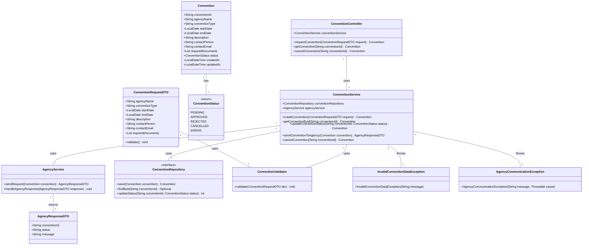
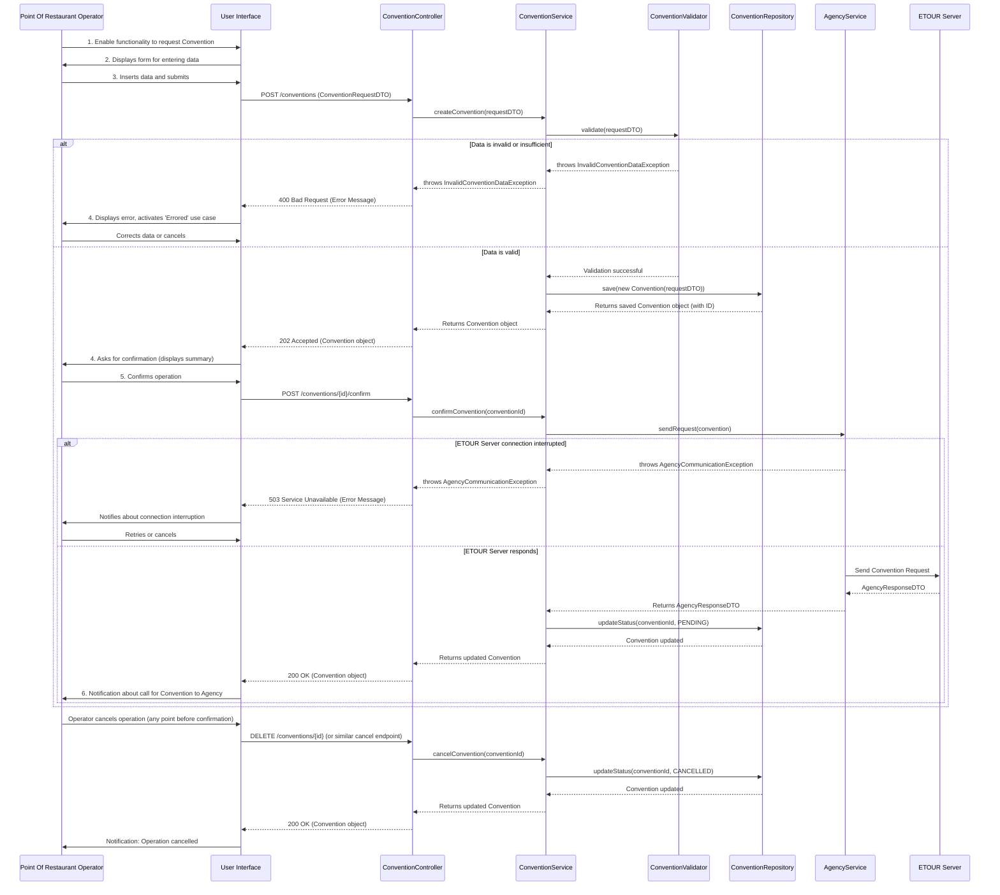

## Implementation approach

We will implement the ConventionRequest system using Java, following a layered architecture pattern (Presentation, Service, Data Access). This approach promotes separation of concerns, maintainability, and testability. We will leverage standard Java libraries and potentially Spring Boot for rapid development and robust features, although the core design will remain framework-agnostic for now. The system will interact with a relational database for persistence and an external agency system (ETOUR) via a well-defined API (e.g., RESTful).

**Key Technologies/Libraries:**
*   **Java**: Core programming language.
*   **Database**: H2 (for simplicity in this design, can be replaced with PostgreSQL/MySQL in production).
*   **JSON Processing**: Jackson or Gson for API communication.
*   **Logging**: SLF4J with Logback.
*   **Validation**: Java Bean Validation (JSR 380).

**Difficult Points and Solutions:**
1.  **Data Validation**: Implement both client-side (if UI is web-based) and server-side validation using Java Bean Validation annotations and custom validators to ensure data integrity before processing.
2.  **External System Integration (ETOUR)**: Design a dedicated `AgencyService` or `EtourClient` to encapsulate all communication with the external agency system. This will use HTTP clients (e.g., `java.net.http.HttpClient` or Spring's `RestTemplate`/`WebClient`) and handle request/response mapping, error handling, and retries.
3.  **Error Handling**: Implement a comprehensive error handling strategy, including custom exceptions for business logic errors (e.g., `InvalidConventionDataException`), network errors during ETOUR communication, and database errors. This will ensure graceful degradation and informative error messages to the user.
4.  **Concurrency**: If multiple operators can submit requests simultaneously, ensure thread-safe operations, especially during database interactions and external API calls. For this initial design, we'll assume a single-threaded request processing model, but the architecture can be extended with asynchronous processing if needed.
5.  **User Interface**: While the PRD describes UI screens, this system design focuses on the backend logic. A separate frontend application (e.g., React, Angular, Vue) would consume the backend APIs.

## File list

- src/main/java/com/convention/request/ConventionRequestApplication.java
- src/main/java/com/convention/request/controller/ConventionController.java
- src/main/java/com/convention/request/service/ConventionService.java
- src/main/java/com/convention/request/service/AgencyService.java
- src/main/java/com/convention/request/repository/ConventionRepository.java
- src/main/java/com/convention/request/model/Convention.java
- src/main/java/com/convention/request/model/ConventionRequestDTO.java
- src/main/java/com/convention/request/model/AgencyResponseDTO.java
- src/main/java/com/convention/request/exception/InvalidConventionDataException.java
- src/main/java/com/convention/request/exception/AgencyCommunicationException.java
- src/main/java/com/convention/request/util/ConventionValidator.java
- src/main/resources/application.properties
- src/main/resources/schema.sql
- src/main/resources/data.sql
- pom.xml (or build.gradle)
- convention_request/docs/system_design.md
- convention_request/docs/system_design-class-diagram.mermaid
- convention_request/docs/system_design-sequence-diagram.mermaid

## Data structures and interfaces:

## Program call flow:

## Anything UNCLEAR

1.  **Specific Convention Data Fields**: The PRD mentions "actual fields depend on convention details." A detailed list of all required data fields for a convention (e.g., financial terms, specific clauses, participant lists, duration constraints) is needed for precise data model and validation implementation.
2.  **ETOUR Server API Specification**: A clear API contract (endpoints, request/response formats, authentication mechanisms, error codes) for the ETOUR server is crucial for implementing the `AgencyService` correctly. This includes whether the communication is synchronous or asynchronous and expected response times.
3.  **Detailed Business Rules for Validation**: While general validation (required fields, data types) is covered, specific business rules (e.g., `startDate` must be before `endDate`, minimum/maximum duration, valid agency names) need to be defined.
4.  **Authentication and Authorization**: The entry condition states "The Point Of Restaurant Operator has successfully authenticated to the system." The specific authentication mechanism (e.g., OAuth2, JWT, session-based) and authorization rules (e.g., what actions an operator can perform) need to be detailed.
5.  **Persistence Layer Details**: While `ConventionRepository` is defined, the specific ORM (e.g., Hibernate, Spring Data JPA) or direct JDBC usage is not specified. This will influence the implementation details of the repository.
6.  **Error Handling for ETOUR Retries**: The PRD mentions retrying on connection interruption. The retry strategy (e.g., number of retries, backoff policy) and how the system notifies the operator about pending retries or eventual failure needs clarification.
