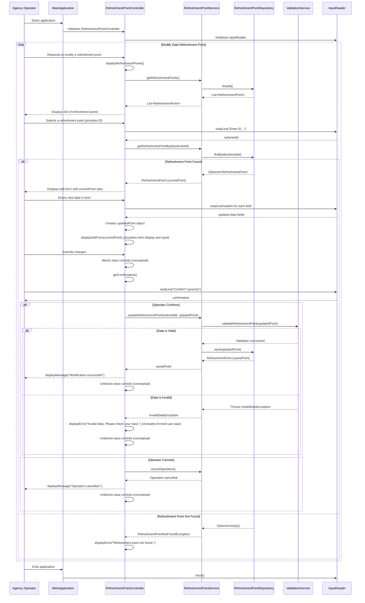

## Program call flow:

## Anything UNCLEAR

1.  **Specific Data Fields and Validation Rules**: The PRD mentions "What specific data fields constitute a 'point of rest' that need to be modified?" and "What are the exact validation rules for each data field?". For this design, I've assumed common fields like `id`, `name`, `address`, `contactInfo`, `capacity`, `servOffered`, and `status`. The `ValidationService` includes placeholder methods for these. A detailed implementation would require concrete definitions for each field's type, constraints (e.g., min/max length, regex patterns, allowed values for status), and whether they are mandatory.
2.  **`Errored` Use Case Activation**: The PRD states, "Where the data is invalid or insufficient, the system activates the use case Errored." In this design, `InvalidDataException` is thrown and caught by the `RefreshmentPointController`, which then displays an error message. The exact details of the `Errored` use case (e.g., logging, specific error codes, user interface for error resolution) would need further clarification.
3.  **ETOUR Server Interruption**: The PRD mentions "Interruption of the connection to the server ETOUR." Without details on how the ETOUR server is integrated (e.g., for `SearchRefreshmentPoint` or for actual data persistence), this design assumes that `RefreshmentPointRepository` would handle such external calls. Robust error handling (retries, circuit breakers, fallback mechanisms) would be necessary for a production system, but are beyond the scope of this high-level design without more information.
4.  **Integration with `SearchRefreshmentPoint`**: The PRD states, "View a list of points of rest as a result of the use case SearchRefreshmentPoint." This design assumes that the `RefreshmentPointController` can retrieve a list of refreshment points, simulating the output of `SearchRefreshmentPoint`. The actual integration mechanism (e.g., REST API call, shared service) would need to be defined.
5.  **Security Requirements**: The PRD asks about security requirements like audit trails and role-based access control. This design does not explicitly include these, as they were not core to the `ModifyDataRefreshmentPointAgency` use case flow. For a real system, an `AuthenticationService` and `AuthorizationService` would be integrated, and the `RefreshmentPointService`