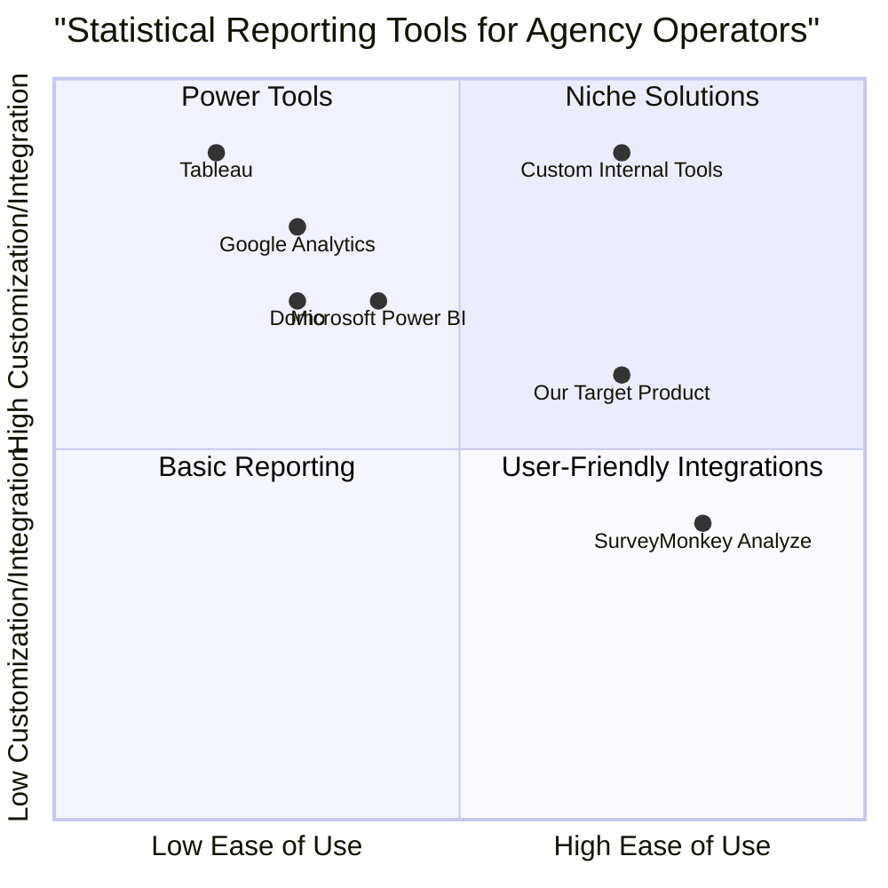

# Product Requirement Document: ViewReportStatistic

## 1. Language & Project Info

*   **Language:** English
*   **Programming Language:** Java
*   **Project Name:** view_report_statistic

### Original Requirements:

Based on the following use case, write a complete program in Java. Make sure to include all necessary functions, classes, and imports. Ensure the code is correct, efficient, and handles edge cases.

**Use Case:**
*   **Use case name:** ViewReportStatistic
*   **Description:** View statistical report relating to a selected location.
*   **Participating Actor:** Initialization Agency Operator
*   **Entry Operator conditions:** The agency has logged.
*   **Flow of events User System:**
    1.  Activate the feature on the statistical report.
    2.  Upload the list of places in the system and displays them in a form.
    3.  Select a location and submit the form.
    4.  Upload midsize site feedback obtained by activating the SearchSite use case for the location selected. Prepare the statistical report.
*   **Exit conditions:** The system displays the statistical report for the selected location.
*   **Interruption of the connection to the server:** (Implicitly, the system should handle this gracefully, e.g., display an error message or retry).
*   **Quality requirements:** (Not explicitly stated in the use case, but will be inferred for the technical specifications).

## 2. Product Definition

### Product Goals:

1.  **Enable efficient statistical reporting:** Provide agency operators with a quick and intuitive way to generate statistical reports for specific locations.
2.  **Ensure data accuracy and relevance:** Present statistical data that is directly tied to the selected location and derived from reliable feedback mechanisms.
3.  **Enhance operational decision-making:** Offer clear and concise reports that aid agency operators in understanding site performance and making informed decisions.

### User Stories:

*   **As an Agency Operator,** I want to easily activate the statistical report feature so that I can quickly access reporting functionalities.
*   **As an Agency Operator,** I want to see a comprehensive list of available locations so that I can select the specific location for which I need a report.
*   **As an Agency Operator,** I want the system to gather relevant site feedback automatically after I select a location so that I don't have to manually collect data.
*   **As an Agency Operator,** I want to view a clear and well-organized statistical report for my chosen location so that I can understand the site's performance at a glance.

### Competitive Analysis:

For this specific feature (viewing statistical reports for locations), we can consider general reporting tools or existing agency management systems that might offer similar functionalities. Since the prompt doesn't specify a domain, I'll assume a generic "site feedback" context.

1.  **Google Analytics:**
    *   **Pros:** Comprehensive web analytics, highly customizable reports, widely adopted, powerful data visualization.
    *   **Cons:** Can be complex for non-technical users, primarily focused on web data, might require significant setup for custom "site feedback."
2.  **Tableau:**
    *   **Pros:** Excellent data visualization capabilities, connects to various data sources, highly interactive dashboards.
    *   **Cons:** High cost, steep learning curve for advanced features, requires data preparation.
3.  **Microsoft Power BI:**
    *   **Pros:** Integrates well with Microsoft ecosystem, strong data modeling, good for business intelligence.
    *   **Cons:** Can be resource-intensive, less intuitive for some users compared to Tableau, primarily Windows-based.
4.  **Custom Internal Reporting Tools (Generic):**
    *   **Pros:** Tailored exactly to specific business needs, full control over data sources and presentation.
    *   **Cons:** High development and maintenance cost, can lack advanced features of dedicated BI tools, scalability issues if not well-designed.
5.  **SurveyMonkey Analyze:**
    *   **Pros:** Good for analyzing survey data, easy to create basic reports, user-friendly interface.
    *   **Cons:** Limited to survey data, less flexible for integrating diverse "site feedback" types, not a general-purpose reporting tool.
6.  **Domo:**
    *   **Pros:** Cloud-native BI platform, good for executive dashboards, integrates many data sources.
    *   **Cons:** Expensive, can be overkill for simple reporting needs, vendor lock-in.

### Competitive Quadrant Chart:



## 3. Technical Specifications

### Requirements Analysis:

The `ViewReportStatistic` feature requires a robust backend to handle data retrieval and processing, and a user-friendly frontend for interaction. The system must securely authenticate the `Agency Operator` and provide a mechanism to select locations. Data for statistical reports will be sourced from "midsize site feedback" obtained via a `SearchSite` use case, implying an existing data collection or search service. The system needs to aggregate this feedback and present it in a meaningful statistical format.

Key technical considerations include:
*   **User Interface (UI):** A web-based or desktop application UI to display location lists and statistical reports.
*   **Backend Serv:** APIs for fetching locations, submitting selected locations, and retrieving statistical data.
*   **Data Storage:** A database to store location information and potentially aggregated feedback data.
*   **Integration:** Seamless integration with the `SearchSite` use case/service to obtain raw feedback data.
*   **Error Handling:** Robust mechanisms for handling server connection interruptions, invalid inputs, and data retrieval failures.
*   **Security:** Authentication and authorization for `Agency Operators`.

### Requirements Pool:

*   **P0: Must-have**
    *   The system MUST allow authenticated `Agency Operators` to activate the statistical report feature.
    *   The system MUST display a list of available locations to the `Agency Operator`.
    *   The system MUST allow the `Agency Operator` to select a single location from the displayed list.
    *   The system MUST, upon location selection, trigger the `SearchSite` use case to gather midsize site feedback for the selected location.
    *   The system MUST process the gathered site feedback to prepare a statistical report.
    *   The system MUST display the prepared statistical report for the selected location.
    *   The system MUST handle server connection interruptions gracefully, informing the user of the issue.

*   **P1: Should-have**
    *   The system SHOULD provide clear visual feedback during data loading and report generation.
    *   The system SHOULD allow filtering or sorting of the location list.
    *   The system SHOULD provide basic export options for the statistical report (e.g., PDF, CSV).
    *   The system SHOULD include basic data visualizations (e.g., charts, graphs) within the statistical report.

*   **P2: Nice-to-have**
    *   The system MAY allow `Agency Operators` to customize certain parameters of the statistical report (e.g., date range).
    *   The system MAY provide a history of generated reports.
    *   The system MAY offer advanced analytics or predictive insights based on the statistical data.

### UI Design Draft:

**Screen 1: Activate Feature & Select Location**

```
+---------------------------------------------------+
| Agency Dashboard                                  |
+---------------------------------------------------+
| [Menu] -> [Statistical Reports]                   |
|                                                   |
|  **View Statistical Report**                      |
|                                                   |
|  Select a Location:                               |
|  -----------------------------------------------  |
|  [Dropdown/List of Locations]                     |
|  - Location A                                     |
|  - Location B                                     |
|  - Location C                                     |
|  -----------------------------------------------  |
|                                                   |
|  [Submit Button]                                  |
|                                                   |
+---------------------------------------------------+
```

**Screen 2: Display Statistical Report**

```
+---------------------------------------------------+
| Statistical Report for [Selected Location Name]   |
+---------------------------------------------------+
|                                                   |
|  **Report Summary:**                              |
|  [Brief overview of key statistics]               |
|                                                   |
|  **Key Metrics:**                                 |
|  - Metric 1: [Value]                              |
|  - Metric 2: [Value]                              |
|  - Metric 3: [Value]                              |
|                                                   |
|  **Data Visualization:**                          |
|  [Chart/Graph representing feedback trends]       |
|                                                   |
|  **Detailed Feedback Analysis:**                  |
|  [Table or list of aggregated feedback data]      |
|                                                   |
|  [Export Button (PDF/CSV)]                        |
|                                                   |
+---------------------------------------------------+
```

### Open Questions:

1.  What specific data points constitute "midsize site feedback" from the `SearchSite` use case? (e.g., ratings, comments, traffic data, incident reports).
2.  What are the exact statistical calculations or aggregations required for the report (e.g., averages, sums, percentages, trends over time)?
3.  What is the expected volume of locations and feedback data? This will influence performance and scalability considerations.
4.  What is the desired refresh rate for the statistical data? Is real-time data required, or can it be batched?
5.  Are there any specific security or compliance requirements for handling the site feedback data?
