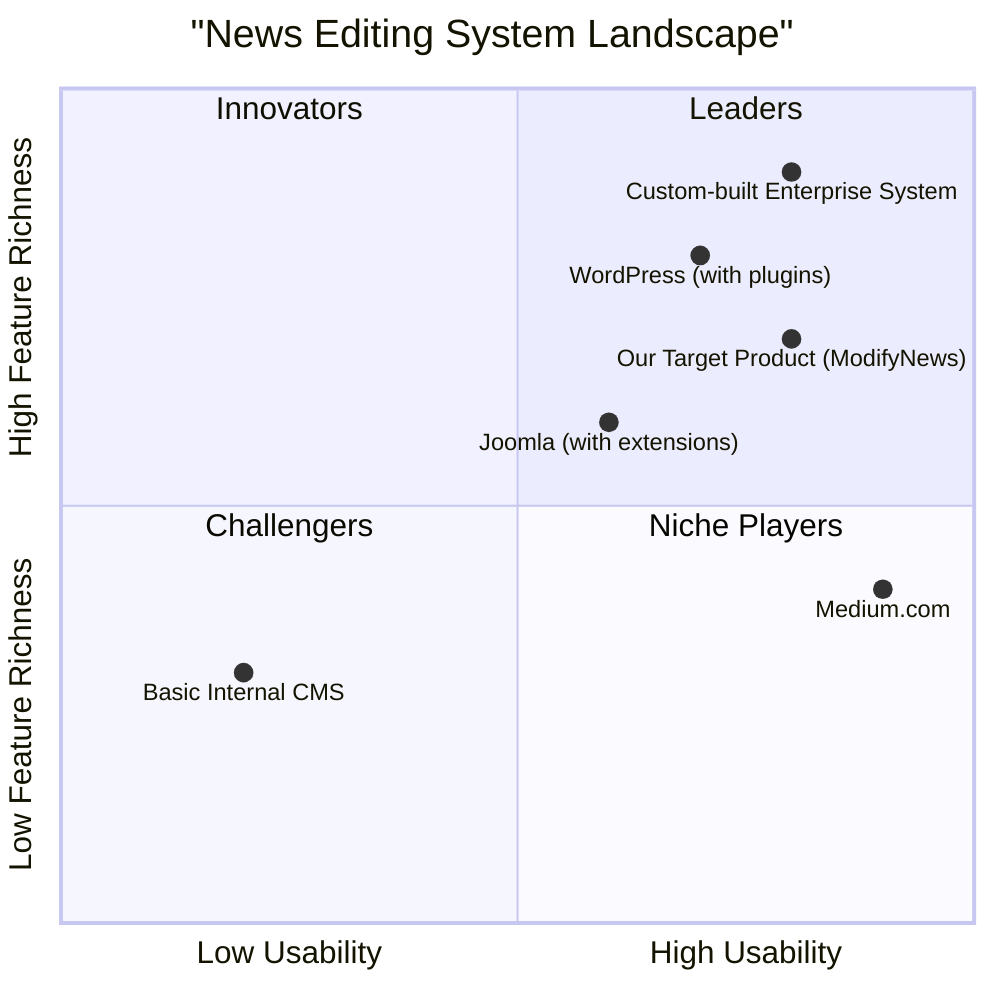

# Product Requirement Document: ModifyNews

## 1. Language & Project Info
*   **Language:** English
*   **Programming Language:** Java
*   **Project Name:** modify_news
*   **Original Requirements:** Change data of a news on the computer.

## 2. Product Definition

### 2.1 Product Goals
1.  **Efficiency:** Enable Agency Operators to quickly and easily modify news data with minimal steps.
2.  **Accuracy:** Ensure the integrity and validity of news data through robust validation mechanisms before storage.
3.  **Reliability:** Provide a stable and consistent news modification experience, with clear feedback on operation status.

### 2.2 User Stories
*   **As an Agency Operator, I want to activate the editing functionality of a news item so that I can begin the modification process.**
*   **As an Agency Operator, I want to view a list of all news items so that I can select the specific news I need to modify.**
*   **As an Agency Operator, I want to edit the data of a selected news item in a form so that I can update its information.**
*   **As an Agency Operator, I want the system to validate my changes and ask for confirmation so that I can ensure the accuracy of the modified news before saving.**
*   **As an Agency Operator, I want to be notified of the successful amendment of news so that I know my changes have been saved.**

### 2.3 Competitive Analysis (Simulated)

For the purpose of this PRD, we will consider common news content management systems (CMS) or internal agency tools that offer news editing functionalities. While specific product names are not provided, we can infer general characteristics.

**Competitors:**
1.  **Basic Internal CMS:** Often simple, functional, but may lack advanced validation or user-friendly interfaces.
    *   **Pros:** Low cost, tailored to specific internal needs.
    *   **Cons:** Limited features, poor UX, potential for data errors due to weak validation.
2.  **WordPress (with news plugins):** A widely used CMS with extensive plugin ecosystems, offering flexibility.
    *   **Pros:** Highly customizable, large community support, many features.
    *   **Cons:** Can be complex to set up and maintain, performance issues with too many plugins, security concerns.
3.  **Joomla (with news extensions):** Another popular open-source CMS, known for its robust access control lists.
    *   **Pros:** Strong ACLs, good for structured content, active community.
    *   **Cons:** Steeper learning curve than WordPress, fewer extensions, less modern UI.
4.  **Custom-built Enterprise News System:** Solutions developed specifically for large media organizations.
    *   **Pros:** Perfectly tailored to organizational workflows, high performance, strong security.
    *   **Cons:** Very high development and maintenance costs, vendor lock-in, slow to adapt to new trends.
5.  **Medium.com (as a simplified publishing platform):** Focuses on ease of writing and publishing.
    *   **Pros:** Extremely user-friendly, clean interface, good for quick publishing.
    *   **Cons:** Limited customization, not designed for complex news management workflows, less control over data.

### 2.4 Competitive Quadrant Chart

## 3. Technical Specifications

### 3.1 Requirements Analysis
The `ModifyNews` functionality requires a robust backend to handle news data storage and retrieval, a user interface for operators to interact with, and a validation layer to ensure data integrity. The system must support listing existing news, loading specific news data for editing, allowing modifications, and then saving the updated information. Error handling for invalid or insufficient data is critical, as is the ability to confirm or cancel operations.

### 3.2 Requirements Pool

*   **P0 (Must-have):**
    *   The system MUST allow an Agency Operator to activate news editing functionality.
    *   The system MUST display a list of all available news items to the Agency Operator.
    *   The system MUST allow the Agency Operator to select a news item from the list for editing.
    *   The system MUST load and display the selected news item's data in an editable form.
    *   The system MUST allow the Agency Operator to modify the news data in the form.
    *   The system MUST validate modified news data upon submission (e.g., check for required fields, data type consistency).
    *   The system MUST prompt the Agency Operator for confirmation before saving changes.
    *   The system MUST store the modified news data persistently.
    *   The system MUST notify the Agency Operator of successful news amendment.
    *   The system MUST handle invalid or insufficient data by activating the 'Errored' use case (e.g., display error messages, prevent saving).

*   **P1 (Should-have):**
    *   The system SHOULD provide a clear and intuitive user interface for news listing and editing.
    *   The system SHOULD allow the Agency Operator to cancel the modification operation at any point before confirmation.
    *   The system SHOULD provide real-time feedback during data entry (e.g., character limits, format hints).
    *   The system SHOULD implement robust error logging for connection interruptions to the ETOUR server.

*   **P2 (Nice-to-have):**
    *   The system MAY include version control for news items, allowing rollback to previous versions.
    *   The system MAY provide a search/filter functionality for the news list.
    *   The system MAY offer a preview function for modified news before saving.

### 3.3 UI Design Draft

**Screen 1: News List View**
*   **Header:** "News Management - Edit News"
*   **Main Area:** A table or list displaying news items with columns like "ID", "Title", "Author", "Publication Date", "Status".
*   **Action Column:** Each row will have an "Edit" button.
*   **Pagination/Search:** (P2) Optional search bar and pagination controls.

**Screen 2: News Editing Form**
*   **Header:** "Edit News: [News Title]"
*   **Form Fields:**
    *   Text input for "Title" (required)
    *   Text area for "Content" (required)
    *   Dropdown/Text input for "Author"
    *   Date picker for "Publication Date"
    *   Dropdown for "Status" (e.g., Draft, Published, Archived)
    *   Other relevant news fields (e.g., Category, Tags)
*   **Action Buttons:** "Submit Changes", "Cancel"

**Screen 3: Confirmation Dialog**
*   **Title:** "Confirm Changes"
*   **Content:** "Are you sure you want to save the modified news data? Review your changes below: [Summary of changes or diff]"
*   **Action Buttons:** "Confirm", "Go Back to Edit"

### 3.4 Open Questions
1.  What specific data fields constitute a 'news' item (e.g., title, content, author, publication date, category, tags)?
2.  What are the exact validation rules for each news data field (e.g., minimum/maximum length, allowed characters, date format)?
3.  How should the 'Errored' use case be handled from a UI/UX perspective (e.g., specific error messages, highlighting invalid fields)?
4.  What is the expected behavior for the "Interruption of the connection to the server ETOUR" scenario? Is it a simple error message, or does it require retry logic?
5.  What is the definition of "logged" for the Agency Operator entry condition? Is it a session-based login, token-based, etc.?
