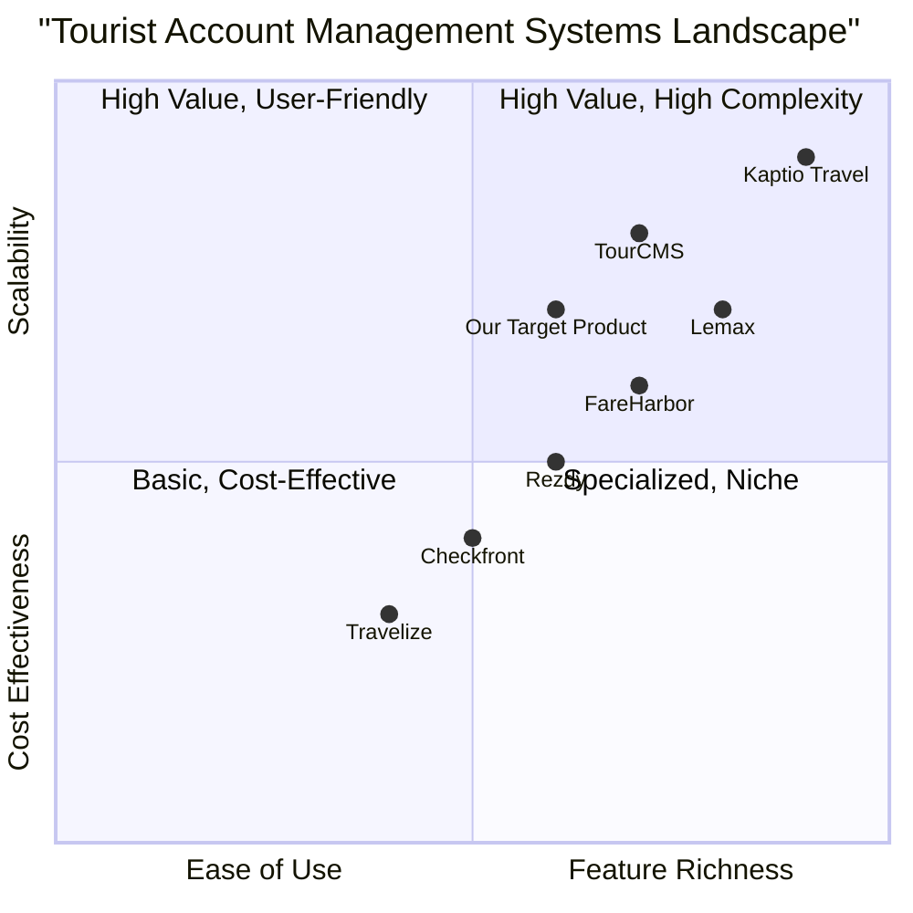

# Product Requirement Document: Modify Tourist Account Data

## 1. Language & Project Info
- Language: English
- Programming Language: Java (as per original request, though this PRD focuses on requirements)
- Project Name: tourist_account_management_system

### Original Requirements Restated:
This PRD outlines the requirements for a feature that allows an Agency Operator to modify the data of a selected tourist account. The process involves selecting a tourist from a list, loading their data into a form, allowing edits, validating the changes, confirming the operation, and finally storing the updated data.

## 2. Product Definition

### Product Goals:
1. **Efficiency**: Enable Agency Operators to quickly and easily update tourist account information, reducing manual effort and processing time.
2. **Accuracy**: Ensure the integrity and correctness of tourist data through robust validation mechanisms before saving changes.
3. **User Experience**: Provide a clear and intuitive interface for Agency Operators to modify tourist details, minimizing errors and improving operational flow.

### User Stories:
- As an Agency Operator, I want to select a tourist from a list so that I can initiate the data modification process.
- As an Agency Operator, I want to view the existing data of a selected tourist in an editable form so that I can make necessary changes.
- As an Agency Operator, I want to submit modified tourist data so that the system can validate and save the updates.
- As an Agency Operator, I want to receive clear feedback on data validation errors so that I can correct invalid or insufficient information.
- As an Agency Operator, I want to confirm data changes before they are permanently saved so that I can prevent accidental modifications.

### Competitive Analysis:
(To be filled after research)

### Competitive Quadrant Chart:
(To be filled after research)

## 3. Technical Specifications

### Requirements Analysis:
This feature requires integration with the existing 'SearchTourist' use case to retrieve a list of tourists. It will need a user interface component to display and edit tourist data. Robust backend logic will be necessary for data validation, persistence, and error handling, especially concerning the 'Errored' use case and potential interruptions to the ETOUR server connection.

### Requirements Pool:
- **P0 (Must-have):**
    - Ability to select a tourist account from a list.
    - Display selected tourist's data in an editable form.
    - Allow Agency Operator to edit fields in the form.
    - Validate submitted data for correctness and completeness.
    - Prompt for confirmation before saving changes.
    - Store modified data for the selected tourist account.
    - Handle invalid or insufficient data by activating the 'Errored' use case.
- **P1 (Should-have):**
    - Provide clear visual feedback on successful data modification.
    - Implement optimistic locking or similar mechanism to handle concurrent modifications.
    - Log all modification operations for auditing purposes.
- **P2 (Nice-to-have):**
    - Auto-save functionality for draft changes.
    - Version history for tourist account data.

### UI Design Draft:
(Basic layout and functionality)
- A form with pre-filled tourist data fields (e.g., Name, Address, Contact Info, etc.).
- 'Save Changes' and 'Cancel' buttons.
- Validation messages displayed next to invalid fields.
- A confirmation dialog before final save.

### Open Questions:
- What specific data fields constitute a 'Tourist Account'? (e.g., name, address, passport number, booking history, etc.)
- What are the exact validation rules for each data field?
- How should the 'Errored' use case be implemented and what information should it convey?
- What are the specific requirements for handling an 'Interruption of the connection to the server ETOUR'? (e.g., retry mechanism, user notification, data caching)
- What level of detail is required for logging modification operations?

### Competitive Analysis: (Based on general knowledge due to search tool limitations)
1.  **TourCMS**: Pros: Comprehensive booking and management features, good for tour operators. Cons: Can be complex to set up, potentially higher cost.
2.  **Rezdy**: Pros: Strong online booking capabilities, good for activity providers. Cons: May lack depth for complex multi-day tour management.
3.  **Checkfront**: Pros: User-friendly interface, good for rentals and activities. Cons: Less focused on traditional tour packages.
4.  **FareHarbor**: Pros: Robust reporting, good customer support. Cons: Can be expensive for smaller businesses.
5.  **Kaptio Travel**: Pros: End-toto-end travel platform, strong CRM. Cons: Enterprise-focused, potentially overkill for smaller agencies.
6.  **Travelize**: Pros: Mobile-first approach, good for field agents. Cons: May not have as many back-office features as competitors.
7.  **Lemax**: Pros: Powerful automation and customization. Cons: Steep learning curve, higher price point.

### Competitive Quadrant Chart: (Based on general knowledge due to search tool limitations)

