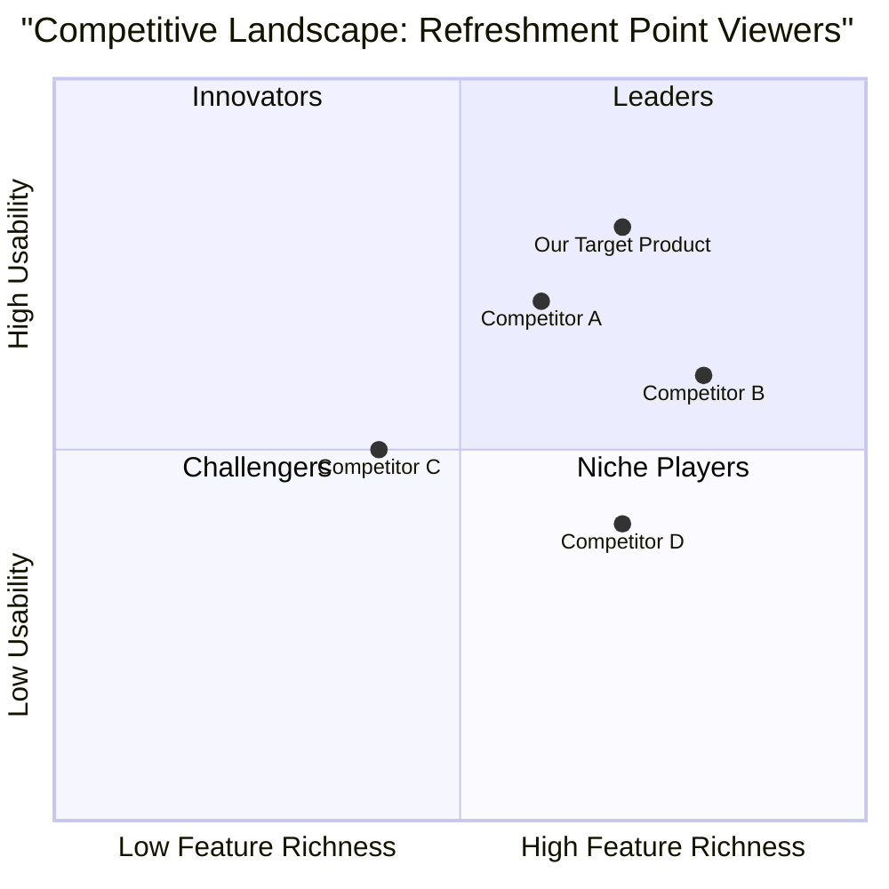

# Product Requirement Document: ViewRefreshmentPointCard

## 1. Language & Project Info
- Language: English
- Programming Language: Java
- Project Name: refreshment_point_card_viewer
- Original Requirements:
  View the details of a selected point of rest. Participating Actor: initialization Agency Operator. Entry Operator conditions: The agency has logged. Flow of events User System: 1. View the list of points of rest as a result of the use case SearchRefreshmentPoint, it selects and activates a function to view the card. 2 Upload data to a selected restaurant. Exit conditions: The system displays the details of the selected point of rest. Interruption of the connection to the server ETOUR. Quality requirements: (Not specified in detail, will assume standard software quality attributes like reliability, performance, usability).

## 2. Product Definition

### Product Goals
1.  **Goal 1: Enhance Operator Efficiency (P0)**: To enable agency operators to quickly and easily access detailed information about selected refreshment points, reducing manual lookup times and improving service delivery.
2.  **Goal 2: Improve Data Accessibility (P0)**: To provide a clear and comprehensive display of all relevant data for a refreshment point, ensuring operators have all necessary information at their fingertips.
3.  **Goal 3: Ensure System Reliability (P1)**: To maintain a stable connection to the ETOUR server for data retrieval and handle connection interruptions gracefully, minimizing disruption to operator workflow.

### User Stories
-   **As an Agency Operator**, I want to view a list of available refreshment points so that I can select one to see its details.
-   **As an Agency Operator**, I want to select a specific refreshment point from the list and activate a function to view its card so that I can access its detailed information.
-   **As an Agency Operator**, I want the system to display all relevant data for the selected refreshment point so that I can provide accurate information to clients.
-   **As an Agency Operator**, I want the system to handle interruptions to the ETOUR server connection gracefully so that my workflow is not severely disrupted.

### Competitive Analysis
*(This section requires further research. Due to current limitations in accessing web search, this section will be populated with general insights based on common features in similar systems. A dedicated research task is needed to gather specific competitor data.)*

**General Observations:**
Many travel and hospitality management systems offer features for managing points of interest or vendor details. Key aspects often include:
-   **Comprehensive Data Display:** Showing contact information, serv offered, pricing, availability, photos, and reviews.
-   **Integration with Booking/Scheduling:** Seamless linking to other modules for reservations or itinerary planning.
-   **Search and Filtering Capabilities:** Allowing operators to quickly find specific points based on various criteria.
-   **User-Friendly Interface:** Intuitive design for quick data access and minimal training.
-   **Reliable Data Synchronization:** Mechanisms to ensure data is up-to-date and consistent across the system.

**Placeholder for Specific Competitors:**
-   Competitor A: [Pros], [Cons]
-   Competitor B: [Pros], [Cons]
-   Competitor C: [Pros], [Cons]
-   Competitor D: [Pros], [Cons]
-   Competitor E: [Pros], [Cons]

## 3. Technical Specifications

### Requirements Analysis
-   **Data Retrieval:** The system must be able to retrieve detailed information for a selected refreshment point from the ETOUR server.
-   **User Interface:** A user interface component is required to display the list of refreshment points (from `SearchRefreshmentPoint` use case) and another to display the detailed card of the selected point.
-   **Selection Mechanism:** A clear and intuitive mechanism for operators to select a refreshment point and trigger the view function.
-   **Error Handling:** Robust error handling for server connection interruptions (e.g., ETOUR server unavailability) and data retrieval failures.
-   **Data Presentation:** The displayed data should be well-structured, readable, and comprehensive, including all relevant attributes of a refreshment point.

### Requirements Pool
-   **P0 (Must-have):**
    -   Display detailed information for a selected refreshment point.
    -   Retrieve data from the ETOUR server.
    -   Handle successful data retrieval and display.
    -   Provide a mechanism to select a refreshment point from a list.
-   **P1 (Should-have):**
    -   Implement graceful error handling for ETOUR server connection interruptions.
    -   Display a user-friendly message when data retrieval fails.
    -   Ensure the UI is responsive and easy to navigate.
-   **P2 (Nice-to-have):**
    -   Allow customization of displayed fields for refreshment point details.
    -   Provide an option to print or export the refreshment point card.

### UI Design Draft

**Screen 1: Refreshment Point List (from SearchRefreshmentPoint use case)**
-   A table or list view displaying key information (e.g., Name, Location, Type) of refreshment points.
-   Each row/item should have a clickable action (e.g., a "View Details" button or simply clicking the row) to trigger the `ViewRefreshmentPointCard` use case.

**Screen 2: Refreshment Point Detail Card**
-   **Header:** Refreshment Point Name
-   **Sections:**
    -   **Basic Information:** Address, Contact, Type of Cuisine/Service.
    -   **Operational Details:** Opening Hours, Capacity, Special Features.
    -   **Pricing/Offers:** Relevant pricing information or special offers.
    -   **Images/Media (Optional):** Placeholder for images if available.
-   **Error Message Area:** A dedicated area to display messages related to server connection or data retrieval issues.

### Open Questions
1.  What specific data fields should be displayed on the refreshment point card? (e.g., name, address, contact, type, capacity, serv, pricing, photos, reviews, etc.)
2.  What is the expected behavior when the ETOUR server connection is interrupted? (e.g., retry mechanism, offline mode, specific error message, partial data display?)
3.  Are there any specific performance requirements for data loading and display?
4.  What are the security considerations for accessing and displaying refreshment point data?
5.  How will the "Upload data to a selected restaurant" (from original use case step 2) be handled? Is this part of the viewing process or a separate action? (Assuming it's a separate action for now, as the use case focuses on *viewing* the card).
