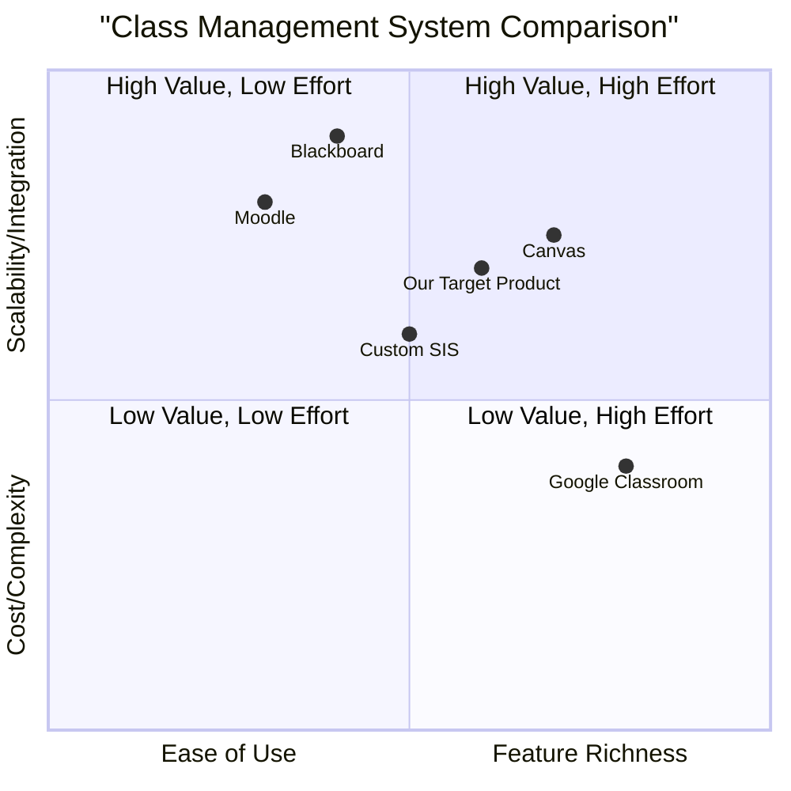

# Product Requirement Document: Insert New Class Functionality

## 1. Language & Project Info

*   **Language**: English
*   **Programming Language**: Vite, React, MUI, Tailwind CSS
*   **Project Name**: `insert_new_class_functionality`

### 1.1 Original Requirements

**Use Case: InsertNewClass**

*   **Actors**: Administrator
*   **Description**: Insert a new class into the archive
*   **Preconditions**:
    *   The user is logged in to the system as an administrator.
    *   The user has already performed the case of use "ViewingLancoclasses" and the system is viewing the list of classes of a particular academic year.
    *   The user clicks on the "New Class" button.
*   **Events Sequence**:
    *   **System**: The system shows the form to be completed with: name, address, academic year.
    *   **User**: Fills out the form.
    *   **User**: Clicks on the "Save" button.
    *   **System**: Makes checks on the validity of the data entered and inserts the new class into the archive. In the event that the data entered are not valid, activates the case of "Errodati" use.
*   **Postconditions**:
    *   The user has entered a class in the system.
    *   The system notifies the user of any data errors.
    *   Connection to the SMOS server interrupted (This seems like an error condition, not a postcondition of success. Will clarify in Open Questions).
    *   The administrator interrupts the operation.

## 2. Product Definition

### 2.1 Product Goals

1.  **Goal 1**: Enable administrators to efficiently add new class records to the system with accurate and validated data.
2.  **Goal 2**: Ensure data integrity by implementing robust validation mechanisms for all class information.
3.  **Goal 3**: Provide clear and immediate feedback to administrators regarding the success or failure of class insertion, including specific error notifications.

### 2.2 User Stories

*   **User Story 1**: As an Administrator, I want to easily access a form to add a new class so that I can quickly input new class details after viewing existing classes.
*   **User Story 2**: As an Administrator, I want the system to validate the class information I enter so that I can be confident that only correct and complete data is saved.
*   **User Story 3**: As an Administrator, I want to receive clear error messages if my input is invalid so that I can understand what needs to be corrected and successfully save the new class.
*   **User Story 4**: As an Administrator, I want to be notified upon successful class creation so that I know the operation is complete and the data is archived.

### 2.3 Competitive Analysis

*(Placeholder for future research. This section will compare similar class management functionalities in other educational or administrative systems.)*

1.  **Product A (e.g., Moodle)**:
    *   **Pros**: Comprehensive course management, widely adopted, robust user roles.
    *   **Cons**: Steep learning curve, potentially complex class creation interface.
2.  **Product B (e.g., Google Classroom)**:
    *   **Pros**: User-friendly interface, easy class setup, integrated with Google serv.
    *   **Cons**: Less granular control over class attributes, primarily focused on assignments.
3.  **Product C (e.g., Blackboard)**:
    *   **Pros**: Enterprise-grade features, extensive customization, strong security.
    *   **Cons**: Can be clunky, high cost, complex administration.
4.  **Product D (e.g., Custom SIS)**:
    *   **Pros**: Tailored to specific institutional needs, potentially highly efficient for specific workflows.
    *   **Cons**: High development and maintenance cost, limited community support, potential for feature gaps.
5.  **Product E (e.g., Canvas)**:
    *   **Pros**: Modern UI, strong integration capabilities, good analytics.
    *   **Cons**: Can be resource-intensive, some features require add-ons.

### 2.4 Competitive Quadrant Chart

## 3. Technical Specifications

### 3.1 Requirements Analysis

The 'InsertNewClass' functionality requires a user interface for administrators to input class details, a backend service to handle data validation and persistence, and a mechanism for error reporting. The system must ensure that only authenticated administrators can access this functionality. Data validation is critical to maintain the integrity of the class archive. The system should provide clear feedback to the user, whether the operation is successful or if there are validation errors.

### 3.2 Requirements Pool

*   **P0: Must-have**
    *   The system MUST display a form for class creation with fields for Name, Address, and Academic Year.
    *   The system MUST validate all input fields (Name, Address, Academic Year) for correctness and completeness.
    *   The system MUST prevent the creation of a class with invalid data.
    *   The system MUST insert valid class data into the archive.
    *   The system MUST notify the administrator of successful class creation.
    *   The system MUST activate the "Errodati" use case (display specific error messages) when data validation fails.
    *   The system MUST ensure that only logged-in administrators can access this functionality.

*   **P1: Should-have**
    *   The form SHOULD provide clear labels and input hints for each field.
    *   The system SHOULD provide real-time feedback on input validation (e.g., highlighting invalid fields).
    *   The system SHOULD allow the administrator to cancel the operation at any point before saving.
    *   The system SHOULD log all class creation attempts, including successes and failures.

*   **P2: Nice-to-have**
    *   The system MAY suggest academic years based on current date or existing data.
    *   The system MAY provide a search function for existing addresses to prevent re-entry.
    *   The system MAY offer a preview of the class details before final submission.

### 3.3 UI Design Draft

#### 3.3.1 New Class Form Layout

*   **Page Title**: "Create New Class"
*   **Form Fields**:
    *   **Class Name**: Text input field (e.g., "10th Grade - Section A")
        *   *Validation*: Required, Alphanumeric, Max length 100 characters.
    *   **Class Address**: Text input field (e.g., "Building C, Room 201")
        *   *Validation*: Required, Alphanumeric with special characters, Max length 200 characters.
    *   **Academic Year**: Dropdown/Select field (e.g., "2024-2025")
        *   *Validation*: Required, Format YYYY-YYYY, Must be a valid academic year range.
*   **Buttons**:
    *   "Save" button: Submits the form for validation and insertion.
    *   "Cancel" button: Discards changes and navigates back to the class list.
*   **Error Display**: Inline error messages next to invalid fields, and a summary error message at the top of the form if multiple errors exist.
*   **Success Message**: A temporary banner or toast notification upon successful class creation.

#### 3.3.2 Example Flow

1.  Administrator clicks "New Class" button from the "ViewingLancoclasses" screen.
2.  System displays the "Create New Class" form.
3.  Administrator fills in Name, Address, Academic Year.
4.  Administrator clicks "Save".
    *   **Scenario A (Valid Data)**: System validates data, inserts class, displays success message, and redirects to updated class list or class detail page.
    *   **Scenario B (Invalid Data)**: System identifies invalid data, displays specific error messages next to the problematic fields and a general error notification (activating "Errodati" use case), and keeps the form open for corrections.

### 3.4 Open Questions

1.  **"Errodati" Use Case Details**: What are the specific error messages or actions associated with the "Errodati" use case? Is it just displaying validation errors, or does it involve a separate error logging/reporting mechanism?
2.  **SMOS Server Connection Interruption**: The postcondition mentions "Connection to the SMOS server interrupted." Is this an expected error scenario during class insertion, or a general system postcondition? If it's an error, how should the system handle it (e.g., retry, notify admin, log)?
3.  **Academic Year Format**: What is the precise format for the academic year (e.g., "2024-2025", "2024/2025", just "2024")? Should it be a free text field or a selection from predefined options?
4.  **Uniqueness of Class Name/Address/Academic Year**: Are there any uniqueness constraints for a class? For example, can two classes have the same name in the same academic year, or the same address?
5.  **Administrator Interrupts Operation**: How does the administrator interrupt the operation? Is it via the "Cancel" button, closing the browser, or another mechanism? What are the system's actions in such a case (e.g., discard unsaved data, prompt for confirmation)?
