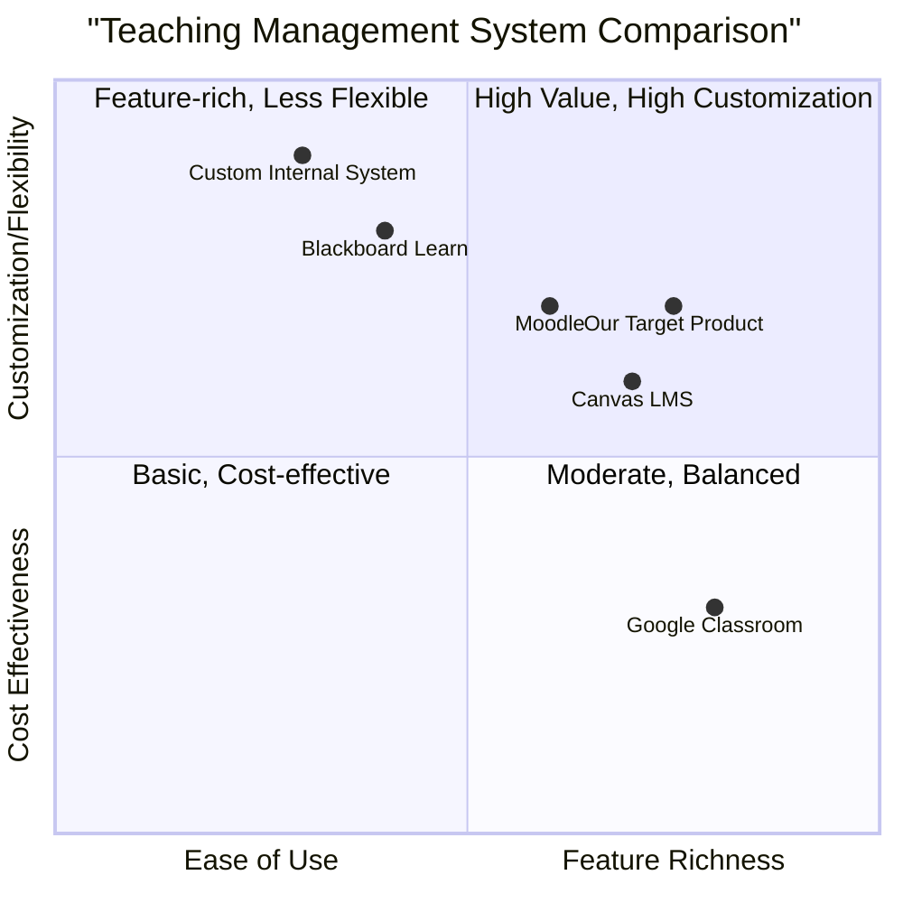

# Product Requirement Document: Edit Teaching Functionality

## 1. Language & Project Info

### 1.1 Language
English

### 1.2 Programming Language
Java

### 1.3 Project Name
edit_teaching_functionality

### 1.4 Original Requirements Restatement
This document outlines the requirements for the 'Edit Teaching' functionality, allowing an Administrator to modify the details of an existing teaching record within the system. The system must ensure data validity, update the archive, and provide feedback to the user.

## 2. Product Definition

### 2.1 Product Goals
1.  **Goal 1: Ensure Data Integrity and Accuracy**: The system must validate all edited teaching data to prevent errors and maintain the integrity of the teaching archive.
2.  **Goal 2: Provide Efficient Administrative Control**: Administrators must be able to easily and quickly modify teaching details, reducing administrative overhead and improving data management efficiency.
3.  **Goal 3: Deliver Clear User Feedback**: The system must clearly communicate the outcome of the edit operation, whether successful or failed, to the administrator.

### 2.2 User Stories
*   **As an Administrator**, I want to **edit the details of an existing teaching record** so that **I can correct inaccuracies or update information quickly**.
*   **As an Administrator**, I want the **system to validate my input when editing teaching details** so that **I can be confident that the data in the archive is correct**.
*   **As an Administrator**, I want to **receive immediate feedback on the success or failure of my edit operation** so that **I know if further action is required**.
*   **As an Administrator**, I want to **view the updated list of teachings after saving my changes** so that **I can confirm the modifications have been applied**.

### 2.3 Competitive Analysis
(This section will require external research. For now, placeholders are used.)

1.  **Competitor A (e.g., Moodle)**
    *   **Pros**: Comprehensive course management, widely adopted, robust user roles.
    *   **Cons**: Can be complex to configure, UI might feel dated, steep learning curve for new users.

2.  **Competitor B (e.g., Blackboard Learn)**
    *   **Pros**: Strong institutional support, good integration capabilities, feature-rich.
    *   **Cons**: High cost, less flexible customization, performance issues reported by some users.

3.  **Competitor C (e.g., Canvas LMS)**
    *   **Pros**: Modern UI/UX, cloud-native, strong community support, intuitive for users.
    *   **Cons**: Some advanced features require add-ons, reporting can be less granular than competitors.

4.  **Competitor D (e.g., Google Classroom)**
    *   **Pros**: Free, easy to use, integrates well with Google ecosystem, simple interface.
    *   **Cons**: Limited advanced features, less robust grading tools, primarily focused on K-12.

5.  **Competitor E (e.g., Custom Internal System)**
    *   **Pros**: Tailored to specific needs, full control over features and data.
    *   **Cons**: High development and maintenance cost, potential for feature creep, reliance on internal IT.

### 2.4 Competitive Quadrant Chart

## 3. Technical Specifications

### 3.1 Requirements Analysis
The 'Edit Teaching' functionality requires a robust backend service to handle data validation, archival updates, and error handling. The frontend will need to display teaching details in an editable form and provide a 'Save' button. Communication between the frontend and backend will be crucial for a smooth user experience. Error conditions, such as invalid data or server connection issues, must be gracefully handled and communicated to the administrator.

### 3.2 Requirements Pool
*   **P0 (Must-have)**: The system **must** allow an administrator to modify all editable fields of a teaching record.
*   **P0 (Must-have)**: The system **must** perform server-side validation on all edited data fields to ensure data integrity.
*   **P0 (Must-have)**: Upon successful validation and update, the system **must** persist the changes to the teaching archive.
*   **P0 (Must-have)**: The system **must** display an updated list of teachings after a successful edit operation.
*   **P0 (Must-have)**: If data validation fails, the system **must** activate the 'Errodati' (Data Error) use case, providing specific error messages to the administrator.
*   **P1 (Should-have)**: The system **should** provide clear visual feedback (e.g., success message, error alerts) to the administrator regarding the outcome of the save operation.
*   **P1 (Should-have)**: The system **should** handle cases where the connection to the SMOS server is interrupted, notifying the administrator appropriately.
*   **P2 (Nice-to-have)**: The system **may** provide an 'undo' functionality for recent changes to a teaching record.
*   **P2 (Nice-to-have)**: The system **may** log all edit operations for auditing purposes.

### 3.3 UI Design Draft

**Page: Edit Teaching Details**

**Header:** Edit Teaching

**Form Fields (Editable):**
*   Teaching Name: [Text Input Field]
*   Course Code: [Text Input Field]
*   Instructor: [Dropdown/Text Input Field]
*   Start Date: [Date Picker]
*   End Date: [Date Picker]
*   Description: [Text Area]
*   (Other relevant teaching details as per system design)

**Actions:**
*   [Save Button] (Primary action)
*   [Cancel Button] (Returns to previous view without saving)

**Feedback Area:**
*   Success Message: "Teaching details updated successfully!"
*   Error Message: "Error: Invalid data entered. Please check the highlighted fields." (with specific field errors)
*   Connection Error: "Warning: Connection to SMOS server interrupted. Please try again."

**Post-Save:**
*   Redirects to "View Updated Teachings List" page.

### 3.4 Open Questions
1.  What specific data fields constitute a 'teaching' record, and what are their data types and validation rules?
2.  What is the exact definition and expected behavior of the 'Errodati' use case? What information should it convey?
3.  How should the system handle concurrent edits to the same teaching record by multiple administrators?
4.  What are the performance requirements for saving teaching edits (e.g., maximum acceptable latency)?
5.  Are there any specific security requirements for editing teaching data (e.g., audit trails, access logging)?
6.  What is the expected behavior when the administrator interrupts the operation? Is it simply discarding changes, or is there a specific notification required?
