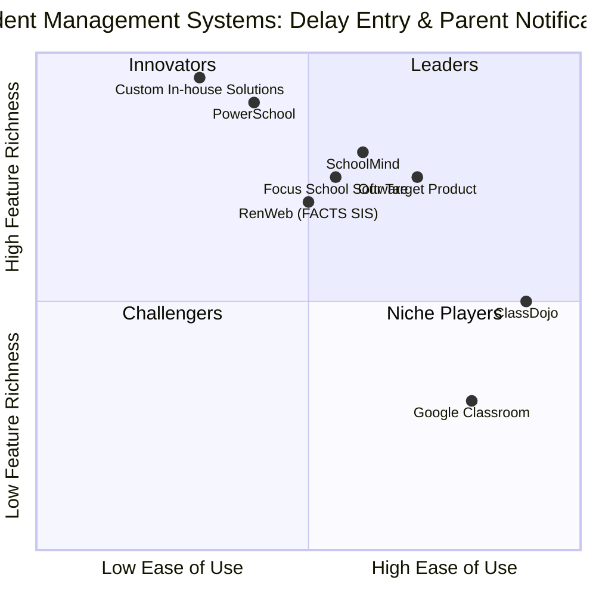

# Product Requirement Document: Insert Delay Admin

## 1. Language & Project Info

*   **Language**: English
*   **Programming Language**: Java
*   **Project Name**: `insert_delay_admin`

### Original Requirements:

**Use Case: InsertDelayAdmin**

**Actors**: Administrator

**Description**: Register digitization, data entry by the administrator

**Preconditions**:
*   The user must be logged in to the system as an administrator.
*   The user took the case of use "SeveralTetTingloregister" (This seems to be a typo or specific system context, will assume it means selecting a registration date).
*   The user selects the date on which he wants to enter the information.

**Events Sequence**:

| User Action                                     | System Response                                   |
| :---------------------------------------------- | :------------------------------------------------ | 
| 2. Fill out the form by entering students with delay and click "Save" | 1. Update the screen displayed according to the date | 
|                                                 | 3. Send data to the server.                       |
|                                                 | 4. Displays the updated log data.                 |

**Postconditions**:
*   The delay data has been entered in the system, and the system sent notifications to parents. The system remains on the registry screen.
*   The administrator interrupts the operation.
*   Connection to the interrupted SMOS server.

**Additional Requirements**:
1.  Use Java.
2.  The code should be fully runnable.
3.  Include comments explaining key logic.
4.  Do not run the code, just save it.

## 2. Product Definition

### 2.1 Product Goals

1.  **Efficiency**: Streamline the process for administrators to accurately record student delays, reducing manual effort and potential errors.
2.  **Communication**: Ensure timely and automated notification to parents regarding their child's delay status, enhancing transparency and parental engagement.
3.  **Data Integrity**: Maintain a robust and reliable system for storing and displaying delay records, ensuring data consistency and availability for reporting and auditing.

### 2.2 User Stories

*   **As an Administrator**, I want to easily select a specific date so that I can enter delay information for that day.
*   **As an Administrator**, I want to fill out a form with student delay details and save it so that the information is recorded in the system.
*   **As an Administrator**, I want the system to automatically send notifications to parents when delay data is saved so that parents are informed promptly.
*   **As an Administrator**, I want to see updated log data after saving so that I can verify the entry and track changes.
*   **As an Administrator**, I want the system to remain on the registry screen after saving so that I can continue entering data without navigating away.

### 2.3 Competitive Analysis

To understand the landscape of student management and attendance systems, we will analyze several existing solutions. This will help us identify best pract, common features, and areas for differentiation.

1.  **SchoolMind**: A comprehensive school management system. 
    *   **Pros**: All-in-one solution, robust attendance tracking, parent portal for notifications. 
    *   **Cons**: Can be complex to implement, potentially high cost, might have features beyond basic delay management.
2.  **PowerSchool**: Widely used student information system (SIS).
    *   **Pros**: Extensive features for student data, attendance, and communication; strong integration capabilities. 
    *   **Cons**: Steep learning curve, often requires significant customization, not always user-friendly for simple tasks.
3.  **ClassDojo**: Focuses on classroom management and parent communication.
    *   **Pros**: Excellent for parent engagement, easy to use for basic communication, real-time updates. 
    *   **Cons**: Less robust for formal attendance/delay tracking, not a full SIS, might lack administrative reporting features.
4.  **RenWeb (FACTS SIS)**: Another popular SIS, particularly in private schools.
    *   **Pros**: Comprehensive student data management, attendance, gradebook, parent access. 
    *   **Cons**: Interface can feel dated, customization can be limited, pricing structure might be complex.
5.  **Google Classroom**: Primarily a learning management system (LMS) with some communication features.
    *   **Pros**: Free, widely adopted, good for assignment management and basic announcements. 
    *   **Cons**: Lacks dedicated attendance/delay tracking, no automated parent notifications for delays, not a true SIS.
6.  **Custom In-house Solutions**: Many schools develop their own systems.
    *   **Pros**: Perfectly tailored to specific needs, full control over features. 
    *   **Cons**: High development and maintenance cost, potential for bugs, lack of ongoing support/updates.
7.  **Focus School Software**: A K-12 student information system.
    *   **Pros**: Comprehensive student data, attendance, scheduling, and reporting. 
    *   **Cons**: Can be complex to navigate, implementation can be lengthy, user interface might not be intuitive for all users.

### 2.4 Competitive Quadrant Chart

## 3. Technical Specifications

### 3.1 Requirements Analysis

The `InsertDelayAdmin` feature requires a robust backend to handle data persistence, business logic, and communication, coupled with a user-friendly frontend for administrators. The system must ensure secure access, efficient data entry, and reliable notification delivery. Key considerations include data validation, error handling, and system responsiveness.

*   **Authentication & Authorization**: The system must verify the administrator's login credentials and ensure they have the necessary permissions to access and modify delay records.
*   **Date Selection**: A mechanism for administrators to select a specific date for which delay data will be entered. This could be a calendar component on the UI.
*   **Form Management**: A dynamic form to enter student delay information. This form should allow for adding multiple students, specifying delay reasons, and potentially other relevant details.
*   **Data Persistence**: Secure storage of delay records in a database. This includes student ID, date, delay reason, entry timestamp, and administrator who made the entry.
*   **Server Communication**: Efficient and secure communication between the client-side UI and the server-side application for data submission and retrieval.
*   **Notification Service**: A reliable service to send automated notifications to parents. This service should integrate with existing communication channels (e.g., email, SMS, parent portal) and handle notification queues and delivery status.
*   **Logging & Auditing**: The system should log all data entry and modification actions for auditing purposes.
*   **Error Handling**: Graceful handling of errors during data entry, server communication, and notification delivery, providing informative feedback to the administrator.
*   **UI Update**: The UI must dynamically update to reflect the selected date and display the newly entered or updated log data.
*   **Session Management**: Maintain the administrator's session and keep them on the registry screen after successful data entry.
*   **Interruption Handling**: The system should gracefully handle scenarios where the administrator interrupts the operation or the connection to the SMOS server is interrupted, ensuring data consistency and preventing partial updates.

### 3.2 Requirements Pool

Here's a prioritized list of requirements:

*   **P0: Must-have**
    *   Admin login and authentication.
    *   Ability to select a date for delay entry.
    *   Form for entering student delay data (student ID, delay reason).
    *   "Save" button to submit delay data.
    *   Backend API for receiving and storing delay data.
    *   Database to store delay records.
    *   Automated notification trigger to parents upon successful save.
    *   Display of updated log data on the screen after save.
    *   System remains on the registry screen post-save.
    *   Basic input validation for delay form fields.

*   **P1: Should-have**
    *   User-friendly calendar component for date selection.
    *   Ability to add multiple students to a single delay entry form.
    *   Pre-defined list of common delay reasons.
    *   Integration with an existing parent communication system (e.g., email/SMS gateway).
    *   Error messages for failed data submission or notification delivery.
    *   Audit trail for all delay entries and modifications.
    *   Clear visual feedback for successful data submission.
    *   Graceful handling of administrator interruption during data entry (e.g., draft saving, confirmation dialog).

*   **P2: Nice-to-have**
    *   Search and filter capabilities for past delay records.
    *   Reporting features for delay trends.
    *   Customizable notification templates for parents.
    *   Integration with SMOS server for real-time status updates (if applicable and feasible).
    *   Offline mode for data entry with synchronization once online.
    *   Performance optimization for large numbers of student entries.

### 3.3 UI Design Draft

#### Screen: Delay Registration

**Header**: System Name | Logged in as: [Administrator Name] | Logout

**Navigation**: Dashboard | Student Management | Attendance | **Delay Registration** | Reports

--- 

**Main Content Area:**

**Title**: Register Student Delays

**Date Selection**:
[Calendar Icon] **Selected Date:** [YYYY-MM-DD] [Change Date Button]

**Student Delay Entry Form**:

| Student ID/Name (Autocomplete) | Delay Reason (Dropdown/Text) | [Add Row Button] |
| :----------------------------- | :--------------------------- | :--------------- |
| [Input Field]                  | [Dropdown: Late Bus, Appointment, Other...] | [Remove Row]     |
| [Input Field]                  | [Dropdown: Late Bus, Appointment, Other...] | [Remove Row]     |
| ...                            | ...                          | ...              |

[**Save Delays** Button] [Cancel Button]

--- 

**Recent Delay Log (Below the form)**:

**Title**: Recently Entered Delays for [Selected Date]

| Time Entered | Student Name | Delay Reason | Notified Parents | Entered By |
| :----------- | :----------- | :----------- | :--------------- | :--------- |
| HH:MM:SS     | John Doe     | Late Bus     | Yes              | Admin A    |
| HH:MM:SS     | Jane Smith   | Appointment  | Yes              | Admin A    |
| ...          | ...          | ...          | ...              | ...        |

**Notifications/Status Bar**: [Success/Error Message] | [Connection Status to SMOS (if applicable)]

### 3.4 Open Questions

1.  **"SeveralTetTingloregister"**: What exactly does "SeveralTetTingloregister" refer to? Is it a specific module, a type of registration, or a typo? Clarification is needed to understand the exact flow for date selection.
2.  **Student Identification**: How are students identified in the system? By ID, name, or a combination? What is the preferred method for administrators to select students in the delay entry form?
3.  **Delay Reasons**: Are there a predefined set of delay reasons, or should administrators be able to enter custom reasons? If predefined, what are they?
4.  **Parent Notification Mechanism**: What is the preferred method for sending notifications to parents (e.g., email, SMS, push notification via a parent app, or an existing parent portal)? What information should be included in the notification?
5.  **SMOS Server**: What is the "SMOS server" and what is the nature of its connection? What specific data or functionality is exchanged with it, and how should interruptions be handled beyond just noting them?
6.  **Interruption Handling**: When an administrator interrupts the operation, what is the expected system behavior? Should unsaved data be discarded, saved as a draft, or prompt for confirmation?
7.  **Data Validation Rules**: What are the specific validation rules for student IDs, dates, and other form fields?
8.  **Reporting Needs**: Are there any specific reporting requirements for delay data (e.g., daily summaries, monthly trends, student-specific delay history)?
