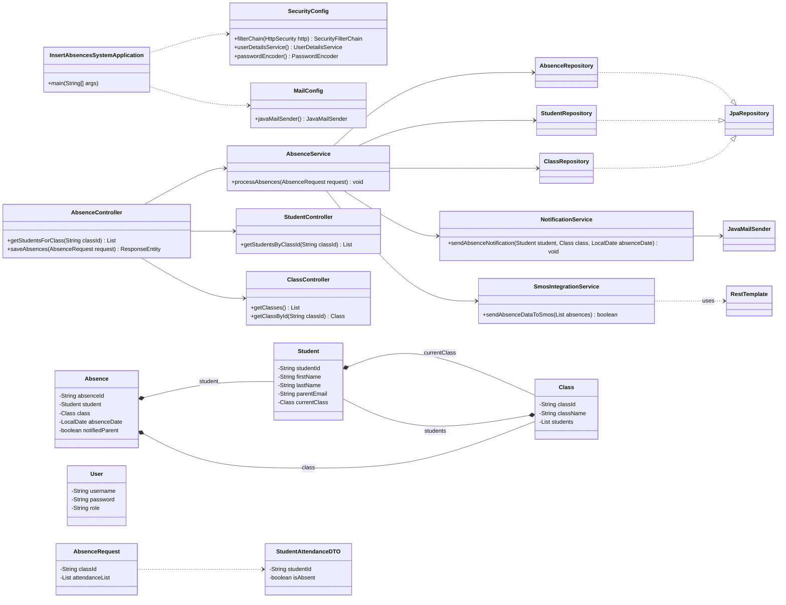
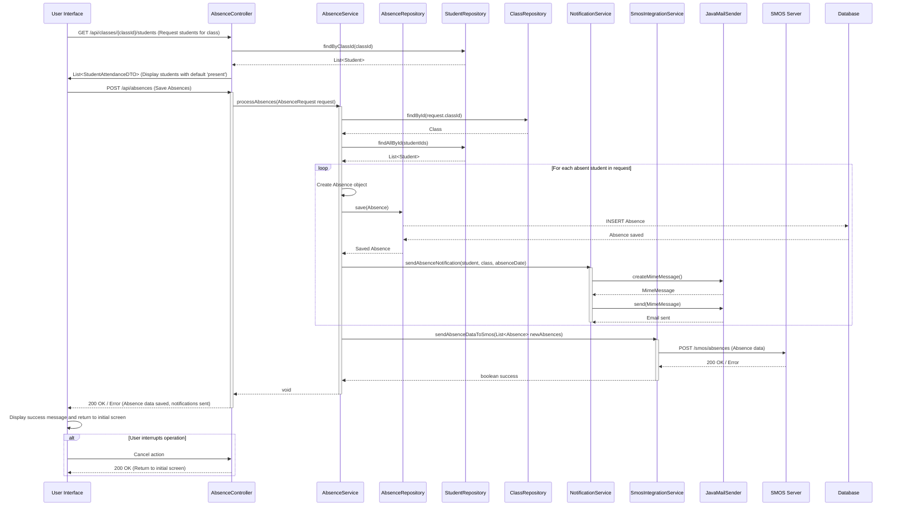

## Implementation approach

We will implement a modern, robust, and scalable Java application using the Spring Boot framework. This approach allows for rapid development, easy integration of various components, and adherence to best pract in enterprise application development.

**Key Technologies and Frameworks:**

*   **Backend Framework**: **Spring Boot** (for building a standalone, production-grade Spring-based application with minimal configuration).
*   **Web Layer**: **Spring Web MVC** (for creating RESTful APIs to serve the frontend).
*   **Data Persistence**: **Spring Data JPA** with **Hibernate** (for Object-Relational Mapping and simplified database interactions).
*   **Database**: **PostgreSQL** (a robust, open-source relational database for production) and **H2 Database** (for in-memory development and testing).
*   **Email Service**: **Spring Mail** with **JavaMail API** (for sending parent notifications).
*   **Security**: **Spring Security** (for user authentication and authorization of ATA staff).
*   **Logging**: **SLF4J** with **Logback** (for comprehensive logging).
*   **Build Tool**: **Maven** (for project management and dependency management).
*   **External System Integration**: A dedicated client/service for communicating with the SMOS server (e.g., using Spring's `RestTemplate` or `WebClient`).

**Architectural Overview:**

The system will follow a layered architecture:

1.  **Presentation Layer (UI - Conceptual)**: This layer will be responsible for displaying the user interface to the ATA staff. While the PRD implies a UI, for this backend-focused design, we assume it will consume the REST APIs provided by the backend. It will handle user input (selecting absent students, clicking save) and display feedback.
2.  **API Layer (Controllers)**: Spring Boot REST Controllers will expose endpoints for the UI to interact with. These controllers will handle HTTP requests, validate input, and delegate business logic to the Service Layer.
3.  **Service Layer (Business Logic)**: This layer contains the core business logic for managing absences, interacting with the database, and orchestrating external serv like email notifications and SMOS communication. It ensures transactional integrity.
4.  **Data Access Layer (Repositories)**: Spring Data JPA Repositories will provide an abstraction over the database, simplifying CRUD operations for entities like `Student`, `Class`, and `Absence`.
5.  **Integration Layer**: This layer will handle communication with external systems, specifically the SMOS server for sending absence data and an SMTP server for sending emails.

## File list

```
insert_absences_system/
├── pom.xml
├── src/
│   ├── main/
│   │   ├── java/
│   │   │   └── com/
│   │   │       └── atastaff/
│   │   │           └── absencesystem/
│   │   │               ├── InsertAbsencesSystemApplication.java
│   │   │               ├── config/
│   │   │               │   └── SecurityConfig.java
│   │   │               │   └── MailConfig.java
│   │   │               ├── controller/
│   │   │               │   ├── AbsenceController.java
│   │   │               │   ├── ClassController.java
│   │   │               │   └── StudentController.java
│   │   │               ├── model/
│   │   │               │   ├── Student.java
│   │   │               │   ├── Class.java
│   │   │               │   ├── Absence.java
│   │   │               │   └── User.java
│   │   │               ├── repository/
│   │   │               │   ├── StudentRepository.java
│   │   │               │   ├── ClassRepository.java
│   │   │               │   └── AbsenceRepository.java
│   │   │               ├── service/
│   │   │               │   ├── AbsenceService.java
│   │   │               │   ├── NotificationService.java
│   │   │               │   └── SmosIntegrationService.java
│   │   │               └── dto/
│   │   │                   ├── AbsenceRequest.java
│   │   │                   └── StudentAttendanceDTO.java
│   │   └── resources/
│   │       ├── application.properties
│   │       └── templates/ (if using server-side rendering like Thymeleaf)
│   └── test/
│       └── java/
│           └── com/
│               └── atastaff/
│                   └── absencesystem/
│                       └── InsertAbsencesSystemApplicationTests.java
└── docs/
    └── system_design.md
    └── system_design-class-diagram.mermaid
    └── system_design-sequence-diagram.mermaid
```

## Data structures and interfaces:



## Program call flow:



## Anything UNCLEAR

1.  **SMOS Server API Details**: The PRD mentions "Connection to the interrupted SMOS server" and "The system sends data to the server. The server for each absence sends a notification email to the parent of the student." This implies the SMOS server is an external system. The exact API endpoint, request/response format, authentication mechanism, and error handling for communication with the SMOS server are not specified. We assume a RESTful API for sending absence data.
2.  **Email Content and Template**: The PRD states "sends a notification email to the parent of the student." The specific content, subject, and any templating requirements for this email are not detailed. We assume a basic email with relevant absence information.
3.  **User Interface (UI) Details**: While the PRD describes UI interactions (selecting students, clicking save), the actual technology stack for the frontend (e.g., React, Angular, Vue, or server-side rendering) is not specified. This design focuses on the backend API, assuming a separate frontend will consume it.
4.  **Error Handling and Retry Mechanisms**: The PRD mentions "Connection to the interrupted SMOS server." This highlights the need for robust error handling, logging, and potentially retry mechanisms for external service calls (SMOS and email sending). Specific requirements for these are not detailed.
5.  **Authentication and Authorization**: The precondition states "The user must be logged in to the system as the ATA staff." While Spring Security is planned, the specific authentication flow (e.g., OAuth2, JWT, session-based) and authorization roles are not detailed.
6.  **Data Validation Rules**: Specific validation rules for student IDs, class IDs, and other input data are not explicitly mentioned beyond general correctness.
7.  **Concurrency and Scalability**: For a production system, considerations for handling multiple concurrent requests and scaling the application would be important, but are not detailed in the PRD.
