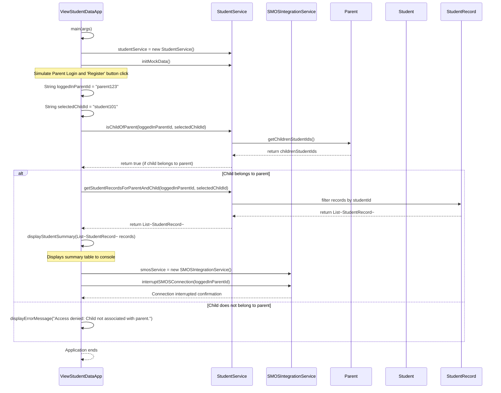

## Program call flow:

## Anything UNCLEAR

1.  **User Interface (UI) for "Register" button and Login:** The current design assumes a console-based simulation of user actions. A real-world application would require a UI framework (e.g., Spring Boot with Thymeleaf/React, JavaFX, Swing) to handle user login and button clicks. For this design, we directly call the relevant methods with pre-defined parent and student IDs.
2.  **SMOS Server Interaction Details:** The `SMOSIntegrationService` currently only simulates the `interruptSMOSConnection` action with a log message. In a real scenario, this would involve actual network calls, API integrations, and error handling specific to the SMOS server's interface.
3.  **Data Persistence:** The design uses in-memory mock data. For a production system, a robust data persistence layer (e.g., a relational database with JDBC/JPA, NoSQL database) would be necessary to store and retrieve `Parent`, `Student`, and `StudentRecord` information permanently.
4.  **Authentication and Authorization:** The design assumes a parent is already "logged in" and their `parentId` is known. A complete system would include a proper authentication mechanism (e.g., username/password validation) and authorization checks to ensure a parent can only view data for their own children.
5.  **Error Handling Granularity:** While basic error handling is considered, a production application would require more comprehensive error handling, logging, and user feedback mechanisms for various failure scenarios (e.g., network issues, data corruption, invalid input).
